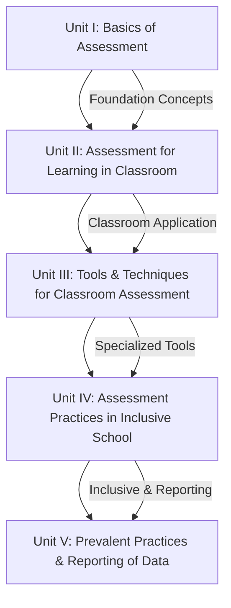

# Assessment for Learning — Exam Preparation Notes

Welcome to the **Assessment for Learning** exam-ready study material. These notes are organized unit-wise for quick revision and exam preparation.

---

## Units Overview

| Unit | Title | Key Topics |
|------|-------|------------|
| **I** | [Basics of Assessment](unit1.md) | Measurement, Assessment, Evaluation, Formative & Summative Assessment, Principles of Good Assessment |
| **II** | [Assessment for Learning in Classroom](unit2.md) | Behaviourist vs Constructivist Approach, CCE, Grading System, Types of Assessment, Dialogue & Feedback |
| **III** | [Tools and Techniques for Classroom Assessment](unit3.md) | Observation, Anecdotal Record, Check List, Rating Scale, Tests, Rubrics, Affective Domain Tools, Test Items |
| **IV** | [Assessment Practices in Inclusive School](unit4.md) | Differentiated Assessment, Culturally Responsive Assessment, Achievement & Diagnostic Tests, Qualities of Good Test, Inclusive Practices |
| **V** | [Prevalent Practices of Assessment & Reporting](unit5.md) | CCE Drawbacks, Assessment for Better Learning, Reflective Journal, Student Portfolio, Statistics, Graphs & Diagrams |

---

!!! tip "How to Use These Notes"
    - Each unit follows the **original section numbering** from the textbook.
    - **Bold terms** indicate key definitions and important concepts.
    - Use the tables and diagrams for quick revision before exams.
    - Admonition boxes highlight notes, tips, and important points.
