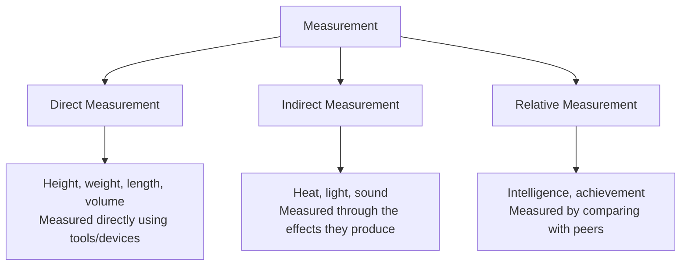
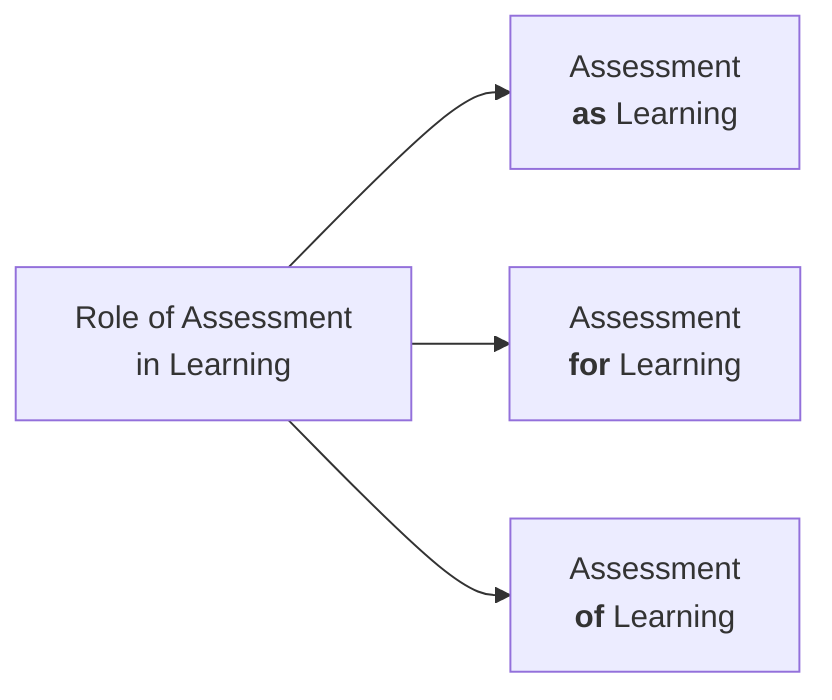
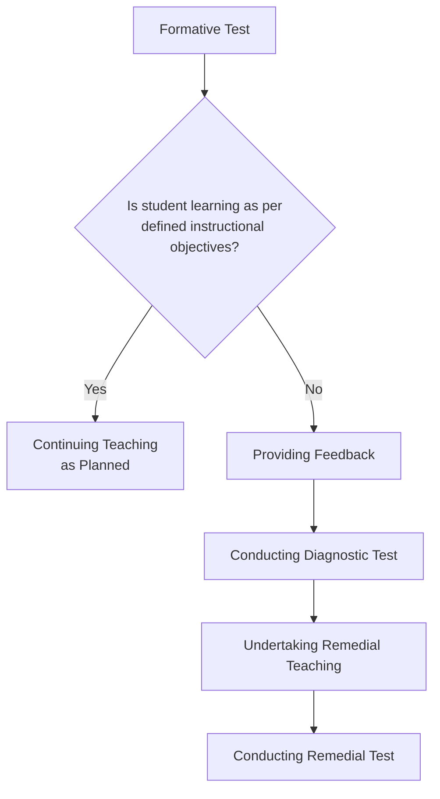
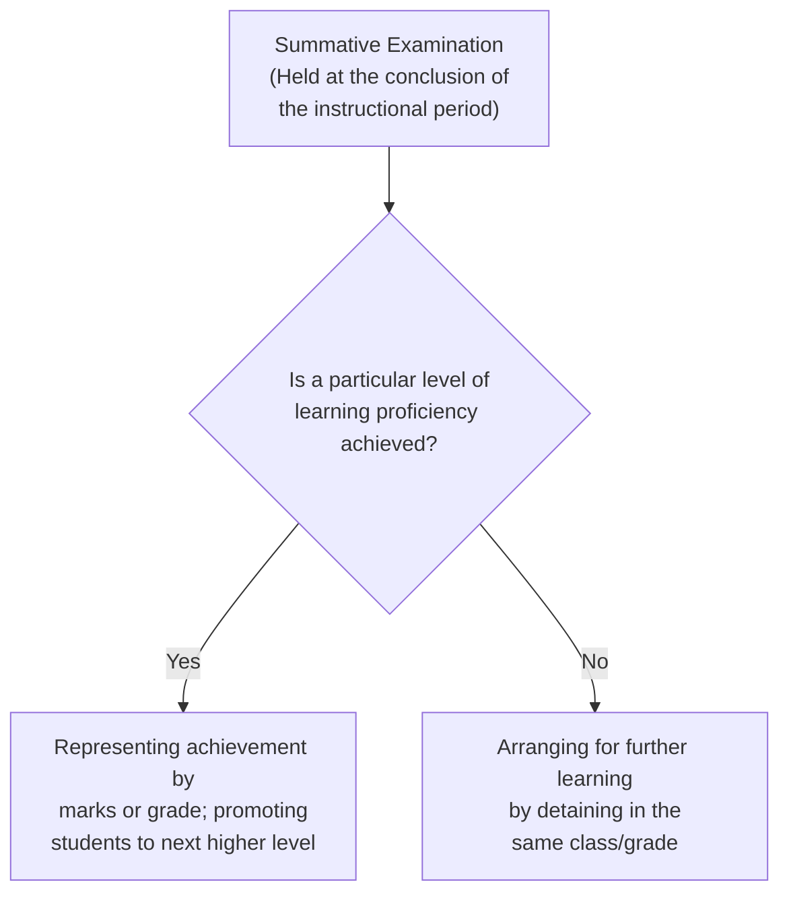
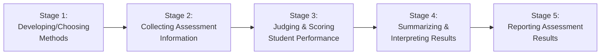

# Unit I — Basics of Assessment

---

## 1:00 Introduction

It is necessary to assess, now and then, the **progress achieved in students' learning** as a result of their self-efforts as well as the teacher's classroom teaching. This is an important duty of the teacher. The term **'Evaluation'** is more appropriate to refer to this than the term **'Assessment'**. Only on evaluating students' learning progress can the teacher know how far students have understood the subject content taught, based on which further teaching can proceed.

!!! note "This Unit Covers"
    - Meaning and definition of **Measurement**, **Assessment**, and **Evaluation**
    - Role of assessment in learning — three approaches:
        - Assessment **as** Learning
        - Assessment **for** Learning
        - Assessment **of** Learning
    - Role of the teacher in each approach
    - **Formative** and **Summative** assessments — uses and differences
    - **Purposes** of assessment
    - **Principles** of good assessment practice
    - Principles related to different stages of an assessment programme

---

## 1:01 Measurement

### 1:01:1 Meaning of 'Measurement'

**Measurement** is involved in all aspects of human life. It is used to assess **physical characteristics** and external features such as height, weight, age, intelligence, abilities, etc.

- The element involved in measurement may be any **quality or attribute** — height, weight, age, intelligence, speed, volume, length, width, etc.
- For expressing how much a particular quality or attribute is present in an object, person, or event, a **numerical value** is assigned.

!!! tip "Examples"
    - Krishnan's height is **165 cm**
    - Murugan's weight is **60 kg**
    - Meenakshi scored **65 marks** in the mathematics test

> **Key Point:** Assigning numerical values to represent the amount of an attribute or quality present in an object, person, or event constitutes **'measurement'**.

---

### 1:01:2 Definition of 'Measurement'

!!! important "Definition (James M. Broadfield)"
    **Measurement** is *"assigning numerical values to objects, persons or events, according to certain well-established rules so as to represent the amount of the qualities or attributes present in them."*

**Analysis of the definition reveals:**

| # | Key Insight |
|---|-------------|
| i | We cannot measure any object, person, or event directly — only the **attributes** present in them can be measured. *(e.g., a table cannot be measured; only its height, weight, length, width — called 'attributes' — can be measured.)* |
| ii | The process of measurement involves **assigning a numerical value** to represent how much a particular attribute is present. |
| iii | **Previously established rules** must be followed for assigning numerical values. |

**Three steps involved in measurement:**

1. **Identify / define** the attribute or quality to be measured *(e.g., height of a person, weight of an object)*
2. **Perform a set of operations** by which the attribute is made manifest and perceivable *(e.g., to measure height — make the person stand erect and mark the distance from head to toe)*
3. **Quantify** the distance/value using an appropriate numerical scale based on well-established rules *(e.g., 5 ft 5 inches or 165 cm)*

---

### 1:01:3 Types of Measurement

| Type | Description | Examples |
|------|-------------|----------|
| **Direct Measurement** | External attributes measured directly with high precision using tools/devices | Height (metres), Volume (litres), Weight (kg) |
| **Indirect Measurement** | Cannot be measured directly; measured through the effects they produce | Heat, Light, Sound |
| **Relative Measurement** | Used in education and psychology; measured by comparing with peers | Intelligence, Achievement |

#### Scales of Measurement

| Scale | Description | Properties |
|-------|-------------|------------|
| **Ratio Scale** | Starts from zero; contains units of equal size *(e.g., CGS system)* | Can be added, subtracted, multiplied, divided. *30 cm is twice 15 cm.* |
| **Interval Scale** | Absolute zero point is not known; units are not of equal size | **Cannot** be added, subtracted, multiplied, or divided among themselves. *A student with 60 marks is NOT twice as proficient as one with 30 marks.* |

!!! important "Key Distinction"
    - **Physical measurements** use **Ratio Scales** — accurate and highly stable.
    - **Educational/behavioural measurements** use **Interval Scales** — relative and not very accurate.
    - Marks obtained in different subjects or by students in different education systems (CBSE, State Board, etc.) **cannot be compared**.

---

### 1:01:4 Characteristics of Educational Measurement

| # | Characteristic | Explanation |
|---|----------------|-------------|
| i | **No Definite 'Zero' Measure** | If a student scores zero in a maths test, it does not mean he has no knowledge — he simply did not score in that particular test. A different test may yield 35 marks. Measurements in education are **relative**, not precise. |
| ii | **Units are not of equal interval** | A student scoring 80 marks is NOT twice as proficient as one scoring 40. Marks in different subjects or sections **cannot be compared**. |
| iii | **Tests measure only expressed traits** | An educational test does not measure the **true potential** of a trait — only the **expressed level**. There is always a gap between potential and expressed level. |
| iv | **Attributes are not directly measured** | Only the **effects of an attribute on behaviour** are measured. *(e.g., memory efficiency is measured by making a student recall a list of words.)* |
| v | **Measurement is a means, not an end** | If a student scores 67% in maths, it reveals how far he is from the goal — it serves as a **stimulant** for further improvement. |

---

## 1:02 Assessment

### 1:02:1 Meaning of 'Assessment'

Attributes/traits like singing, dancing, beauty, honesty, etc. **cannot be measured accurately**. We assess these qualities using tools and techniques like **observation** and **tests**. Such quality judgement is known as **'assessment'**.

!!! tip "Example"
    A revenue inspector **assesses** the present value of a house based on its size, materials used (teak/country wood for doors, tiles/marbles for floor), and other features. Based on this assessment, the annual house tax is determined.

> **In brief:** Assessment is the process of **objectively understanding the state or condition** of a thing, by observation, measurement, and tests.

- **Formative assessment** = measurement for the purpose of **improving** it
- **Summative assessment** = what we normally call **'evaluation'**

---

### 1:02:2 Definition of Assessment

!!! important "Definition"
    **Assessment** is defined as *"objectively determining the present state or condition of a thing or process, by observation, measurement and tests."*

> **Purpose of assessment:** To **improve** the present state or condition of a thing or process.

---

## 1:03 Evaluation

### 1:03:1 Meaning of 'Evaluation'

**Evaluation** is the process of observing, measuring, and testing a thing for the purpose of **judging it** and **determining its 'value'** — either by comparison to similar things or to a standard.

> **In brief:** Evaluation of a thing or process involves the **assessment of its different aspects** and, based on that, **determining its value**.

!!! important "Key Relationship"
    - **Evaluation** is **broader and more comprehensive** than assessment.
    - Evaluation **includes** assessment.
    - **Measurement** is a tool or method employed in assessment and evaluation.

---

### 1:03:2 Definition of Evaluation

!!! important "Definition"
    **Evaluation** is *"the process of determining the value of a thing or process, based on the assessment of its different aspects/components by employing observation, measurement and tests."*

> Evaluation includes the process of **'assessment'** and the tools and methods of **'measurement'**.

---

### 1:03:3 Illustrations for Measurement, Assessment and Evaluation

| # | Illustration |
|---|-------------|
| i | Teacher **measures** Rahul's height as 125 cm and **judges** (evaluates) that he is the shortest in the class. |
| ii | Teacher **measures** Hemalatha's proficiency in Mathematics as 65% and **judges** (evaluates) her performance as "Satisfactory". |
| iii | Mr. Jagadeesh **measures** a room as 4m × 3m × 2.5m, finds no windows. He **assesses** the room is too small for 40 students with no air circulation. He **evaluates** and reports the room is unfit for classroom instruction. |
| iv | Kanthan and Kumaran score 65 and 35 marks respectively in half-yearly maths exam — Kanthan is **evaluated** as more proficient than Kumaran. |

!!! tip "Relationship Formula"
    **Evaluation of a thing** = Assessing the thing through observation and measurement **+** Determining the value of the thing by comparing it with other similar things or to a standard

---

## 1:04 Role of Assessment in Learning

Assessment plays **three kinds of roles** in learning:

---

### 1:04:1 Assessment as Learning

**Assessment as Learning** enables students to:

- **Judge themselves** and their learning through the process of assessment
- Become aware of **what kind of learners they are** and **how they are learning**
- **Adjust and advance** their learning
- Know their **strengths and weaknesses**
- **Monitor their own learning** and improve further — they become **metacognitive**

Students reflect on their work regularly through **self and peer assessment** and decide on content areas requiring more attention.

!!! important "Key Point"
    When the student uses assessment in learning **to learn further and bring improvements**, then the assessment **becomes a learning**. Assessment as Learning helps students take **more responsibility** for their learning and fix **personal goals** for further learning.

---

#### 1:04:1:01 Role of the Teacher in Assessment as Learning

In assessment as learning, the teacher serves as a **guide** to students. Students learn **self-monitoring** their work and make necessary adaptations.

**Classroom practices teachers can adopt:**

| # | Practice |
|---|---------|
| i | **Model and teach** the skills of self-assessment |
| ii | **Discuss** with students the learning outcomes of each content area in the curriculum |
| iii | Provide **examples and models** of good practice and quality work reflecting curriculum outcomes |
| iv | **Work with students** to develop criteria for tasks to be completed and skills to be learned |
| v | Provide **regular feedback** to students as they learn and put guiding questions to help them monitor their own learning |
| vi | **Guide students** in setting their own goals and monitoring progress towards them |
| vii | Create an **environment** where it is safe to take chances and where support is readily available |

!!! note "Metacognitive Skills"
    Once students acquire metacognitive skills, they become **independent learners** who adjust their learning as required and demonstrate **self-reflection, self-monitoring, and self-adjustment**.

    **Questions that help students acquire metacognitive skills:**

    1. What is the purpose of learning these concepts and skills?
    2. What do I know about this topic?
    3. What strategies do I know that will help me learn this?
    4. Am I understanding these concepts?
    5. What are the criteria for improving my work?
    6. Have I accomplished the goals I set for myself?

---

### 1:04:2 Assessment for Learning

!!! important "Definition (Assessment Reform Group, 2002)"
    **Assessment for Learning** is *"the process of seeking and interpreting evidence for use, by learners and their teachers to decide where the learners are in their learning, where they need to go and how best to get there."*

**Key features:**

- The emphasis shifts from **summative** to **formative** assessment
- Happens when a teacher **monitors students' progress** during teaching, identifies shortcomings, conducts tests intermittently, and provides **continuous feedback**
- The continuous feedback helps the teacher **plan and incorporate necessary modifications** in teaching
- Students use the feedback to **remove shortcomings** and continuously improve their learning
- Includes both **diagnostic** and **formative** assessments

> **In brief:** Assessment for learning is the process of **improving and enhancing students' learning**, undertaken throughout the period of teaching. Teachers use assessment as an **investigating tool** to find out what students know and can do, and what confusions, preconceptions, or gaps they might have.

---

#### 1:04:2:01 Teachers' Role in Assessment for Learning

| # | Role |
|---|------|
| 1 | Assessment for learning happens during the **entire period of teaching** — through teacher-student interactions, intermittent questions, home assignments, and other assessment activities |
| 2 | **Identifying** particular learning needs and deficiencies of backward students from assessment feedback |
| 3 | **Selecting and adopting** materials and resources to improve students' learning |
| 4 | Developing **differentiated teaching strategies** and learning opportunities for backward students |
| 5 | Providing **immediate feedback** and direction to students to improve learning |
| 6 | **Aligning instruction** to suit the needs of students |

---

### 1:04:3 Assessment of Learning

**Assessment of Learning** is the use of a task or activity to **measure, record, and report** on a student's level of achievement with respect to specific learning expectations. These are often known as **summative assessments**.

- Usually held at **defined points** during a course of study (end of a unit, term, or semester)
- Collects evidence of how far **instructional objectives are achieved**
- Used to **rank or grade** students
- Helps in deciding who should be **promoted** to the next higher class or permitted to proceed to the next content unit

---

#### 1:04:3:01 Teachers' Role in Assessment of Learning

| # | Role |
|---|------|
| 1 | Provide **clear descriptions** of learning expectations to students at the beginning |
| 2 | Use assessment methods that **directly measure** the defined learning outcomes |
| 3 | Ensure assessment is **fair, valid, and reliable** |
| 4 | Use assessment results to **grade students** and decide on promotion |
| 5 | **Report** student achievement to parents and stakeholders |

---

### 1:04:4 Comparative Analysis of Three Kinds of Learning Assessment

| Basis | Assessment **as** Learning | Assessment **for** Learning | Assessment **of** Learning |
|-------|--------------------------|---------------------------|--------------------------|
| **Purpose** | To guide and provide opportunities for each student to **monitor and critically reflect** on his/her learning and identify next steps | To enable teachers to **determine next steps** in advancing student learning | To **certify or inform** parents/others of students' proficiency in relation to curriculum learning outcomes |
| **What is Assessed** | Each student's **thinking** about his/her learning, strategies used, and mechanisms to adjust and advance learning | Each student's **progress and learning needs** in relation to curricular outcomes | The extent to which students can **apply key concepts, knowledge, skills, and attitudes** related to curricular outcomes |
| **Methods** | A range of methods that elicit students' **learning and metacognitive processes** | A range of methods that make students' **skills and understanding visible** | A range of methods that assess both **product and process** |
| **Ensuring Quality** | Accuracy, consistency of student's **self-reflection, self-monitoring, and self-adjustment** | Accuracy, consistency, and **fairness of judgement** based on high-quality information | **Engagement** of the student in considering and challenging his/her thinking |
| **Using Information** | Make each student focus on **tasks to be learnt** and acts of learning; provide ideas for **rethinking, adjusting, and articulating** learning; students report about their learning | **Differentiate instruction** by checking where each student is in relation to curricular outcomes; provide detailed information for **next steps**; provide conditions for teacher-student discussion of alternatives | Indicate each student's **level of learning**; provide foundation for **grading** and deciding promotion; provide parents with **descriptive feedback**; report fair, accurate, and detailed information |
| **Type of Assessment** | **Formative** — promotes self-monitoring and helps the learner to improve learning | **Formative and Diagnostic** — helps the teacher find learning needs and modify teaching accordingly | **Summative** — highly useful for parents, teachers, and educational administrators |

---

## 1:05 Formative and Summative Assessments

Measuring students' behavioural changes based on well-defined educational objectives and interpreting the obtained scores meaningfully is central to educational assessment. Such assessments are of **two types**:

1. **Formative Assessment**
2. **Summative Assessment**

---

### 1:05:1 Meaning and Definition of 'Formative Assessment'

In any event, assessments made at **different stages of its growth** is called **formative assessment**.

**Examples:** Questions during classroom instruction, daily assignments, unit tests after a content unit, weekly and monthly tests.

!!! important "Definition (N.E. Gronlund)"
    **Formative Assessment** is *"the evaluative technique used to monitor learning progress during instruction and to provide continuous feedback to both pupil and teacher concerning learning success and failures."*

---

#### 1:05:1:01 Important Features of Formative Assessment

| # | Feature |
|---|---------|
| i | Used for **monitoring students' learning progress** during the period of teaching |
| ii | Provides **continuous feedback** to students regarding their learning progress — helps them rectify mistakes and shortcomings |
| iii | Provides **feedback to teachers** so they can make necessary changes in teaching — modify strategies, activities, and learning experiences |
| iv | May be in the form of **questions during instruction**, home assignments, weekly tests, or monthly tests |
| v | Formative tests are usually **developed by the teacher** who has taught the content |
| vi | Used to test how well students learn **as the process of teaching is going on** |
| vii | Helps the teacher **align teaching** to suit the immediate needs of learners by adopting necessary changes in instructional methods |

!!! tip "Key Point"
    Formative assessment aims to **improve student learning** and is **not useful in grading** students on the basis of their learning achievement.

---

#### 1:05:1:02 Uses of Formative Assessment

| # | Use |
|---|-----|
| i | To find **how far the instructional objectives are achieved** |
| ii | When objectives are not achieved — helps conduct **diagnostic test** and undertake **remedial teaching** for those who lag behind |
| iii | Helps the teacher **change methods and techniques** of teaching based on student responses |
| iv | Helps in **sustaining students' motivation** in learning |
| v | **Reduces students' test anxiety** |
| vi | Helps **inform parents** about learning progress, enabling them to take necessary steps |

---

### 1:05:2 Summative Assessment

#### 1:05:2:01 Meaning and Definition of 'Summative Assessment'

Assessment carried out **at the end** of any event, activity, or process is known as **'summative assessment'**. In education, assessment of the **total output** at the end of any educational or training programme is called summative assessment.

!!! important "Definition (Wierman and S.G. Gurs)"
    **Summative Evaluation** is *"done at the conclusion of instruction and measures the extent to which students have attained the desired outcomes."*

---

#### 1:05:2:02 Important Features of Summative Assessment

| # | Feature |
|---|---------|
| i | Generally carried out at the **end of the instructional period** (one semester to one full academic year). The test is known as **'examination'** — quarterly, half-yearly, annual, semester examinations. |
| ii | Attempts to find the **proficiency achieved** by students against the instructional objectives established for the course of study. |
| iii | Learning proficiency is **evaluated and represented by marks or grades**. |
| iv | Used to **grade students** based on their level of learning achievement and to decide who is eligible for **promotion** to the next higher class. |
| v | **Many kinds of test items** drawn from different portions of the subject content find place in summative tests. |
| vi | Test items vary in **difficulty level** (easy to very difficult) and may evaluate at three cognitive levels — **knowledge, understanding, and application**. Skill-learning is tested through **Practical Examination**. |

!!! note "In Summary"
    Summative assessment includes **public examination, terminal examination, annual examination**, etc. It may be a teacher-made test or rating scale. It helps evaluate the **instructional programme on the whole** through students' learning achievement.

---

#### 1:05:2:03 Important Uses of Summative Assessment

| # | Use |
|---|-----|
| i | To identify the **present level of educational proficiency** of students |
| ii | To **classify students** on the basis of their learning achievement |
| iii | To decide whether or not to **promote** the student to the next higher class |
| iv | To decide the **further course of the educational journey** based on marks or grades obtained |
| v | To find the **overall performance** of the teaching-learning process |

---

#### 1:05:2:04 Differences Between Formative and Summative Assessment

| Basis | Formative Assessment | Summative Assessment |
|-------|---------------------|---------------------|
| **Instrument** | Done using **tests** | Carried out with **examinations** |
| **Timing** | During the **period of instruction**, at each stage | At the **conclusion** of the instructional period or academic session |
| **Scope** | Content area tested is **small**; but **in-depth** evaluation is done | Tests **large portion** of content; evaluates different aspects but **lacks depth** |
| **Outcome** | Leads to **diagnostic testing** and **remedial teaching** for those lagging behind | Helps to **grade students** and decide who is to be **promoted** |
| **Focus** | Reveals how well students have learned the **portion** of the course | Assesses the **overall achievement** in each subject |
| **Position** | An **integral part** of the teaching-learning process | Carried out at the **terminal stage** of the teaching-learning process |

---

#### 1:05:2:05 An Illustration from Practical Life for Formative and Summative Assessment

!!! tip "Wrist Watch Factory Analogy"
    - In a factory manufacturing wrist watches, there are different sections producing each part.
    - In each section, **every piece** of the particular part is tested thoroughly → This is **Formative Assessment**.
    - All sections send parts to the assembly section where the watch is assembled and packed.
    - Each box is **tested and certified** for smooth functioning → This is **Summative Assessment**.
    - In the terminal stage, only **one or two pieces** from each lot are tested. Lots with defective watches are **not sent** for distribution.

---

## 1:06 Purpose of Assessment

### 1. Assessment drives instruction

- Before teaching, the teacher uses **pre-test or need assessment** to find what students already know
- Uses **prior knowledge** as a stepping place to develop new knowledge
- By testing students' learning throughout instruction, the teacher can **constantly revise and refine** teaching to meet diverse needs

### 2. Assessment drives learning

- What and how students learn depends on their knowing of **how their learning will be assessed**
- Assessment practices should send the **right signals** about what to study, how to study, and relative time to spend on concepts
- **High expectations** for learning result in students taking increased efforts

### 3. Assessment informs students of their progress

- Helps students know their **present level of progress** and how far their efforts have been fruitful
- Shows progress in relation to **learning outcomes** of the course
- Gets students **motivated** through feedback on strengths and shortcomings
- Helps take **remedial measures** based on feedback

### 4. Assessment helps teachers know the effectiveness of their instructional method

- Reflection on student accomplishments offers teachers **insights on teaching effectiveness**
- Teachers can adopt **necessary modifications** to enhance effectiveness

### 5. Assessment grades students on the basis of their level of learning achievement

- Grades students according to **proficiency attained** in learning
- Helps find whether a student's achievement is **on par with the accepted standard**
- Decides whether to **promote** the student or allow them to proceed to the next unit

### 6. Helping the teacher to take remedial measures when student learning is not up to the expected level

- From feedback data, the teacher understands **which areas** students' performance is not satisfactory
- Accordingly **reteaches** and arranges **remedial teaching** based on diagnostic test findings

!!! important "Summary"
    Based on assessment, **students' learning achievement** and their **further journey in education** are determined.

---

## 1:07 Principles of Good Assessment Practice

Substantial research exists on the characteristics of good practice of assessing student learning. The findings have been summarized in the following principles:

### 1. The primary purpose of assessment is to improve student performance

- Good assessment is based on a vision of the kinds of learning we **most value** for students
- Gives more importance to **how things are learned** rather than what is learned

### 2. Assessment should be based on an understanding of how students learn

- Learning is a **complex process** — involves not only what students know but what they **can do** with what they know
- Involves **values, attitudes, and habits of mind** that affect academic success and performance beyond the classroom
- Assessment should employ **diverse methods** over time to reveal change, growth, and increasing integration

### 3. Assessment should be an integral component of course design and not something to add afterwards

- When a course is designed, apart from teaching and learning elements, **assessment of learning** (the third important element) should be stated clearly and explicitly

### 4. Good assessment provides useful information to report credibly to parents on student learning achievement

- A variety of assessment methods provide evidence of what students **know and can do**
- Teachers can report to parents on **progress, standards comparison**, and what needs to be done to improve

### 5. Good assessment requires clarity of purpose, goals, standards, and criteria

- Works best when based on **clearly stated purpose and goals**, standards students are expected to achieve, and criteria for measuring success
- Criteria need to be **understandable and explicit** so students know what is expected

### 6. Good assessment requires a variety of measures

- A **single instrument** will not tell us all we need to know
- Teachers need to be familiar with a **variety of assessment tools** and use the most appropriate one

### 7. Assessment methods used should be valid, reliable, and objective

- Instruments should **directly measure** what we intend to measure
- A good system provides for **moderation** between different teachers' assessments and **objectivity** in measurement

### 8. Assessment requires attention to outcomes and processes

- Information about **learning achievement** is important to know proficiency levels
- Equally important to know about **learning experiences** along the way and efforts taken

### 9. Assessment works best when it is ongoing rather than episodic

- **Continuous** assessment proves most effective
- Monitoring learning activities over a period of time leads to **continuous improvement** and achievement of course goals

### 10. Assessment for improved performance involves feedback and reflection

- All methods should provide for students to receive **feedback on their learning**
- Assessment should serve as a **developmental activity** enhancing student learning
- Should provide opportunities for students and teachers to **reflect** on practice, efforts, and achievement

---

## 1:08 Principles Related to Different Stages of an Assessment Programme

There are **five stages** in the selection and use of appropriate methods to assess students' knowledge, skills, attitudes, etc. and reporting findings:

---

### 1:08:1 Developing / Choosing Methods for Assessment

Teachers can use different methods and techniques to assess students' subject knowledge, skills, and attitudes:

- Observation
- Written tests (subject-based questions)
- Oral testing
- Interview
- Peer assessment
- Self-assessment
- Standardized tests (criterion-referenced and norm-referenced)
- Performance tests
- Portfolio assessment
- Process and product assessments

---

#### 1:08:1:01 Principles Related to the Selection of Assessment Methods

| # | Principle |
|---|-----------|
| i | Methods should have **high validity** and be consistent with available resources — should yield valid, appropriate measures with no room for wrong interpretation |
| ii | Methods should give **highly reliable measures** — anyone using the method at any time should get the same result |
| iii | Methods should be related to **instructional objectives and goals** and be compatible with instructional approaches |
| iv | Methods should give **pertinent information** enabling parents and teachers to take decisions regarding the student's education |
| v | For comprehensive and reliable assessment, **more than one method** should be used as there are multiple student attributes affecting performance |
| vi | Methods should be **suitable to students' background** and previous experiences |
| vii | Contents and language style should **not be offensive or irritable** |
| viii | Tests translated from another language should be **compatible with the cultural environment** and provide valid inferences |

---

### 1:08:2 Principles Related to Collecting the Assessment Information

Assessment data can be collected through observation, oral test, interview, interest inventory, etc. General principles:

| # | Principle |
|---|-----------|
| i | Students should be told **beforehand** — why information is collected, what kind, and how it will be used (developing a proper mindset) |
| ii | The assessment procedure should **suit the purpose and form** of the tool used — no single technique works in all conditions |
| iii | When using observation, checklist, or rating scale — attributes assessed in a short session should be **small in number and well-defined** for accurate, reliable observations |
| iv | Directions provided to students should be **clear, complete, and appropriate** to their age and grade level |
| v | Techniques involving choosing correct alternatives (true/false, multiple choice) should facilitate students to answer **all items without penalty** for incorrect choices |
| vi | Interactions with students (clarifying doubts, replying to queries) should be **appropriate and consistent** |
| vii | If unexpected **interruptions/interferences** occur, they should be **recorded** |
| viii | **Written guidelines for alternative procedures** should be available for students with special needs |

---

### 1:08:3 Principles Related to Judging and Scoring Student Performance

| # | Principle |
|---|-----------|
| i | Before using an assessment method, a **detailed scoring scheme** should be prepared to guide judging the quality of performance, products, attitudes, behaviour, and correctness of answers |
| ii | Students should be **informed beforehand** how their responses will be judged and scored |
| iii | Factors **not relevant** to the purpose of assessment should not be allowed to influence evaluation |
| iv | Comments recorded regarding student performance should be **easy to understand** and make use of |
| v | If changes in scoring procedure are necessary during scoring (based on real problems encountered), the **modified procedure should be applied to all responses** already scored and rescored |
| vi | The **scheme of appeal** for revaluation should be explained well in advance, at the beginning of the academic year |

---

### 1:08:4 Principles Related to Summarizing and Interpreting Results Obtained in Assessment

Summarizing and interpreting consists of two procedures:

1. **Summarizing comments** on students' performance
2. **Assigning grade symbols** indicating the level of performance and value associated with it

**Principles:**

| # | Principle |
|---|-----------|
| 1 | A **written policy** should guide the procedure for summarizing and interpreting assessment results |
| 2 | How summary comments and grade symbols are formulated and interpreted should be **explained beforehand** to students and parents |
| 3 | The process of deriving summary comments and grades should be **explained in detail** so students can understand their results |
| 4 | When different kinds of results are combined, it should be done **cautiously** — achievement, efforts, participation, and other behaviours should be assessed and graded **separately** as each may require different scales |
| 5 | Summary comments and grades should be based on **more than one assessment result** for adequate sampling of learning outcomes and reliable evaluation |
| 6 | When multiple results are used, **proper weightage** should be given to each (e.g., weightage for quarterly, half-yearly, and annual examination marks should be determined in advance) |
| 7 | The basis for interpretation should be **justifiable** (e.g., Grade 'D' = "Inadequate performance; needs improvement") |
| 8 | While interpreting, students' **background and learning experiences** should be kept in mind |
| 9 | Results combined into summary comments and grades should be **well preserved separately** ensuring no addition, deletion, or modification |
| 10 | Interpretations should account for **limitations** in assessment methods/tools, problems in collecting information, judging/scoring, and the basis used for interpretation |

---

### 1:08:5 Principles Related to Reporting the Assessment Results

| # | Principle |
|---|-----------|
| 1 | The written report should mention the **period of instruction or semester** it pertains to (quarterly, half-yearly, annual, first/second semester) |
| 2 | Reports should be prepared in accordance with the **written policy of the school** |
| 3 | Reports should be **complete** in describing strengths and shortcomings in each school subject — so students can build on strengths and focus on problem areas |
| 4 | Following the report, there should be a **meeting between teachers and parents/guardians** to discuss learning progress; students may also participate |
| 5 | Whether an **appeal for reviewing examination marks** will be entertained should be made clear in advance, preferably at the beginning of the academic year |
| 6 | Discussions between teachers and parents should be governed by a **written policy** consistent with applicable laws and basic principles of **fairness and human rights** |
| 7 | Reports should contain **accurate and complete information** regarding student's learning achievement and should be helpful to parents and others to plan and improve performance |
| 8 | Transfer of assessment information from one school to another should be governed by a written policy with **stringent provisions for safeguarding confidentiality** |
