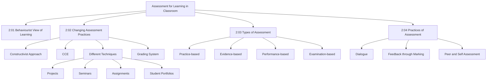
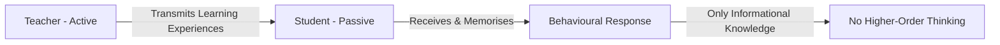
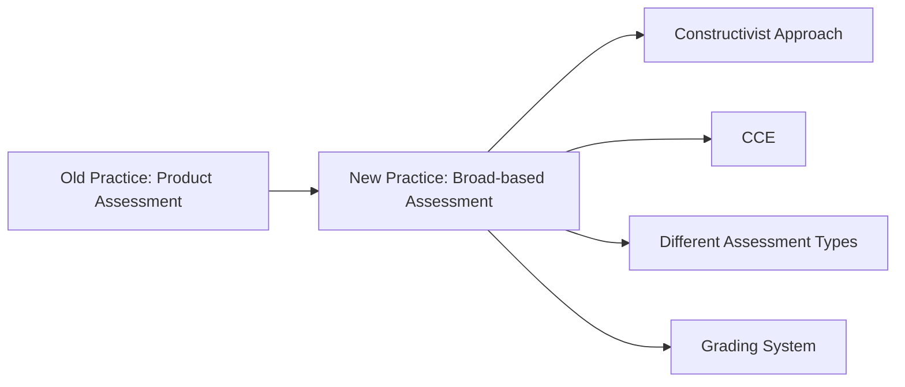
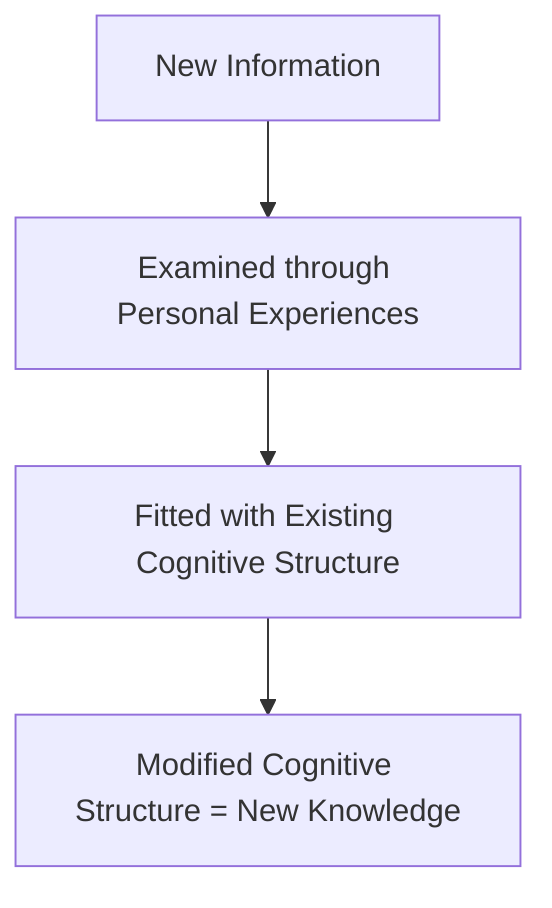
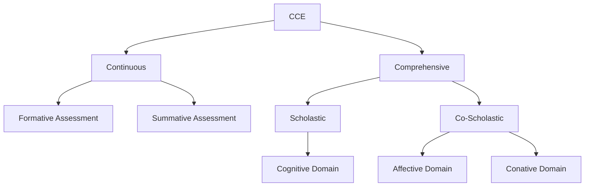
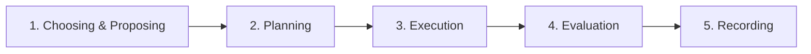
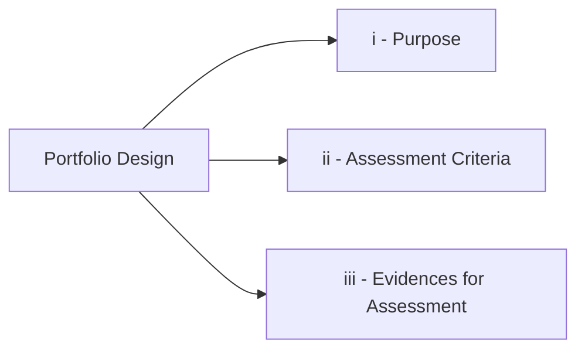
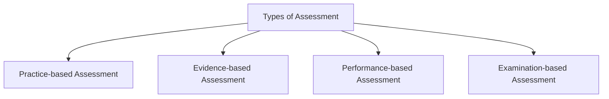
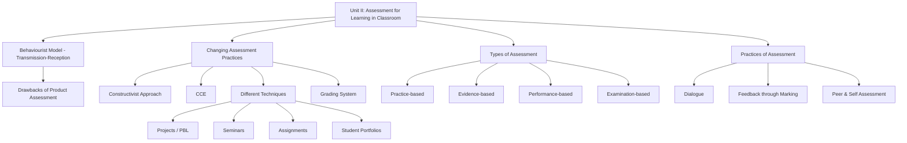

# UNIT – II: Assessment for Learning in Classroom

---

## 2:00 Introduction

**Classroom assessment** is the process of gathering evidences of what students **know**, **understand**, and are **able to do**. Teachers evaluate students' learning based on criteria formed from **expected learning outcomes** and **level of performance**. These criteria form the basis for evaluating learning progress and reporting to parents.

!!! note "Unit Overview"
    This unit covers:

    - **Behaviourist view** of learning and its drawbacks
    - **Changing assessment practices** in education
    - **Constructivist approach** in assessment
    - **Continuous and Comprehensive Evaluation (CCE)**
    - Techniques: **Projects**, **Seminars**, **Assignments**, **Student Learning Portfolios**
    - **Grading system** in place of marks
    - **Types of assessment**: Practice-based, Evidence-based, Performance-based, Examination-based
    - **Practices of assessment**: Dialogue, Feedback through Marking, Peer and Self Assessment

---

## 2:01 Behaviourist View of Learning

According to **behaviourism**:

> **"Learning is nothing but expressing appropriate behaviour in response to the information received from the environment."**

- In the behaviourist model, the **teacher is active** — provides learning experiences.
- **Students remain passive** — receive, register in memory, and express responses.
- Learning is treated as a **mechanical process** of **Transmission–Reception**.
- Knowledge acquired remains only **informational**, not **functional** (i.e., students cannot apply it).
- There is **no place for higher-order cognitive abilities** like understanding, application, or adaptation.

!!! important "Key Point"
    The behaviourist model treats learning as a **Transmission–Reception** process where the teacher transmits and the student receives. Knowledge stays informational, not functional.

---

### 2:01:1 Student Evaluation in Transmission-Reception Model Based on Behaviourist Theory

In the **Transmission–Reception model**:

- Only **what** students have learned is assessed — **not how** they learned.
- Uses **Product Assessment Approach** (not Process Assessment Approach).
- **Informational knowledge** is assessed through oral or written tests.
- Skills, abilities, attitudes, and values developed through learning are **not assessed**.
- Assessment is **narrow in nature** — does not evaluate learning outcomes comprehensively.

| Aspect | Product Approach | Process Approach |
|---|---|---|
| Focus | What is learned | How learning takes place |
| Assesses | Informational knowledge | Skills, attitudes, values |
| Nature | Narrow | Comprehensive |
| Used in | Behaviourist model | Constructivist model |

---

#### 2:01:1:01 Drawbacks of Assessment Based on Transmission-Reception Model

The **Product Assessment Approach** based on the Transmission–Reception model has the following drawbacks:

1. **Narrow in nature** — assesses only informational knowledge, not comprehensive learning outcomes.
2. **Cannot assess understanding** — difficult to determine whether students truly understood what they learned or can apply it in practical life.
3. **Ignores skills, attitudes, and values** — does not assess proficiency in pertinent skills or development of desirable attitudes and values.
4. **Emphasises summative over formative** — does not continuously improve student learning by removing deficiencies.
5. **Encourages rote learning** — promotes memorisation and retention rather than understanding.
6. **No higher-order thinking** — does not encourage critical thinking, problem-solving, or creative thinking.
7. **Limited test forms** — mainly employs oral and written tests; no other elements of personality development are evaluated.
8. **Does not drive further learning** — does not motivate students to learn beyond what is tested.

!!! tip "Exam Tip"
    Remember the **8 drawbacks** of the Product Assessment Approach: Narrow, No understanding check, Ignores skills/attitudes, Summative only, Rote learning, No higher-order thinking, Limited test forms, No motivation for further learning.

---

## 2:02 Changing Assessment Practices

Previously, emphasis was only on **informational knowledge** acquired by students. Educationists realised the **shortcomings** of this approach:

- Narrowness
- Failure to improve student learning
- Not driving students for further learning

!!! note "Major Changes in Assessment"
    The following **four major changes** have taken place:

    1. **Constructivist approach** in assessment — students actively participate and construct knowledge
    2. **Continuous and Comprehensive Evaluation (CCE)**
    3. **Different types of assessment** adopted
    4. **Grades instead of marks** in assessing student achievement

---

### 2:02:1 Use of Constructivist Approach in Assessment

#### 2:02:1:01 Meaning of Knowledge Construction / Constructivism

**Constructivism** explains how knowledge is constructed when new information comes into contact with existing knowledge developed through personal experiences.

!!! important "Definition"
    **Constructivism**: The learner processes every new information on the basis of personal experiences and assimilates it as new knowledge by fitting it with the existing cognitive structure, thereby modifying it.

**Key ideas of Constructivism:**

- Knowledge is **not** a true copy of the outside world — it is a **personal construction**.
- The learner receives information about objective reality, examines it in light of **past and present personal experiences**, and registers it as **subjective representations**.
- Objective reality is processed and internalised as **subjective knowledge** of the individual.

**A Constructivist Classroom:**

- Facilitates students to **critically examine** new information by raising questions and seeking answers.
- Allows for **collaborative learning** to find solutions.
- Teacher does **not** pour subject contents; importance is **not** given for identical/correct answers.

**Three Principles of Constructivism:**

1. Learning is an **active process**.
2. The learner has **prior knowledge** on the basis of which new information is examined and understood.
3. The learner takes **responsibility** for his/her own learning.

---

#### 2:02:1:02 Constructivism and Assessment

Constructivists believe that **assessment is a tool** for improving both:

- The **student's learning**
- The **teacher's understanding** of students

| Feature | Constructivist Assessment | Traditional Assessment |
|---|---|---|
| Nature | **Formative** process | Summative act |
| Purpose | Improve quality of learning | Evaluate/grade students |
| Timing | **Ongoing** along with learning | End of instruction |
| Focus | Process of learning | Product of learning |

**Assessment at every stage of classroom teaching:**

| Stage | Assessment Activity |
|---|---|
| **Introduction** | Teacher raises questions to test previous knowledge and motivate students |
| **Presentation** | Teacher asks questions linking new concepts with prior knowledge; students cite real-life examples |
| **Feedback** | Teacher provides feedback to enhance understanding |
| **Terminal stage** | Teacher evaluates student learning; serves as basis for next phase |

!!! important "Key Point"
    In the constructivist approach, **assessment of student learning forms a part and parcel of the instructional process**. The primary aim is to **improve and enhance learning**, not to provide evidence for grading.

---

#### 2:02:1:03 Tools and Methods Used in the Constructivist Assessment

In constructivist assessment, the teacher uses methods that allow **engaging students in verbal interactions**:

- **Discussion**
- **Debate**
- **Story telling**
- **Dramatization**

**Assessment tools used:**

- **Observation** of student performance in learning activities
- **Student portfolio**
- **Investigatory projects**
- **Check lists**
- **Written tests**
- **Performance tests** of achievement

---

#### 2:02:1:04 Role of Teacher in Constructivist Assessment

The teacher's role in a constructivist classroom:

1. Often puts **open-ended questions** and patiently waits for student responses.
2. Gives more importance for students' **higher-order thinking** and **logical reasoning**.
3. Ensures adequate opportunities for students to **interact** with the teacher and among themselves.
4. Encourages students to **discuss and share** learning experiences mutually.
5. Encourages learning by **investigating** and **critical thinking**.
6. Gives more importance for **problem-solving** based learning.
7. Uses instructional techniques such as:
    - **Group interacting sessions**
    - **Cooperative learning**
    - **Collaborative learning**
    - **Group project work**
    - **Solving jig-saw puzzles**

**Four Phases of Cooperative Learning Planning:**

1. Making decisions **before** the lesson begins
2. Setting the **learning activities** for the lesson
3. **Monitoring** students' activities while they work in groups
4. **Assessing** the process and product of group work

!!! tip "Three Key Instructional Techniques"
    1. **Stimulating inquiry** related to every concept taught
    2. **Providing for multiple interpretations** — helps multiple intelligences get expressed
    3. **Encouraging group work** and use of peers as resources

---

### 2:02:2 Use of Continuous and Comprehensive Assessment

#### 2:02:2:01 Concept of Continuous and Comprehensive Evaluation – CCE

!!! important "Definition of CCE"
    **Continuous and Comprehensive Evaluation (CCE)** refers to the practice of evaluating students' skills and proficiency that covers **all aspects of development**, **periodically throughout the course**, and maintaining a record of the **cumulative progress** achieved.

**Understanding the two key terms:**

| Term | Meaning |
|---|---|
| **Continuous** | Evaluation is a **continuous process** (not a one-time event), built into the teaching-learning process, spread over the entire academic session. Includes regularity of assessment, frequency of unit testing, diagnosis of learning gaps, corrective measures, retesting, and feedback. Minimum **two formative evaluations** per term/semester + **one summative evaluation** at end of term/semester. |
| **Comprehensive** | Evaluating **all aspects** of students' growth and development across **three domains**: (i) **Cognitive** (ii) **Affective** (iii) **Conative**. Includes both **scholastic** and **co-scholastic** proficiency. Uses a **variety of tools and techniques** (testing and non-testing). |

---

#### 2:02:2:02 Aims of CCE

1. Make evaluation an **integral part** of teaching-learning process — assess at regular intervals and provide feedback.
2. Lay emphasis on **thought process** and de-emphasize **memorization**.
3. **Eliminate subjectivity** or subjective bias in evaluation.
4. Keep students **continually motivated** throughout the academic year.
5. Encourage participation in **co-scholastic activities** besides scholastic proficiency.
6. Help teachers take **corrective measures** based on assessment feedback.
7. Assess students' **multifaceted development** and encourage improvement.
8. Make teaching-learning a **learner-centred** activity.

!!! tip "Summary"
    CCE aims to use evaluation for **improvement** of students' achievement and teaching-learning strategies based on **regular diagnosis** followed by **remedial instruction**, evaluating **all aspects** of student development.

---

#### 2:02:2:03 Characteristics of CCE

1. Assesses student learning **continuously** throughout the academic year at **regular intervals**.
2. Evaluates **all aspects** of learners' progress — both **scholastic** and **co-scholastic**.
3. Scholastic component covers evaluation of **all academic subjects** spread over the entire learning period.
4. Includes **physical education** in its scope.
5. Uses a **variety of tools and techniques**: written tests, observation, rating scale, check list, quiz, etc.
6. Carried out through **Formative Assessment (FA)** and **Summative Assessment (SA)**.
7. FA is **criterion-based**, **diagnostic**, and **remedial** — offers feedback to students and teachers.
8. **Descriptive indicators** are used to assess achievement profile in FA.
9. SA involves **regular and norm-based** assessment at the end of a term/semester.
10. Emphasises **thought process**, de-emphasises **memorization**.
11. **Co-scholastic evaluation** assesses: life skills, attitudes and values, wellness, service activities, and work education.
12. Identifies **individual needs** of learners to help them become efficient citizens.

---

#### 2:02:2:04 Functions of CCE

1. Helps the teacher organise **effective teaching strategies**.
2. Helps assess students' progress **continuously**.
3. **Diagnoses deficiencies** in student learning — ascertains individual strengths, weaknesses, and needs; provides **immediate feedback**.
4. Helps students have **realistic self-assessment** — motivates good study habits, corrects errors, and directs activities towards goals.
5. Identifies areas of **aptitude and interest**; helps identify required changes in attitudes and values.
6. Helps in making **future decisions** — choice of subjects, courses, and careers.
7. Provides **progress reports** in scholastic and co-scholastic areas; helps predict future success.

---

#### 2:02:2:05 Merits of CCE

1. **Continuous evaluation** with regular feedback improves teaching-learning process.
2. Promotes **regular study habits** — increases student motivation.
3. Teaching-learning activities are **well developed**.
4. Students' progress is **reported periodically** to parents — secures their cooperation.
5. Identifies **deficiencies** and takes **immediate remedial measures** including remedial teaching.
6. **Non-threatening** — reduces learner stress by assessing meaningful small portions periodically.

---

#### 2:02:2:06 Disadvantages of CCE

1. **Increased stress and anxiety** — students face increased number of assessment tests conducted frequently.
2. **Inconsistent evaluation** — procedures differ from school to school.
3. **Skewed grading** — teachers give large number of students 'A' grade (75%–89%) even when undeserved; such students struggle in higher classes and fail in 12th standard public examinations.
4. **Impractical in overcrowded classes** — proper implementation is not possible with large student numbers.
5. **Increased teacher workload** — teachers spend more time on evaluation reports and records than on teaching, leading to deterioration of education quality.

---

#### 2:02:2:07 Role of Teachers in CCE

1. Should **not spend excessive days** on assessment tests — preserve time for regular teaching.
2. Enter assessment findings in **proper registers promptly** without delay.
3. Be **honest and fair** in evaluating students' performance.
4. **Never use assessment as a tool to discipline** students.
5. Provide **proper feedback** to students based on assessment reports and take measures to improve learning.
6. **Inform parents** regularly about learning progress and secure their cooperation.

---

### 2:02:3 Adopting Different Techniques in Evaluating Multiple Aspects of Students' Development

Previously, teachers used only **written tests** based on **Benjamin Bloom's Taxonomy of Instructional Objectives** to evaluate cognitive abilities. However, this approach could not evaluate all attainments comprehensively.

!!! note "Modern Practice"
    The practice of evaluating student performance now includes:

    - **Written tests**
    - **Project work**
    - **Seminars**
    - **Assignments**
    - **Student portfolios**

---

#### 2:02:3:01 Projects

##### (A) Meaning and Definition of 'Project'

!!! important "Definitions"
    - **Kilpatrick**: *"A project is a whole-hearted purposeful activity proceeding in a social environment to learn the truth."*
    - **Stevenson**: *"Project is a problematic act carried to completion in its natural setting."*

In short, a **project** is a piece of work or activity completed over a period, intended to achieve a particular purpose.

**John Dewey** initially promoted the idea of **'learning by doing'**, which evolved into **Project-Based Learning (PBL)**.

---

##### (B) Project-based Learning

**Project-Based Learning (PBL)** is a **student-centred pedagogy** involving a dynamic classroom approach where students acquire deeper knowledge through **active exploration of real-world challenges and problems**.

- Students learn by working for an **extended period** to investigate and respond to a complex question, challenge, or problem.
- PBL contrasts with **paper-based, rote memorisation**, or teacher-led instruction.
- The **core idea**: real-world problems capture students' interest and provoke **serious thinking**.

**Role of the Teacher in PBL:**

- Acts as **facilitator and collaborator**
- Frames worthwhile questions
- Structures meaningful tasks
- Coaches knowledge development and social skills
- Constantly monitors participation and assesses learning

**Nature of Projects:**

- Vary in depth, subject content, and activities
- Can be **multi-disciplinary** or **single subject**
- Can involve **whole class**, **small groups**, or **individuals**

---

##### (C) Important Features of Project-based Learning

1. **Collaborative inquiry** — students learn by direct experiences; problem-solving skill improves; opportunities to create something novel.
2. Develops **21st Century Skills**: critical thinking, inquiry, problem-solving, collaboration, communication.
3. **Five stages** of PBL:
    1. Choosing and proposing the project
    2. Planning
    3. Execution
    4. Evaluation
    5. Recording
4. Incorporates **feedback and revision** — self, peer, and teacher assessment.
5. Develops **social skills**: cooperation, collaboration, respecting others' views, team spirit.
6. Teacher can easily assess **how students learn**.
7. Develops **practical knowledge** and **multiple skills**.

---

##### (D) Advantages of Project-based Learning

1. Develops **social responsibilities** through group work.
2. Develops **good work habits** and attitudes.
3. Develops ability to **apply subject contents** to practical life.
4. Promotes **self-directed learning** and **lifelong learning**.
5. Provides opportunities for teacher to **move closely with students** in a meaningful way.

---

##### (E) Demerits and Limitations of Project-based Learning

1. **Absorbs a lot of time**.
2. Involves **much more work** on the part of the teacher.
3. Whole syllabus **cannot be covered** through projects; difficult to finish syllabus in limited time.
4. **Text books and materials** written on project lines are not available.
5. **Expensive** — students bear expenses of field work, outdoor activities, materials, experiments; requires well-equipped library and laboratory.

---

##### (F) Assessing Students' Learning Through Project Work

The following aspects are assessed:

1. **Significance** of the problem selected for investigation.
2. **Planning** the details of gathering necessary data.
3. **Completing** the project within the stipulated time.
4. **Quality, appropriateness, and language style** of the project report.
5. **Participation and involvement** in group work (if group project).
6. **Content proficiency** and improvement in **social skills** achieved.

---

##### (G) Illustration for Conducting a Project

**Example: Mosquito Menace Project**

| Group | Task |
|---|---|
| Group 1 | Investigate causes of mosquito breeding |
| Group 2 | Survey drains and stagnated pools of water |
| Group 3 | Collect information on methods of destroying mosquitoes |
| Group 4 | Implement selected eradication technique and test effectiveness |

- Each group records activities and findings, prepares a report.
- Teacher compiles all group reports into a **comprehensive project report**.

---

##### (H) Characteristics of a Good Project

1. Should allow **active participation** of both learners and teacher.
2. Should be **useful and purposeful**.
3. Should have **definite educational value**.
4. Should be **practicable**.
5. Should provide **maximum number of activities**.
6. Should **not be expensive**.
7. Should promote **investigative ability** among learners.

---

#### 2:02:3:02 Seminars

##### (A) Concept of Seminar

A **seminar** refers to a single person or many persons lecturing or presenting papers on given topics.

**Key features:**

- Generally used in **higher education**.
- At university level, research scholars present theses/dissertations.
- Generally **10 to 15 persons** participate.
- An **expert** (university professor or research guide) serves as **chairperson**.
- Audience listens, raises questions, seeks clarifications, and expresses views.
- More than one speaker can present on **different topics** (not necessarily related).
- **Discussion** takes place between speakers and audience.
- Chairperson **regulates proceedings**.

---

##### (B) Employing Seminar Method of Teaching at the School Level

- Can be used at **high and higher secondary school level**.
- Teacher asks students to prepare an **essay or write-up** (2–3 pages) on a topic.
- Students present papers **one after another** in class.
- After each presentation, other students ask questions and raise doubts.
- Teacher acts as **chairman** and **resource person**.
- Class size should be small — **maximum 20–25 students**.
- Achieves **higher levels of cognitive objectives**: analysis, synthesis, and evaluation.

---

##### (C) Merits of Seminar Method of Teaching

1. Develops the habit of **extensive reading**.
2. Develops the habit of **collecting relevant information** from various sources.
3. **Removes shyness** — develops language ability to present ideas logically and fluently.
4. Develops the **spirit of participation**.
5. Develops the ability to **face students and answer questions boldly**.

---

##### (D) Disadvantages of Seminar as a Method of Teaching

1. Requires **more time, space, and personnel**.
2. Only **few students** may participate; most cannot make proper preparations.
3. Suitable only at **higher education level** — requires mental maturity to independently collect, analyse, and arrange information.
4. Unless the chairperson is skilful, seminars easily degenerate into a **question-answer session or lecture**.

---

##### (E) Evaluating Student's Participation in Seminar

1. **Concepts** in the seminar paper, explanations, illustrations, and appropriateness.
2. Student's ability to **gather information** related to the topic.
3. Student's **communication skills**.
4. Use of **information technology** in presentation.
5. Ability to **clarify doubts** raised by the audience.
6. Ability to **raise appropriate questions** and seek clarifications as an audience member.

---

#### 2:02:3:03 Assignments

##### (A) Meaning of 'Assignment'

!!! important "Definition"
    **Assignment** in the teaching-learning process refers to the **learning activities allotted by the teacher** to students — either drill and practice of knowledge already acquired, or carrying out theoretical study or practical activities on individual or small group basis, aimed at realising stipulated instructional objectives.

---

##### (B) Procedure for Using Assignment as a Teaching Device

1. Divide the yearly syllabus **topic-wise** into suitable parts; decide which to teach in class and which to allot as assignments.
2. Instruct students to finish assignments within a **specified period**, allowing adequate time.
3. Teacher should give **relevant references** and guide students in preparation and completion.
4. Initial assignments should be **simple and easy**; gradually increase difficulty level.
5. Give more assignments for **theoretical topics**; for practical work, provide necessary suggestions and guidelines.
6. No student should proceed to the **next assignment** without completing the previous one.
7. Assign **specified time in class** for submitting completed assignments.
8. Students who haven't finished the **theory part** should not proceed to related practicals.
9. Students should keep a **written record** of their assignments.

---

##### (C) Advantages of Providing Assignment

1. Teacher can allot assignments according to each student's **mental ability, capacity, and interest** (addresses individual differences).
2. Develops desirable habits:
    - **Sense of responsibility** to finish tasks
    - **Self-study** and working with self-confidence
    - **Self-dependency** in action and thought
3. Provides **freedom in learning** — students can use library, laboratory, get hints from teachers and classmates; work without stress.
4. **Rapport** between teacher and students increases.
5. Written records help teacher know students' **abilities and progress**; students understand their **strengths and weaknesses**.
6. Reduces **student indiscipline** as students focus on assignments.
7. Based on **'Learning by Doing'** — promotes better learning.

---

##### (D) Limitations and Disadvantages of Assignment as a Teaching Device

1. **Not suitable for all students** — not for slow learners or those lacking interest; suitable only for average and above intelligence.
2. **Gives room for cheating** — students may copy from others.
3. **Increases teacher's workload** — allotting, guiding, and evaluating assignments adds strain.
4. **Proves expensive** — printing/cyclostyling assignment topics and references; students spend money and time.
5. **Other practical difficulties**:
    - Crowded classes with large number of students
    - Paucity of good text books and reference books
    - Difficulty in covering heavy syllabus
    - Non-conformity of present examination system with assignment system
    - Paucity of teachers oriented to use assignments

---

##### (E) Suggestions for Improving 'Assignment' as a Teaching Device

1. Use assignment **along with other teaching devices** — integrate with regular classroom teaching as a supplement.
2. Plan and prepare assignments **well in advance** on a variety of topics.
3. Assignments should be **well graded and sequentially arranged** — simple to difficult.
4. Permit students to execute assignments in **library, laboratory, and at home**.
5. Provide assignments for **revision, application, or advanced study**.
6. **Synthesize assignments with projects** to make teaching useful in day-to-day life.

---

##### (F) Assessing Students' Learning Based on Assignments Submitted

- Assignments can be completed **in class or at home** within a specified period.
- Teacher distributes topics **group-wise**; students gather information, prepare as an essay, and submit individually.
- Teacher provides **reference books, website addresses**, and guidance.

**Peer Assessment of Assignments:**

- Assignments are distributed to **other group members** for evaluation.
- Teacher prepares **guidelines for scoring** and provides a copy to each member.
- All assignments are evaluated **simultaneously**.
- The evaluator **signs** the script; after evaluation, scripts are returned.
- Students check whether evaluation is done properly; complaints are resolved by the teacher.
- This practice **reduces teacher's workload** and allows all students to know expected information for each topic.

---

### 2:02:4 Students' Learning Portfolios

#### 2:02:4:01 Meaning of Student Learning Portfolio

A **portfolio** in education is a documented collection of students' various learning activities, made available to parents, teachers, and educationists, showcasing **how learning took place**.

!!! important "Key Concept"
    The core of portfolio assessment is providing opportunities for students to **demonstrate** rather than **tell** about what they know and can do.

**Portfolio assessment** = Collecting and assessing information regarding student learning from **various sources**, using **multiple methods**, over **multiple points of time**.

**Contents of a student portfolio (artifacts/evidence):**

- Drawings, photos, video/audio tapes
- Writing or other work samples
- Computer discs
- Copies of answer scripts for tests

**Verification sources:** Teacher, parents, staff, community members who know the student.

!!! note "Example"
    In B.Ed. examination: Camp record, SUPW record, Audio-Visuals record, Micro-teaching record etc. are considered as learning portfolios.

---

#### 2:02:4:02 Definitions of Student Learning Portfolio

| Scholar | Definition |
|---|---|
| **Paulson and Mayer** | *"Student learning portfolio is a collection of student's work that exhibits the student's efforts, progress and achievements in one or more areas."* |
| **Grace** | *"A record of student's process of learning — what the student has learned, how he/she has gone about learning, how he/she thinks, questions, analyzes, synthesizes, produces, creates and how he/she interacts intellectually, emotionally and socially with others."* |
| **DeFina** | *"Student learning portfolios are systematic, purposeful and meaningful collection of student's work in one or more subject areas."* |

!!! tip "Summary Definition"
    **Student learning portfolio** is a systematic and purposeful collection of evidences in a given subject of study which reflect the **level of learning achievement** exhibited by the student and the **efforts put in** over a period of time.

---

#### 2:02:4:03 Assessing Student's Learning by Using Learning Portfolio

**Steps for the teacher:**

1. **Select** various learning activities that could be undertaken in the subject content area.
2. **List** the selected learning activities based on objectives of assessment.
3. **Determine** the criteria for assessing every learning activity.
4. **Clarify** to students about the learning activities, objectives, and criteria of assessment.
5. **Analyse and evaluate** each student's learning activities over a period of time; assign marks or grade.

**Example — Science (Newton's Laws of Motion):**

1. Students stating Newton's laws in their **own words**
2. Citing **illustrations** from day-to-day life
3. Developing an **improvised aid** for explaining each law
4. Preparing an **essay** on what would happen if each law didn't function
5. **Solving numerical problems** using Newton's laws
6. **Explaining** by drawing suitable diagrams

**Example — Language Skills Assessment:**

- Ability to **express ideas**
- Ability to **interpret information/data**
- Skill of **presentation**
- Skill of **comparing and contrasting**
- Skill of **group discussion**
- Skill of **functioning as a team**

Additional portfolio items: audio discs, recorded speeches, essays, seminar texts, project reports, answer sheets, poems composed, etc.

---

#### 2:02:4:04 Designing the Portfolio Assessment of Student-Learning

Three main factors guide the design:

**i) Purpose**

- Clarify what the portfolio will serve: assessing learning progress, reporting to parents, identifying special needs, programme accountability, or all of these.

**ii) Assessment Criteria**

- Decide what constitutes **success or good performance** (criteria to judge).
- Determine strategies to meet goals.
- Select items that provide **evidence** for meeting criteria or making progress.

**iii) Collecting Evidences for Assessment**

| Type | Description | Example |
|---|---|---|
| **Artifacts Produced** | Items produced in normal course of classroom activities | Essays, improvised aids, audio/video discs |
| **Reproductions** | Documentation of interviews or projects done outside classroom | Field interviews, external projects |
| **Attestations** | Statements by teaching staff, librarian, and other staff testifying student participation | Certificates, observation notes |
| **Production** | Items prepared especially for the portfolio | Participant reflections on learning experiences |

---

#### 2:02:4:05 Advantages of Using Portfolio in Student Learning Assessment

1. Assesses student learning **over a period of time** in **multiple ways**.
2. Assesses proficiency in a **realistic situation** (better than paper-pencil tests).
3. Allows students, teachers, and parents to assess **strengths and weaknesses**.
4. Helps students **demonstrate** their learning rather than describe it.
5. Develops abilities to become **independent and self-directed** learners.
6. Helps students use **creative ways** to share what they have learned.
7. **Improves relationships** among students, teachers, and parents by providing detailed information about learning progress.

---

#### 2:02:4:06 Disadvantages of Portfolio Assessment of Student-Learning

1. **Less reliable** in measuring learning achievement compared to written tests — better for assessing quality than quantity.
2. **Time consuming** for teachers to organise and evaluate multiple learning activities; workload increases manifold; **impractical in overcrowded classes**.
3. Requires teachers to develop **individualised criteria** — can be difficult and unfamiliar.
4. If goals and criteria are **not clear**, portfolio becomes a miscellaneous collection of artifacts — cannot assess learning progress.
5. Like any qualitative data, portfolio assessments are **difficult to analyse or aggregate** to decide the level of learning achievement.

---

### 2:02:5 Use of Grading in the Place of Marks in the Assessment of Student Performance

!!! important "Definition"
    **Grading** in education refers to the classification of students into a few graded categories according to their level of achievement in examinations in every subject of study.

**Types of grading scales:**

- **Letters**: A to E (or nine-point scale: A₁, A₂, B₁, B₂, C₁, C₂, D₁, E₁, E₂)
- **Numbers**: Range 1 to 5 (or 1 to 9)

**History:**

- Developed by **William Farish**
- First implemented by **University of Cambridge in 1792**
- In India: **CBSE** started nine-point grading scale from **2010–11** for Stds. VI to X
- **Tamilnadu Government**: Grading system from **2012–13** for Stds. I to VIII; from **2013–14** for Stds. IX and X

---

#### 2:02:5:01 Important Features of the Grading Scheme Followed by the Tamilnadu Government

1. Only **grades** (not marks) mentioned in certificates and school records.
2. Practice of declaring **'pass' or 'fail' has been stopped**.
3. Results declared in two categories:
    - **(i) Eligible for qualifying certificate**
    - **(ii) Advised to improve performance**
4. No **'overall marks'** — only **Grade Point Average (GPA)** is mentioned.
5. Candidates scoring less than 33% get **five chances** to improve without repeating a year.

**Nine-Point Grade Scale:**

| Marks | Grade | Grade Point | Verbal Discrimination |
|---|---|---|---|
| 91–100 | A₁ | 10 | Outstanding Performance |
| 81–90 | A₂ | 9 | Excellent Performance |
| 71–80 | B₁ | 8 | Very Good Performance |
| 61–70 | B₂ | 7 | Good Performance |
| 51–60 | C₁ | 6 | Above Average Performance |
| 41–50 | C₂ | 5 | Average Performance |
| 33–40 | D | 4 | Adequate Performance |
| 21–32 | No Grade Point | — | Inadequate Performance; needs improvement |
| 0–20 | No Grade Point | — | Poor Performance; needs huge improvement |

!!! note "Minimum qualifying level"
    Grade **'D'** and above is the minimum level for qualifying in any subject.

6. Those below Grade 'D' get **five chances** to improve.
7. First chance to improve is in an examination held **within about a month** in the same year — those who succeed can study Std. XI without wasting a year.

**Formulas:**

- **Percentage of marks in a subject** = Grade Point × 9.5
- **Grade Point Average (GPA)** = Cumulative Grade Points (CGP) ÷ Total number of subjects
- **Overall percentage of marks** = 9.5 × GPA

---

#### 2:02:5:02 Uses of Grading System

1. **Reduces mental stress** — eliminates the notion that 59% is less proficient than 60%.
2. Students with scores in a **particular class interval** are considered **equal** in proficiency.
3. A student's grade is **not influenced** by the achievement level of other students.
4. **Avoids competition** among students.
5. Students who fail to achieve minimum proficiency are given a **chance to improve** and get admitted to the next class **without wasting an academic year**.

---

## 2:03 Types of Assessment

Assessment is an **integral part** of the teaching-learning process. It requires the teacher to use different evaluative methods and tests to assess students' **knowledge, understanding, skills, attitudes, and values**.

!!! important "Four Important Types of Assessment"
    1. **Practice-based Assessment**
    2. **Evidence-based Assessment**
    3. **Performance-based Assessment**
    4. **Examination-based Assessment**

---

### 2:03:1 Practice-based Assessment

**Practice-based assessment** was initially used in professional courses like **Teacher Education**, **Nurse Training**, and **Medical Education** for evaluating how far students apply knowledge and skills in the true professional setting.

**Example — B.Ed. Course:**

| Step | Activity |
|---|---|
| 1 | Student-teachers observe classroom teaching of the mentor (guide teacher) |
| 2 | Student-teachers practise regular classroom teaching in the presence of the mentor |
| 3 | Mentor provides **feedback** after each practice-teaching session |
| 4 | Student-teacher uses feedback to improve and practise again on a different topic |
| 5 | Cycle repeats **at least 10 times** per school subject |
| 6 | Mentor awards marks for teaching competency |

!!! important "Key Feature"
    The important feature of practice-based assessment is **providing practice with feedback** to improve learning achievement.

**In School Classroom:**

- After teaching a topic → conduct **achievement test** → provide **feedback** → student improves → **test again** → provide feedback
- This cycle runs **at least three times**
- The **best among the three scores** is taken as the learning achievement score
- Test may be: **oral test, written test, or performance test**

!!! tip "Core Principle"
    *"Practice with feedback improves student learning."* Any learner can achieve his/her learning goal — more intelligent ones may require less practice, while those with less intelligence require more practice.

---

### 2:03:2 Evidence-based Assessment

!!! important "Definition"
    **Evidence-based assessment** refers to evaluating student achievement of **Expected Learning Outcomes (ELOs)**. It involves determining ELOs, arranging the teaching-learning process based on them, gathering evidences during teaching, and assessing them.

- This is essentially **formative assessment** in nature.
- First introduced in the field of **medicine**, later extended to education.
- Assessment happens **during** the period of instruction, not at the end.

**Methods of gathering evidence:**

- Interaction with students
- Observing how students carry out tasks
- Participation in classroom discussions
- Oral tests, quiz, practical work
- Analysis of work products (poems, charts, diagrams, models)

!!! note "Key Point"
    The learning evidences created by a student in an academic year may become his/her **Learning Portfolio**.

**Methods of Gathering Direct and Indirect Evidences:**

| Direct Evidences | Indirect Evidences |
|---|---|
| Assessing student learning by conducting **oral tests, quiz** in class | Assessing participation in **small group discussions, brainstorming sessions** |
| Making students undertake **projects, field study** | Assessing skills and attitudes through **laboratory work and field investigations** |
| Observing **direct participation** in classroom activities | Assessing involvement and interest in **co-curricular activities** |
| Using **criterion-referenced tests** to assess achievement in terms of grades | Comparing each student's achievement with **class average (Grade Norm)**; assessing **student learning portfolio** |

---

### 2:03:3 Performance-based Assessment

!!! important "Definition"
    **Performance-based assessment** is defined as evaluating students' ability to **apply the skills and knowledge** learned from a unit or units of study to **complete a given task**. The task challenges students to use **higher-order thinking skills** to create a product or complete a process (Chun, 2010).

- Started in the **1990s** as a valid alternative to traditional multiple-choice tests.
- Tasks range from **simple constructed response** (short answer) to **complex design proposals**.
- The most genuine assessments require students to complete tasks that closely mirror **professional responsibilities** (artist, engineer, lab technician, financial analyst, etc.).

**Example:** Asking students why **Boyle's Law** (at constant temperature, pressure and volume of a gas are inversely proportional) cannot be applied to a man blowing a balloon (where both volume and pressure increase).

---

#### 2:03:3:01 Essential Components of Performance-based Assessment

Test items or tasks should consist of one or more of the following constructs:

1. **Complex**
2. **Authentic**
3. **Process or Product oriented**
4. **Open-ended**
5. **Time-bound**

!!! note
    Students are presented with an **open-ended question** that may produce several different correct answers. In higher-level tasks, there is a sense of urgency for the product or process, as in most real-world situations.

---

#### 2:03:3:02 Teachers Preparing Students for Performance-based Assessments

**Steps in the teaching-learning process for performance-based assessment:**

**1. Identifying goals of the performance-based assessment**

- E.g., evaluating ability for **critical thinking and problem-solving**
- Criteria: student completing every step of a task **without seeking help**

**2. Selecting the appropriate course standards**

- Select the **Common Core Standard** to be addressed
- E.g., XII Std. Maths — assessment should measure understanding of **Conditional Probability** and rules of probability

**3. Reviewing assessment and identifying learning gaps**

- Analyse assignments to find what is missing
- Conduct **brainstorming sessions** — teacher selects most appropriate ideas/answers

**4. Preparing the Examination (Blue-Print Method)**

| Step | Activity |
|---|---|
| Fix content areas to be tested | Identify instructional objectives |
| Determine type of test items | Essay, short answer, very short answer, objective type |
| Determine weightages | Content areas, objectives, type of items |
| Develop **Blue-Print** | Based on marks allotted |
| Develop questions | According to blueprint |
| Assemble question paper | Group same type items together |
| Prepare **Scoring Scheme** | Scoring cues for awarding marks |

**Objective type items include:** Fill in the blanks, True/False, Multiple Choice, Matching.

!!! tip "Key Point"
    Preparing the **Scoring Scheme** before conducting the examination ensures **objectivity and consistency** in scoring.

- Instead of teacher-made tests, **Standardized Tests** could also be used.

**5. Gather / Create Suitable Learning Materials**

- Students may be given assignments to cite **practical applications** in daily life.

**6. Developing a Learning Plan**

- Teachers develop instructional plans that help students in performance assessment **and** make them understand concepts and develop ability to find **practical applications** in daily life.
- Strike a balance between **teaching contents** and **preparing students for performance-based tasks**.

---

### 2:03:4 Examination-based Assessment

!!! important "Definition"
    **Examination** is the test that assesses the subject knowledge and skills acquired by students at the **end of the instructional period**. The one who is subjected to the test is called **Examinee**.

**Forms of examination:**

- Written test
- Practical test
- On-line test

**Guidelines to Improve Examinations:**

1. Assessment should **reflect the curriculum** — areas assessed should be considered important.
2. Modes of assessment should reflect **curricular goals**.
3. Test items should measure not only **recall and recognition** but also **higher-order outcomes** (application, analysis, synthesis).
4. Should assess students' ability to apply knowledge in **real-life situations** outside school.
5. Content and form should be **free from gender, ethnic group, and location biases**.
6. **60%** of items should be of average difficulty, **20%** easy, and **20%** very difficult.
7. A **blueprint** should be prepared before developing the question paper; preparing the **scoring scheme** is equally important.
8. Ensure **content validity** of the question paper.
9. The examination should contain **different types of test items**.

---

## 2:04 Practices of Assessment of Students' Learning

The practices of assessment followed in the class for **formative evaluation** of student learning are:

1. **Dialogue** between teacher and student
2. **Feedback through marking**
3. **Peer and self-assessment**

---

### 2:04:1 Dialogue

**Dialogue** refers to sharing/exchanging ideas between two or more people.

**Uses of dialogue as an assessment technique:**

1. **Assessing subject knowledge** — Before teaching a topic, the teacher finds through dialogue students' **previous knowledge** related to the topic.
2. **Assessing learning outcomes** — At the terminal stage, the teacher assesses through oral questions how far students have learned.
3. **Assessing language proficiency** — Teachers assess language ability; some students struggle to communicate, others are fluent.
4. **Assessing and directing learning activities** — Dialogue helps evaluate activities (classroom assignments, home assignments) and point out corrections.
5. **Assessing learning achievement** — **Interview** (a form of dialogue) is useful to assess depth of learning; testee cannot provide vague replies or copy others' responses.

!!! note "Interview as Assessment"
    Interview is useful for finding problems of children who find it difficult to learn and offering **remedial measures**. It can assess the **depth of learning achievement** in a very short time.

---

#### 2:04:1:01 Strategies for Employing Dialogue

1. Dialogue could be **structured into many layers** so that different dimensions of ideas get expressed.
2. Getting engaged in **flexible dialogue** by relating many topics.
3. Getting engaged in dialogue that takes the form of **question-answer**.

!!! tip
    By employing these three techniques, dialogue becomes the **medium of classroom interactions** for formative assessment of student learning.

---

### 2:04:2 Feedback through Marking

The important aim of assessment tests is **not only** to measure learning achievement in terms of marks but also to **provide feedback** to improve it.

!!! important "Definition"
    **Providing feedback** refers to making available the **knowledge of results** of one's own actions immediately.

**Psychological basis:**

- Psychologists like **Skinner** demonstrated that knowledge of results serves as a **positive reinforcer** — enhances performance.
- Praise also serves as an effective positive reinforcer.
- **Feedback** is one of the means of achieving reinforcement of desired responses.

**How to provide feedback through marking:**

- While scoring, the teacher should record **comments on the left margin** of the answer script:
    - Which answers require corrections for improving clarity
    - Which are to be modified
    - Which need to be expanded with additional information
    - Which answers are really good
- While returning scripts, the teacher explains how answers could be improved.

**Differentiated feedback based on performance:**

| Score Range | Feedback Approach |
|---|---|
| **Below 40%** | Inform correct answers; ask students to **rewrite** correct answers once |
| **40%–60%** | Provide **detailed feedback** — point out corrections, explain aspects requiring refinement |
| **Above 60%** | Provide **detailed feedback** — how to improve further with illustrations, additional information, appropriate units |

---

#### 2:04:2:01 Principles of Good Feedback Practices

1. Feedback should make students know what **good performance** is.
2. Feedback should help students to **self-correct** their responses.
3. Provide opportunity for students to **resubmit answers** after improving with feedback.
4. Arrange for **discussion** with students regarding ways of improving learning achievement.
5. Allow **enough time** for students to reflect on their achievement and ways of improving based on feedback.
6. During feedback sessions, make students know the **criteria for appropriate answers** expected by examiners.
7. Feedback should encourage **positive motivational beliefs and self-esteem** — should **not** involve severe criticism or condemning.

!!! tip "Summary"
    Feedback through marking should help students know their learning achievement and shortcomings, corrections required, and **motivate them to undertake self-correction**.

---

### 2:04:3 Peer and Self Assessment

#### 2:04:3:01 Peer Assessment

!!! important "Definition"
    **Peer assessment** is a process wherein students individually assess and grade each other's assignments or test papers based on a **predetermined list of criteria**.

**Benefits:**

- **Reduces teacher's workload**
- Helps students know the **criteria for judging** an assignment or answer
- Students understand **different viewpoints** on concepts
- Expands **subject knowledge**
- Improves **meta-cognitive skills**: critically evaluating and self-reflecting on own learning

**Guidelines for implementation:**

- Peers must be provided with **'Guidelines for Assessment'** containing the list of criteria.
- In due course, students can **discuss and develop criteria** themselves.
- The **average of marks** awarded by group members is taken as the final mark/grade.

**Practical procedure in a crowded class:**

1. Assignments/answer papers are **distributed randomly** among students.
2. Each student evaluates another's work based on **guidelines provided by the teacher**.
3. All assignments are evaluated **simultaneously**.
4. The evaluator puts **signature with name** on the script.
5. Scripts are **returned** to respective students to check evaluation.
6. Complaints about errors are shown to the teacher for correction.
7. If students are cautioned that **difference in marks** reported will be subtracted from their own marks, they will assess honestly.

---

#### 2:04:3:02 Self-Assessment

!!! important "Definition"
    **Self-assessment** involves a student taking responsibility for **monitoring and making judgements** about different aspects of his/her own learning, now and then.

**Two stages of self-assessment:**

1. **Determining the accepted criteria** or standard for assessing learning outcomes.
2. **Judging** the extent of learning proficiency achieved based on the criteria.

!!! note "Key Insight"
    Though self-assessment assesses the **product of learning**, it is a **learning process in itself**. The term **'self-evaluation'** is more appropriate as it develops skills of judging quality, identifying shortcomings, and finding ways to remove them. **Self-assessment leads to self-learning** — hence it is both **summative and formative**.

**Benefits of Self and Peer Assessment:**

1. Students develop the skill of **assessing their own learning**.
2. Apart from assessment skills, **self-learning** also takes place.
3. Help students discuss and decide **essential elements of quality work**.
4. Enable students to understand the **subjective nature of judgements** in assessments.
5. Understand the need for **forming criteria** before starting evaluation.
6. **Reduce significantly** teacher's workload and time spent in marking.
7. Help to **assess group work**.
8. Develop student **involvement and responsibility**.
9. Encourage students to **reflect on their role** and contribution to group work.
10. Help provide feedback by combining **learning achievement and assessment of learning**.

---

## Conclusion

!!! tip "Quick Revision Summary"
    - **Behaviourist model** → Transmission-Reception → Product assessment → Narrow, rote learning
    - **Constructivist approach** → Active learning → Process assessment → Comprehensive
    - **CCE** → Continuous + Comprehensive → Formative + Summative → All domains
    - **Projects** → Learning by doing → 5 stages → Develops 21st century skills
    - **Seminars** → Paper presentation → Higher cognitive objectives → 10–15 participants
    - **Assignments** → Learning activities allotted → Individual differences addressed → Learning by doing
    - **Portfolios** → Systematic collection of evidences → Demonstrates learning → Multiple methods
    - **Grading** → Classification into categories → Reduces stress → Nine-point scale
    - **Practice-based** → Practice with feedback → Best of three scores
    - **Evidence-based** → ELOs → Formative → During instruction
    - **Performance-based** → Apply skills → Higher-order thinking → Open-ended tasks
    - **Examination-based** → End of instruction → Blueprint → Scoring scheme
    - **Dialogue** → Exchange ideas → Assess knowledge, outcomes, language
    - **Feedback through marking** → Knowledge of results → Positive reinforcement → Differentiated
    - **Peer assessment** → Students evaluate each other → Criteria-based → Reduces workload
    - **Self-assessment** → Monitor own learning → Summative + Formative → Leads to self-learning
