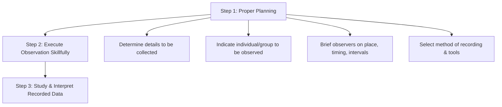
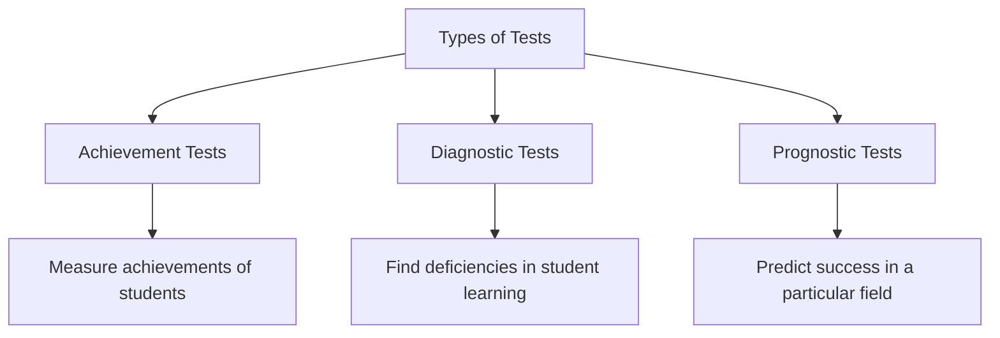
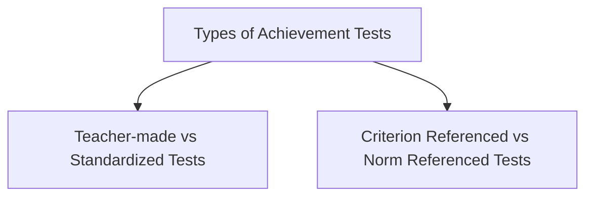
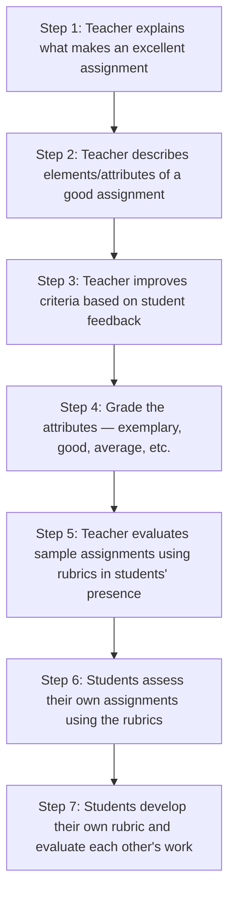
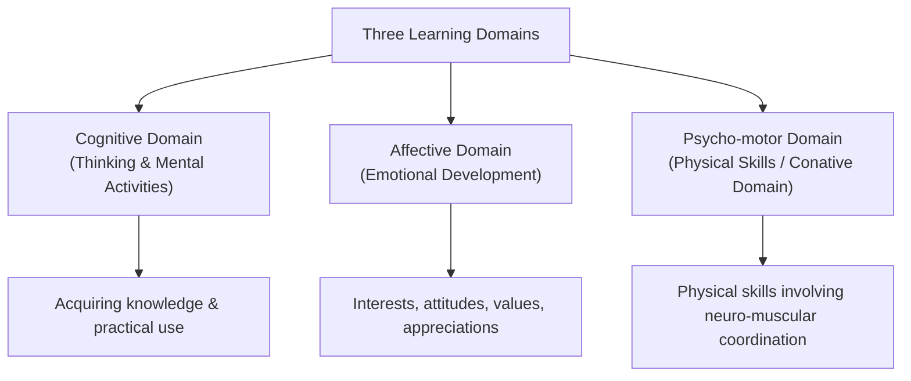
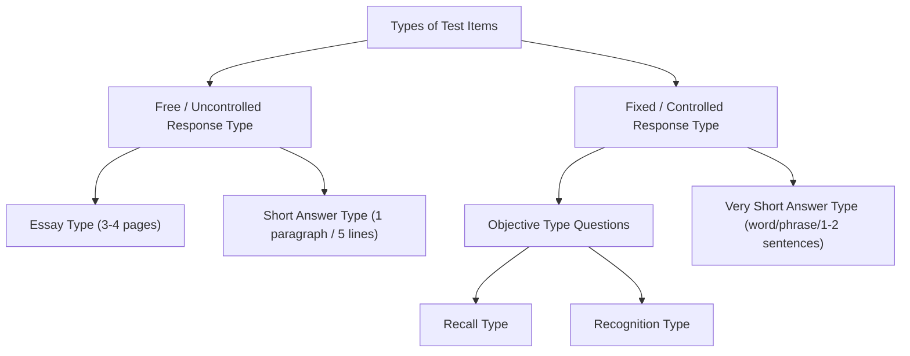
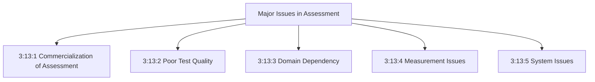
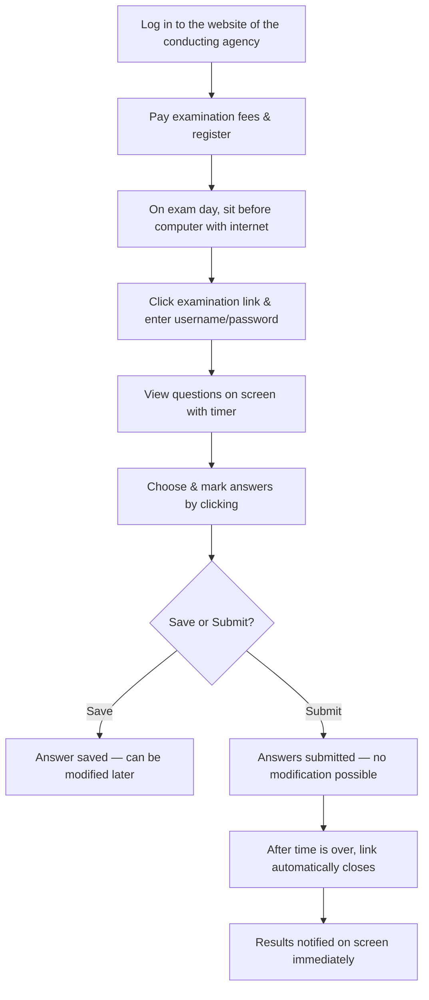

# UNIT – III: Tools and Techniques for Classroom Assessment

---

## 3:00 Introduction

This unit covers the important **tools and techniques for classroom assessment** including observation, self-reporting techniques, anecdotal record, check list, rating scale, different kinds of tests, rubrics, assessment tools for the affective domain, types of test items, principles for constructing test items, major issues in assessment, and reforms in assessment.

!!! note "Unit Overview"
    Topics covered in this unit:

    - **Observation** — types, procedures, uses, limitations
    - **Self-reporting Techniques** — advantages and disadvantages
    - **Anecdotal Record** — meaning, features, maintenance, uses, limitations
    - **Check List** — uses, merits, limitations
    - **Rating Scale** — types, construction, merits, limitations
    - **Types of Tests** — Achievement, Diagnostic, Prognostic, Ability, Oral, Practical
    - **Rubrics** — purpose, examples, steps to create, importance
    - **Assessment Tools for Affective Domain** — Attitude Scales, Motivation Scales, Interest Inventories
    - **Types of Test Items** — Objective, Short Answer, Paragraph, Essay
    - **Principles for Constructing Test Items**
    - **Major Issues in Assessment** — Commercialization, Poor Test Quality, Domain Dependency, Measurement Issues, System Issues
    - **Reforms in Assessment**
    - **Open Book System**
    - **Online Examinations**

```mermaid
graph TD
    A[Tools & Techniques for Classroom Assessment] --> B[3:01 Tools & Techniques]
    A --> C[3:02 Observation]
    A --> D[3:03 Self-reporting Techniques]
    A --> E[3:04 Anecdotal Record]
    A --> F[3:05 Check List]
    A --> G[3:06 Rating Scale]
    A --> H[3:07 Types of Tests]
    A --> I[3:08 Rubrics]
    A --> J[3:09 Assessment Tools – Affective Domain]
    A --> K[3:10 Measuring Interest]
    A --> L[3:11 Types of Test Items]
    A --> M[3:12 Principles for Constructing Test Items]
    A --> N[3:13 Major Issues in Assessment]
    A --> O[3:14 Reforms in Assessment]
    A --> P[3:15 Open Book System]
    A --> Q[3:16 Online Examinations]
```



---

## 3:01 Tools and Techniques for Classroom Instruction

To assess students' **learning achievement** and their **method of learning**, teachers must collect various relevant information. Depending on the **purpose of assessment** and the **nature of information** to be collected, the teacher selects appropriate tools and techniques.

!!! important "Key Definitions"
    - **Assessment Techniques** = Methods of organising the various activities in an assessment process
    - **Tools of Assessment** = Devices and materials employed in assessment techniques

    **Example:** If *observation* is used, the observational activity is the **technique**, and devices like *checklist* and *rating scale* are the **tools**.

### Important Tools and Techniques for Classroom Assessment

| S.No. | Tool / Technique |
|-------|-----------------|
| i | Observational Techniques |
| ii | Self-reporting Techniques |
| iii | Anecdotal Record |
| iv | Check List |
| v | Rating Scales |
| vi | Different Kinds of Tests |

---

## 3:02 Observation

**Observation** is keenly watching the **external behaviour** of persons in appropriate situations — controlled or uncontrolled.

!!! tip "Definitions"
    - **C.V. Good:** Observation is concerned with neither what a respondent places on paper, nor with what he says in an interview.
    - **Young:** Observation is careful and systematic viewing of a selected situation and recording then and there, what is perceived.

- In modern times, observation techniques have been refined using **audio and video recording devices**, **telescopes**, **thermometers**, **audiometers**, **stop-watches**, etc.
- Observation is considered a **non-testing device**.

**Example:** A teacher can guess that a student is highly anxious by observing external symptoms like **trembling hands**, **incoherent speech**, **biting nails**, and **restlessness**.

---

### 3:02:1 Procedures to be Followed for Good Observation

1. In appropriate situations, observe the **whole event**
2. Observe only **one aspect** of an individual's behaviour at a time
3. Observe **without the knowledge** of the observed and record **then and there**
4. Observer should **not mix opinions and guesses** with observed data
5. Observation should be **continuously carried out** within the time schedule

---

### 3:02:2 Steps Involved in Carrying Out a Good Observation



**Step 1: Proper Planning**

- **(a)** Determine the **behaviour aspect / incident** to be observed beforehand
- **(b)** Precisely indicate the **individual or group** to be observed
- **(c)** Give clear briefing about **places**, **timings**, **time intervals**, and **minimum number of observations**
- **(d)** Select the **method of recording** and **tools** to be used (Check List, Descriptive Rating Scale, Score Cards, Tally Mark Forms, etc.)

**Step 2:** Execute the observation **skillfully** and record the data **carefully**

**Step 3:** Study and **interpret** the recorded data

---

### 3:02:3 Types of Observation

There are several types of observations:

| Type | Category |
|------|----------|
| Participant / Non-participant | Based on observer's role |
| Natural / Artificial | Based on setting |
| Scheduled / Unscheduled | Based on planning |

---

#### 3:02:3:01 Participant Observation

- The observer **finds a place in the group** where the observed is a member
- By **participating in group activities**, the observer can understand the group's functioning
- Helps gather factual information about the observed person's **behaviour**, **performance**, **attitudes**, **sociability**, **leadership**, and other **personality traits**

---

#### 3:02:3:02 Non-Participant Observation

- Best suited to observe **infants**, **maladjusted individuals**, and similar persons
- The observer takes a position where his **presence goes unnoticed** and is **least disturbing**
- Permits the use of **recording instruments** and gathering of **large quantity of data**

!!! note "Key Point"
    Among the several observation methods, **uncontrolled observation** (natural situation) and **controlled observation** (artificial) are the two types largely used in education.

---

#### 3:02:3:03 Uncontrolled Observation

Observing students in **classrooms**, **playgrounds**, **library**, and **common places** without their knowledge is an example of uncontrolled observation.

---

#### 3:02:3:04 Controlled Observation

- A child is asked to study in a **silent room** and then in a **noisy room** to compare learning achievements
- The child's learning efficiency is **more in a silent atmosphere** and **less in a noisy environment**
- In this experiment, **noise level is controlled** and the child's behaviour (learning outcomes) is compared in opposite situations

!!! tip "Key Difference"
    - **Uncontrolled Observation** = Observing in natural settings without manipulation
    - **Controlled Observation** = Manipulating conditions and comparing behaviour in opposite situations

---

### 3:02:4 Uses of Observation

1. Helps understand a person's **mental state** — happiness, sorrow, anger, excitement
2. Used to evaluate a **student-teacher's performance** or teaching ability in colleges of education
3. Useful for understanding a person's **personality**
4. Suited for **individuals** as well as **groups**
5. Observers need only **short-term training**
6. Suits **all age groups** and **both genders**
7. **Not expensive** — may need only a few gadgets
8. Observing in the **natural environment** provides **reliable information**
9. Observation tools can be **designed to meet any situation**

---

### 3:02:5 Limitations of Observation as a Technique of Assessment

1. **Personal likes and dislikes** of the observer affect the quality of observation
2. Only **expressed behaviour** can be observed; **inner feelings** cannot be found out
3. Recording may **not be done on the spot** — data recorded may not be accurate
4. Observation requires **more time**, **more patience**, and a **keen insight**

---

## 3:03 Self-reporting Techniques

In self-reporting techniques, the **respondent himself provides answers** to items in a given questionnaire concerning his characteristics or behaviour — either **orally** or in **written form**.

- The investigator gathers answers by reaching out the questionnaire **in person**, through **post**, or **phone**
- In **interviews**, the interviewer asks questions face-to-face, besides noticing the respondent's **mood**, **likes**, **dislikes**, **fears**, etc.
- Extensively used for assessing **attitudes**, **interests**, **adjustment in behaviour**, and other **personality traits**

---

### 3:03:1 Examples for Self-reporting Techniques

| S.No. | Technique |
|-------|-----------|
| i | Questionnaire |
| ii | Opinionnaire |
| iii | Check List |
| iv | Interest Inventory |
| v | Attitude Scale |

!!! note "Well-known Self-reporting Devices"
    - **Woodworth's Personal Data Sheet**
    - **Bell's Adjustment Inventory**
    - **The Minnesota Multiphasic Personality Inventory (MMPI)**
    - **Thurstone's Occupational Interest Inventory**
    - **S.P. Ahluwalia's Teacher Attitude Inventory**
    - **Strong-Campbell Interest Inventory**

---

### 3:03:2 Advantages of Self-reporting Techniques

1. Answers obtained **directly from respondents** — gathered responses are **highly valid**
2. **Large amount of data** can be obtained **quickly and cheaply**
3. Left-out data can be **easily obtained back** — data is **highly reliable**
4. Data from **closed-form questions** can be easily **tabulated and analysed**

---

### 3:03:3 Disadvantages of Self-reporting Techniques

1. Respondents may **not give answers completely and honestly** — may hide information
2. Respondents tend to give **socially acceptable answers** — reliability is mostly **low**; cross-checking through other sources is necessary
3. Chances of questions being **misunderstood**
4. Answers may be **influenced by the respondent's mood** at the time of answering
5. Most devices contain **fixed-choice questions** and **lack flexibility** — no opportunity for supplementary information
6. **Low response rate**

---

## 3:04 Anecdotal Record

### 3:04:1 Meaning of Anecdotal Record

In everyone's life, particularly during youth, a few **noteworthy incidents/events** occur. These incidents reveal the **nature of one's mind** and **abilities**. Recording such episodes and compiling them is called an **anecdotal record**.

!!! important "Definition"
    An anecdotal record is a **factual description of meaningful incidents and events** which the teacher has observed in a student's life.

- Highlights the student's **personality traits**, **needs**, **problems in social adjustment**, **special abilities**
- Useful for providing **guidance and counselling**

---

### 3:04:2 Definition of Anecdotal Record

- **Raths Louis:** "Anecdotal record is a report of the informations about the significant episodes which happened in a student's life."
- **Traxler:** "Anecdotal record involves setting down accounts concerning some aspects of pupil behaviour which seems significant to the observer."

!!! tip "Analogy"
    An **anecdote** can be compared to a **snapshot of a camera** which catches the pose of an individual at a specific time among a sequence of actions.

---

### 3:04:3 Salient Features of Anecdotal Record

1. **Factual information** about important events is recorded **objectively** — insignificant daily routines are excluded
2. Only **one incident at a time** is observed and recorded
3. Only **one incident per card** — each card is **3" × 5"** in size
4. Cards are arranged **chronologically** and maintained as a record
5. Every teacher maintains **separate cards**
6. Behaviours from **various places** (playground, hostel, laboratory, excursion, assembly hall, etc.) are collected
7. **Description** and **teacher's comments/interpretations** are kept **separately**
8. Records are kept **confidentially**; succeeding events are added **cumulatively**
9. It is only **supplementary** to other methods of data collection — not a reliable strategy on its own

---

### 3:04:4 Maintaining Anecdotal Record

- Teachers should decide **which students** to observe, **when** to observe, and **how** to record
- A **specific time** should be earmarked every day for recording observations
- If there is a **long interval** between observation and recording, the teacher may **forget details** or **add unobserved information**
- Recording **numerous anecdotes of all students** is better than focusing only on problem students
- At the **end of every year**, anecdotal records become part of the **cumulative record** — an information file for future guidance

**Anecdotal Record Form I:**

| Field | Details |
|-------|---------|
| Name of Observed Student | |
| Observer | |
| Date | |
| Place of Observation | |
| Description of Anecdotal Incident | |
| Signature of Observer | |

**Anecdotal Record Form II:**

| Field | Details |
|-------|---------|
| Name of Student | |
| Description of Incident (brief) | |
| Comments | |
| Recommendation | |
| Signature of Observer | |

---

### 3:04:5 Advantages of Using Anecdotal Record

1. Student's behaviour is observed under **varied situations** — helps in properly understanding the student's **personality**
2. Useful to **cross-check** information obtained from other sources
3. Teacher gets opportunities to **know students fully** and get **closer to them**
4. Very useful in studying the behaviour of **small children** and the **mentally retarded**
5. More productive to offer ideas and recommendations based on **accurately observed behaviour** rather than general criticism

---

### 3:04:6 Limitations of Anecdotal Record

1. Observing, recording, and studying anecdotal incidents takes **a lot of time** — increases teacher's **workload**
2. When present behaviour **differs from recorded behaviour**, other teachers may develop a **wrong notion**
3. Any **exaggerated description** may lead to **misunderstanding** the student
4. Information is useful **only if accurate and comprehensive**
5. If described behaviour is **isolated from the social background**, its real nature cannot become clear
6. Chances of occurrence of such **revealing incidents** in adequate numbers are **very limited**

---

## 3:05 Check List

A **check list** is a simple laundry-list type device consisting of a **prepared list of items**. It is used to record the **presence or absence** of an item by checking **'Yes'** or **'No'**, or indicating the type/number of items present.

!!! important "Key Point"
    Responses to check-list items are a matter of **fact** — not judgement or opinion.

**Example:**
Put a tick (✓) mark against statements that describe you correctly:

- i) I make friends easily ( )
- ii) I like to go alone in long distance walking ( )
- iii) I take much care about my belongings ( )
- iv) Generally, I think a lot about myself ( )

---

### 3:05:1 Uses of Check-list

- Collecting **educational statistics**
- Finding out **needs of students**
- Assessing **facilities available** in educational institutions
- Observing and recording students' **behavioural traits**
- Finding out students' **learning efficiency**
- Evaluating the effectiveness of **classroom teaching-learning activities**

---

### 3:05:2 Merits of Check-list

1. Can be used easily by the **investigator** or the **informants/respondents**
2. Takes only a **few minutes** to fill in — details indicated using tick marks, words, or numbers
3. Information obtained through **observation** — no need to doubt them
4. Each item can be easily used to compute its **frequency**, **average**, and **percentage**

---

### 3:05:3 Limitations of Check-list

1. **Not helpful** to gather complex information
2. The **objectivity** of the check list cannot be stated with certainty

---

## 3:06 Rating Scale

A **rating scale** is superior to a check list. While a check list only finds whether a certain characteristic trait is **present or not**, a rating scale also evaluates **how much** of that characteristic is present.

!!! important "Definition"
    A **rating scale** is a device containing a set of **graded categories** in small numbers that helps an individual to express his/her judgement regarding **how much** certain characteristic traits or attributes are present in some situation, object, or behaviour.

---

### 3:06:1 Definition of a Rating Scale

- **Ruth Strong:** "A rating scale is essentially a device for direct observation. It is a device having a set of few graded categories to judge whether a given characteristic trait or attribute is present or not in an observed object or situation and if present, how much of it."
- **A.S. Barr and others:** "Rating is a term applied to expression of opinion or judgement regarding some situation, object or character. Opinions are usually expressed on a scale of values."

---

### 3:06:2 Constructing a Rating Scale

In a rating scale, only a small number of items relating to characteristics or attributes are given. Based on observation findings, each item is given a **rating** to indicate the **degree** to which each attribute is present. Rating can be done in **three ways**:

---

#### 3:06:2:01 Numerical Rating Scale

- Serial numbers are used to indicate the rating: **1, 2, 3, 4, 5** or **-2, -1, 0, 1, 2** or symbols like **A, B, C, D, E**
- Generally **1 = lowest** and **5 = highest**
- Usually Rating Scales have **3, 5, or 7 points**

**Example:**

| Number | Rating |
|--------|--------|
| 1 | Very Poor |
| 2 | Poor |
| 3 | Average |
| 4 | Good |
| 5 | Very Good |

*Instruction: Circle the number for — "How is 'X' cooperating with fellow students in group work?"*

---

#### 3:06:2:02 Descriptive Rating Scale

- The rated value is indicated by selecting one of the **verbal descriptions** given

**Example:** How is the managerial skill of the teacher?

| Very High | High | Average | Low | Very Low |

---

#### 3:06:2:03 Graphic Rating Scale

- The rated value is indicated as a **dot on a graduated line**

**Example:** How is the perseverance of 'X'?
*(Mark your evaluation as a dot on the scale given)*

```
|---------|---------|---------|---------|---------|
Very Low    Low     Average    High    Very High
```

---

### 3:06:3 Uses of Rating Scales

1. **Teacher rating** — selection for post, promotion, evaluating efficiency, sanctioning increment
2. **Personality rating** for various purposes
3. Testing the **validity** of many objective instruments like paper-pencil inventories of personality
4. **School appraisals** — including appraisal of course practices and programmes
5. Judging **competitors' proficiency** in various competitions (elocution, essay, painting, music, etc.)

---

### 3:06:4 Merits and Limitations of Rating Scales

#### 3:06:4:01 Merits

1. **Easy to evaluate** through rating
2. **Less time consuming**
3. **Not much training** needed for raters
4. Various factors (personality, teaching, institutional performance, cultural programmes) can be **assessed separately** and their **combined value** worked out

---

#### 3:06:4:02 Limitations

1. Rater may find it **difficult to understand** the qualities to be assessed
2. Inherent danger of **personal likes and dislikes** influencing the rating
3. **Five types of errors** may occur in rating:

| Error Type | Description |
|-----------|-------------|
| **Generosity Error** | Rating liberally about persons who are very popular or admired |
| **Constant Severity Error** | Some raters think everyone else is inferior and award only low marks |
| **Average Error** | Providing average rating to all to escape blame or criticism |
| **Halo Effect** | High rating on first few qualities leads to high rating on all others (and vice versa) — based on superficial general impression |
| **Logical Error** | Influence of one aspect of quality entering into another (e.g., beautiful handwriting leading to higher content marks) |

!!! tip "Remember: 5 Errors in Rating"
    **G-C-A-H-L** — Generosity, Constant Severity, Average, Halo Effect, Logical Error

---

## 3:07 Types of Tests

### 3:07:1 Concept of 'Test' in Education

A **test** in education refers to a device containing a set of **sequentially arranged questions or tasks** given to students, requiring them to provide individual responses. By awarding marks, students' **achievement can be evaluated and compared**.

- Tests yield measurements by evaluating **student-learning as it develops**
- Can be conducted **daily, weekly, monthly**, or during the period of training
- May be in **oral** or **written** form

---

### 3:07:2 Categorization of Tests



| Category | Purpose |
|----------|---------|
| **Achievement Tests** | Measure the achievements of students |
| **Diagnostic Tests** | Find deficiencies or shortcomings in student learning |
| **Prognostic Tests** | Measure the capacity of a person for predicting success in a particular field |

---

#### 3:07:2:01 Achievement Tests

##### A) Meaning and Definition of an Achievement Test

An **achievement test** measures the **level of performance** or **proficiency** achieved by an individual after a period of instruction or training.

- **Downie:** "Any test that measures the attainments of an individual after a period of training or learning is called an achievement test."
- **Donald Super:** "Achievement test is a tool to measure the level of proficiency achieved by a pupil, indicating what and how much has been learned or how well a task has been performed."

!!! note "What it Measures"
    An achievement test measures **knowledge**, **understanding**, and **skills acquired** as learning outcomes.

**Examples:** Unit test, monthly test, terminal examination, annual examination

---

##### B) Purposes of Achievement Tests

1. Measure **proficiency** in knowledge, understanding, and skills — determine **relative position** of each student
2. Help in **grading students** according to learning achievement
3. Help in deciding **promotions** to the next higher class/grade
4. Help to know the **entry-level knowledge/skills** at the beginning of an academic year
5. **Motivate students** before providing a new assignment
6. Test whether **instructional objectives** have been achieved
7. Help the teacher know how far the **teaching method** has been successful
8. Help the teacher know the **fruits of his labour**
9. **Inform parents** about the progress of their children
10. Identify **content areas** students struggle with and arrange **remedial measures**

---

##### C) Types of Achievement Tests



**i) Teacher-made Tests and Standardized Tests**

| Feature | Teacher-made Tests | Standardized Tests |
|---------|-------------------|-------------------|
| **Scope** | Specific to syllabus, portions covered, standard of students | Subject contents selected, verified by experts |
| **Procedures** | Vary by content/teaching-units, type of questions | Uniform test procedures and scoring system |
| **Quality** | Reliability and validity not assured — called **Non-standardized tests** | Have validity, reliability, and objectivity |
| **Examples** | Classroom tests, unit tests | State Board exams, IIT Entrance Tests, NEET |

**ii) Criterion Referenced and Norm Referenced Tests**

| Feature | Criterion Referenced Tests | Norm Referenced Tests |
|---------|--------------------------|---------------------|
| **Purpose** | Evaluate how far students achieved proficiency in specific content/skills | Compare individual's performance with group average (norm group) |
| **Standard** | Objective standard or acceptable level of proficiency | Average performance of the group |
| **Result** | Reveals what individuals **can do** and at **what level** | Determines **rank position** among peers |
| **Example** | If 80% marks is the acceptable level, those below 80% are labelled 'fail' | Students graded based on marks obtained relative to group |

---

#### 3:07:2:02 Diagnostic Tests

##### A) Meaning of 'Diagnostic Test'

A **diagnostic test** helps the teacher identify the **concepts** in the content area that students **struggle to learn** and the **nature of difficulties** experienced by them.

Also used to identify deficiencies in skills like **pronouncing words**, **reading with comprehension**, **writing**, **numerical computation**, etc.

---

##### B) Purposes of Diagnostic Tests

**Rose and Stanley (1956)** identified **five levels of diagnosis:**

1. In the content area taught, **where** do pupils have trouble?
2. Where are **more errors** committed?
3. **Why** do such errors occur?
4. What **remedial measures** are suggested?
5. How can the errors be **prevented**?

!!! note "Key Distinction"
    - Levels 1–4 relate to **Corrective Diagnosis** (correcting existing difficulties)
    - Level 5 relates to **Preventive Diagnosis** (preventing future errors)

---

##### C) Uses of Diagnostic Tests

1. Identifying **learning concepts/points** students struggle to learn
2. Finding the **errors** students commit and their **nature**
3. Identifying **inadequacy in specific skills** required to understand difficult concepts
4. Determining which content areas require **individualized instruction**
5. Serving as the basis for **modifications** in teaching method
6. Providing **feedback** to teacher and students about their shortcomings

---

##### D) Differences between Achievement Test and Diagnostic Test

| S.No. | Achievement Test | Diagnostic Test |
|-------|-----------------|----------------|
| 1 | Measures the level of performance/proficiency attained in a specific subject | Finds content areas/concepts students find difficult to learn |
| 2 | Different content areas and skills are tested — range is **wide** | Only difficult content areas/skills are tested — range is **less** |
| 3 | Difficulty level ranges from **easy to very difficult** | Items are **simple and easy**, clustered as sub-tests |
| 4 | Time for completing the test is **well defined** | **No time-limit** set for completing the test |
| 5 | Test items are **not arranged** according to syllabus sequence | Test items are **sequentially arranged** as per syllabus order |
| 6 | Responses are **scored** to measure proficiency | Only **errors** are taken into account to assess difficulty level |
| 7 | Used to **grade pupils** or promote them | Followed by **remedial teaching** |
| 8 | Comes under **Summative Evaluation** | Comes under **Formative Evaluation** |

---

#### 3:07:2:03 Prognostic Test

##### A) Meaning of a Prognostic Test

A **prognostic test** measures the **capacity of a person for success** in some field — it is **predictive** in character. In education, a prognostic test is essentially an **aptitude test**.

- **Hull:** "Aptitude test is one that measures the inborn capacity to learn a specific vocation or skill."
- Aptitude tests predict **potential abilities and interests** for a particular vocation or course of study
- Conducted **before** imparting training/instruction in that field
- Also known as **'Pragmatic Tests'**

---

##### B) Some Well-known Aptitude Tests

**a) Seashore's Musical Aptitude Test**

Tests knowledge regarding **pitch and intensity of sound**, **sense of tonal discrimination**, **tonal memory**, ability to identify **sound beats and notations**

**b) Mechanical Aptitude Tests**

- **Verbal tests** — guessing full shapes from components, judging appropriate tools, speed of action, knowledge about machines
- **Assembly tests** — assembling parts of cycle, bell, lock, pen, etc.
- **Spatial perception** — Wiggly Blocks (9 curved wooden blocks), block cut into 27 small cubes

**c) Differential Aptitude Test (DAT)**

Developed by **George K. Bennett, Harold G. Seashore, and Alexander G. Wesman** in **1947**, revised in **1964**.

| Sub-test | Description |
|----------|-------------|
| **i) Verbal Reasoning** | Items of double analogy type |
| **ii) Numerical Ability** | Numerical problems emphasizing comprehension over computation |
| **iii) Abstract Reasoning** | Series of problem figures |
| **iv) Spatial Relations** | Visualize which solid figure could be produced by folding a flat figure |
| **v) Mechanical Reasoning** | Indicate which choice is true to a mechanical device/situation shown |
| **vi) Clerical Speed & Accuracy** | Mark the same combination of symbols on the answer sheet |
| **vii) Language Use – Spelling** | Identify incorrectly spelt words |
| **viii) Language Use – Sentences** | Indicate which section of a divided sentence contains errors |

---

##### C) Uses of Aptitude Tests

1. **Selecting** students and teachers for a course of study or vocation
2. Providing **educational and vocational guidance** for pupils
3. **Selection and training** of people based on aptitude — socially productive and yields maximum **job satisfaction**

---

##### D) Differences between Aptitude and Achievement Tests

| Aspect | Achievement Tests | Aptitude Tests |
|--------|------------------|---------------|
| **When conducted** | After a period of training/instruction | Without providing any training/instruction |
| **Relationship** | Furnish the standard/criterion against which aptitude tests' predictive effectiveness is judged | Predict future achievement |
| **Purpose** | Measure **present level of performance** | Measure **present capacity to predict future achievement** |
| **Scope** | Focus on content learned | Also take into account **direction and intensity of interests** |

---

#### 3:07:2:04 Other Categories of Tests

##### A) Ability Tests

- Assess the **general ability** of an individual
- Meant for those with a particular level of educational qualifications (matriculates, graduates, post-graduates)
- Do **not** consider the syllabus of any specific subject
- Assess **general abilities** expected at a particular level of education
- **Examples:** National level selection/admission tests for candidates from different regions/universities

---

##### B) Oral Tests

**1. Oral Response Test**

- Teacher asks questions and gets **oral replies** from students
- Highly useful for assessing **language skills** and **content knowledge**
- Used to check whether students follow **demonstrations/experiments**
- At **pre-primary stage**, learning achievement is assessed mostly through oral tests
- **Economical** compared to written tests

**2. Oral Performance Tests**

- Students execute tasks in the form of **verbal acts**
- **Examples:** Recitation of poems, recitation of multiplication tables, speaking on a topic, participation in debate, presenting project reports, oral quiz competition

---

##### 3. Practical Tests

- Important in **science subjects** and **vocational courses**
- Assess proficiency in **laboratory skills** — carrying out experiments efficiently, handling apparatus, observation skills, recording measurements accurately
- In **teacher education courses**, practical examinations evaluate proficiency in teaching skills (motivating, explaining, stimulus variation, blackboard use, reinforcement, questioning, closure, classroom demonstration)
- Difficult to implement at **high school level** due to cost and time

!!! tip "Key Point"
    Putting into practice what is learned is called **'practical work'**. Evaluating proficiency in executing this is the aim of **practical examinations**.

---

## 3:08 Rubrics

The term **'Rubrics'** denotes a guide listing a **coherent set of rules or specific criteria** for scoring or grading students' answer papers, assignments, projects, and academic performances.

!!! important "Definition"
    **Rubrics** = Criteria used by the teacher to assess students' learning achievement and their specifications describing the **different levels of performance**.

- Clearly define **academic expectations** or **learning standards** for students
- Ensure **consistency** in evaluation — from student to student, assignment to assignment
- Used as **scoring instruments** to determine grades or the degree to which learning standards have been attained

**Example:** When grading an assignment on a scale of 1 to 4, the rubrics detail what students need to do to earn each grade point.

---

### 3:08:1 Purpose of Rubrics

The main purpose is to ensure **consistent and objective evaluation** of student performances.

| Type of Performance | Examples |
|--------------------|----------|
| **Physical Skills** | Playing a musical instrument, preparing a slide for the microscope, use of equipment |
| **Oral Communication** | Making a speech, reading aloud |
| **Constructed Objects/Products** | Wooden bookshelf, handmade apron |
| **Written Products** | Essays, reports, term papers |
| **Academic Products** | Products demonstrating understanding of concepts |
| **Creative Works** | Water colour paintings, assignment reports on drama traditions, research reports |
| **Models/Diagrams** | Structure of an atom, structure of flower, planetary system |
| **Concept Maps** | Visual representation of concepts |

---

### 3:08:2 Example of Marking Rubrics

| Criteria | Level 1 (Poor) | Level 2 (Fair) | Level 3 (Good) | Level 4 (Excellent) |
|----------|---------------|----------------|----------------|-------------------|
| **Comprehension** | Showed minimal knowledge of concepts | Showed practical knowledge of some points | Showed some understanding; could have been better | Showed good understanding in interpreting concepts |
| **Interpretation** | Poor in interpreting concepts | — | — | Showed excellent understanding in interpreting concepts |

---

### 3:08:3 Steps in Students Learning to Create a Rubric

A **seven-step process** for developing a rubric for assessing a writing assignment:



1. Teacher explains with illustrations what makes an assignment **excellent** — students reflect and review
2. Teacher describes the **elements/attributes** of a good assignment (assessment criteria) and gets **feedback** from students
3. Based on student feedback, teacher **improves** the assessment criteria (rubrics)
4. **Grading** the attributes/criteria — arranging which is exemplary, good, average, etc.
5. Teacher **evaluates sample assignments** using the rubrics in the presence of students and discusses
6. Students **assess their own assignments** using the rubrics
7. Students **develop their own rubric** and evaluate their own and others' rubrics

---

### 3:08:4 Importance of Rubrics

1. Helps the teacher assess students' performance using **standardized set of rules** — **transparently and consistently**
2. Forces teachers to focus on **criteria by which learning will be assessed** — improves instruction by focusing on **learning outcomes** rather than just teaching
3. Helps students understand **important concepts** and which aspects should get **more focus**
4. Helps students **reflect on their academic work** and understand areas requiring more concentration
5. Helps assess learning achievement **explicitly and fairly** in all fields including **fine arts** (music, dance, drama, drawing, painting) and **games, handicrafts**, etc.
6. Increases **transparency and objectivity** in assessment
7. Helps students **assess their own learning** — performance-level descriptions help understand what desired performance looks like

---

## 3:09 Assessment Tools for Affective Domain

### 3:09:1 Three Learning Domains



| Domain | Focus | Concerned With |
|--------|-------|---------------|
| **Cognitive** | Thinking and mental activities | Acquiring knowledge and putting it into practical use |
| **Affective** | Emotional development | Cultivating interests, attitudes, values, and appreciations |
| **Psycho-motor** (Conative) | Physical skills | Acquisition of skills involving neuro-muscular coordination |

---

### 3:09:2 Affective Domain and the Tools Used to Assess Learning in it

- Learning in the affective domain involves desirable changes in **interest**, **attitudes**, **values**, and **feelings**
- Helps learners have better **adaptability** to the demands of society
- Assessment of affective learning may **not be as precise** as cognitive learning
- The main organising principle is the degree of **'internalization'** — the extent to which feelings/emotions are controlled, modified, and incorporated into personality

**Main Stages in Affective Domain Learning:**

| Stage | Description | Reflects |
|-------|-------------|----------|
| **(a) Receiving** | Sensitivity to stimuli — awareness, willingness to receive, selected attention | Appreciate |
| **(b) Responding** | Goes beyond receiving — learner responds to the stimulus | Interest |
| **(c) Valuing** | Perceiving a concept/belief as having worth — consistent preference/commitment | Avowement |
| **(d) Organisation** | Organizes values into a system — determines inter-relations among them | Attitude |
| **(e) Characterization** | Values control behaviour — stage of internalization — capable of practising values | Character |

!!! tip "Remember the Stages: R-R-V-O-C"
    **Receiving → Responding → Valuing → Organisation → Characterization**

**Tools for Assessing Affective Domain:**

1. **Attitude Scale**
2. **Motivational Scale**
3. **Interest Inventories**

---

### 3:09:3 Attitude Scales

**Frank Freeman:** "An attitude is the dispositional readiness to respond to certain situations, persons or objects in a consistent manner which has been learned and has become one's typical mode of response."

An **attitude scale** is a tool useful in gathering one's personal views towards a particular object, idea, or incident and **quantifying it in terms of numbers**.

**Two types of attitude scales:**

1. **Thurstone's Equal Interval Scale of Attitude**
2. **Likert's Summated Scale of Attitude**

---

#### 3:09:3:01 Thurstone's Equal Interval Scale of Attitude

- A number of statements (usually **20 or more**) expressing various points of view towards an issue are gathered
- Totally there may be **40 or 50 items** in the attitude scale
- Statements are **calibrated by a large number of judges** on an **eleven-point scale**
- Judges place each statement in one of eleven files according to the degree of **favourableness or unfavourableness**
- The **median value** of the judged locations for a statement is its **scale value** or **weighted score**
- Respondents put a tick (✓) mark against statements they agree with
- The **sum total** of weighted scores = measure of the individual's attitude

**Example (Attitude towards Church):**

| Statement | Response |
|-----------|----------|
| I like the ceremonies of my church but do not miss them much when I am away | (Neutral) |
| I think the church is a parasite on society | (Extreme negative) |
| The church is needed to develop religion, which has always been concerned with man's deepest feelings and greatest values | (Extreme positive) |

---

#### 3:09:3:02 Likert Summated Rating Scale

The **most widely used** procedure to assess attitude today.

- Statements are **not assigned a weighted score** by judges
- The subject indicates the degree of **agreement or disagreement** with each statement on a scale
- Scale has **three or five intervals** varying from extremely negative to extremely positive

**Five-Point Scale:**

| Response | Abbreviation |
|----------|-------------|
| Strongly Agree | S.A |
| Agree | A |
| Not Sure | N.S |
| Disagree | D.A |
| Strongly Disagree | S.D.A |

**Scoring:**

| Response | Positive Statements | Negative Statements |
|----------|-------------------|-------------------|
| S.A | 5 | 1 |
| A | 4 | 2 |
| N.S | 3 | 3 |
| D.A | 2 | 4 |
| S.D.A | 1 | 5 |

The scores for all items are **summed** to get the **attitudinal score** of the individual.

---

#### 3:09:3:03 Uses of Attitude Scales

1. Find out the **likes and dislikes** of students
2. Understand **peculiar behaviours** of students — attitudes shape behaviours
3. Measuring **group attitude** is useful as it can change individual attitude
4. **Modify behaviours** of students into desirable ones
5. Understanding **individual differences**

---

#### 3:09:3:04 Limitations of Attitude Scales

1. Information obtained may **not be fully reliable** — one may not express true opinion
2. A person may **not know his own attitude** precisely
3. Whether the individual will be **firm in his stated position** when faced with a real situation is questionable
4. The five points are **not at equal intervals** — they have only imaginary boundaries
5. Several statements **not included** in the scale might be more appropriate
6. Indicate only the **trend** in outlook (Progressive/Regressive) — do not provide **definite measures**

---

### 3:09:4 Motivation Scales

#### 3:09:4:01 Meaning of Motivation

**Motivation** is the process of **arousing, maintaining, and controlling interest** in a goal-directed pattern of behaviour.

- Motivation is **basic to all behaviours** including learning
- Good motivation ensures **interest**, **urge to do**, **attention**, and **quick, efficient performance**
- Poor motivation leads to **haphazard learning**, **minimum attention**, **plenty of mistakes**, and **poor performance**

!!! important "Key Definition"
    **Crow and Crow:** "Motivation is considered with the arousal of the interest in learning and to the extent is basic to learning."

**Three factors shaping motivation in behaviour:**

1. **Level of aspiration**
2. **Level of expectation**
3. **Mental satisfaction**

---

#### 3:09:4:02 Measuring Motivation

- Motivation is a **psychological process** operating within the organism — **cannot be directly observed**
- Measured using **reactions** and **self-reporting responses** related to cognitive, affective, and psychomotor domains
- Generally, a tool in the form of a **questionnaire** is used

---

#### 3:09:4:03 Some Examples for Motivation Scale

**1. Miller's Motivation Scale**

- Contains **160 test items** in the form of questions
- Arranged under **three sub-headings:** Encouragement, Self-satisfaction, Social Interest
- **Five divisions:** Innovativeness, Creativity, Effectiveness, Cooperation, Authoritative
- Measures one's level of **general motivation**

**2. Measuring Tool for Students' Learning Motivation**

Motivation can be categorized as:

- **(i) Intrinsic motivation** — internal drive
- **(ii) Extrinsic motivation** — external rewards

This tool tests **five components** of student-learning motivation on a **five-point scale**:

| Component | Description |
|-----------|-------------|
| **Interest** | Preference for challenging class work |
| **Focus** | Ability to concentrate on learning |
| **Self-confidence** | Certainty in understanding ideas taught |
| **Perseverance** | Learning from mistakes, continuing despite difficulty |
| **Hard work** | Working on practice exercises, finishing even dull materials |

**Other Notable Motivation Scales:**

| Scale | Items |
|-------|-------|
| **Smith's Inventory** | 81 items |
| **Asch's Inventory** | 15 items |
| **Weinstein's Inventory** | 77 items |

---

## 3:10 Measuring Interest

### 3:10:1 Meaning of 'Interest'

**Interest** is getting involved with a thing or activity **voluntarily** — without compulsion. Engaging in an activity of interest is **enjoyable** and one would like to spend **more time** in it.

!!! note "Key Point"
    Interest is a **behaviour orientation** towards certain objects, activities, or experiences. It is an expression of our **likes and dislikes**, or our **attractions and aversions**.

---

### 3:10:2 Definition of 'Interest'

- **Bingham:** "Interest is a tendency to become absorbed in an experience and to continue it."
- **Guilford:** "Interest is a generalized behaviour tendency of an individual to be attracted to a certain class of incentives or activities."

---

### 3:10:3 Interest Inventory

- We are **not born with specific interests** — we develop them due to the **influence of environment**
- Tests to measure interest are developed in **three broad areas:**

| Area | Description |
|------|-------------|
| **(i) General Interests** | Broad interests across domains |
| **(ii) Vocational Interests** | Interests related to occupations |
| **(iii) Educational Interests** | Interests related to academic subjects |

In an **interest inventory**, activities involved in different areas of interest are listed. The testee chooses those in which he/she has **interest** or **'no interest'**.

**Guilford's Seven Types of Vocational Interests:**

| Type | Includes |
|------|----------|
| **i) Mechanics** | Mechanical or manual activities with less emphasis on thinking |
| **ii) Business** | Selling, business administration, marketing, social sciences |
| **iii) Science** | Scientific investigation, theory, mathematical concepts, laboratory work |
| **iv) Aesthetics** | Aesthetic expression and appreciation — drawing, painting, singing, dancing, literary work |
| **v) Social Work** | Concern for welfare of others, controlling others, office activities, persuasion |
| **vi) Clerical Work** | Office work, number manipulation, precision, exactness |
| **vii) Outdoor Activities** | Agriculture, construction, horticulture, forestry |

---

### 3:10:4 Some Important Interest Inventories

#### 3:10:4:01 Kuder Preference Record

- Published in **1939**, revised in **1949**
- Administered to pupils between ages **9 and 16**
- Scored on **ten scales:**

| Scale | Preference For |
|-------|---------------|
| 1. **Outdoor** | Agriculture, farming, forestry, building construction |
| 2. **Mechanical** | Working with machines and tools |
| 3. **Computational** | Working with numbers |
| 4. **Scientific** | Discovering new facts and solving problems |
| 5. **Persuasive** | Meeting and dealing with people, promoting projects |
| 6. **Artistic** | Creative work with hands — "eye appeal" involving design, colour, materials |
| 7. **Literary** | Reading and writing |
| 8. **Musical** | Concerts, playing instruments, singing, reading about music |
| 9. **Clerical** | Office work requiring precision and accuracy |
| 10. **Social Service** | Helping people |

- Contains **504 items**, each offering **three possible choices**
- Testee indicates which he likes **most** and which he likes **least**
- Scores converted into **percentile ranks** based on "people in general"

---

#### 3:10:4:02 Strong Vocational Interest Blank (SVIB)

- Published by **E.K. Strong** of Stanford University in **1927**, revised in **1951**
- Listed **47 vocations for men** and **28 vocations for women** under **11 sections**
- Available in **separate forms** for men and women from **age 17 onwards**
- Contains **400 test items** dealing with likes and dislikes regarding objects, occupations, school subjects, amusements, activities, and social contacts
- Items given in **pairs** — testee chooses one that reflects best his present characteristics
- **Purpose:** Compare how far the interests of a testee agree with those of **successful persons** in specified occupations

---

#### 3:10:4:03 Strong Campbell Interest Inventory (SCII)

- **David P. Campbell** modified Strong Vocational Interest Blank — published in **1974** with **325 items** under **seven sections**
- In the first **five sections**, testee records preferences by marking **'Like'**, **'Indifferent'**, or **'Dislike'**

| Section | Categories |
|---------|-----------|
| 1 | Occupations |
| 2 | School Subjects |
| 3 | Activities in day-to-day life |
| 4 | Amusements |
| 5 | Day-to-day contact with various types of people |
| 6 | Triads comparing things and men-related interests (Yes/No/Not sure) |
| 7 | Triads comparing characteristics and abilities (Yes/No/Not sure) |

- Can be finished in **30 to 60 minutes**

---

#### 3:10:4:04 Thurstone's Occupational Interest Schedule

- Developed by **L.L. Thurstone**
- Testee expresses preferences for different **occupations given in pairs**
- Each occupation appears **first in one pair** and **second in another**
- Testee records preference as:
    - **Circle** the preferred occupation
    - **Circle both** if equally liked
    - **Mark XX** if both are disliked
- Revised schedule has **100 squares** (ten rows × ten columns)
- **Ten interest groups:** Physical Science, Biological Science, Computational, Business, Executive, Persuasive, Linguistic, Humanitarian, Artistic, Musical
- Possible total score for each group: **0 to 20**
- Scores are **plotted on a profile** — widely used in **vocational guidance**

---

#### 3:10:4:05 Lee-Thorpe Occupation Interest Inventory

- Developed by **Lee and Thorpe**
- Contains **240 items**
- Respondent selects and ticks one of two descriptive statements in each pair
- Items arranged under **six areas of occupation:**

| Area | Description |
|------|-------------|
| a. Social and Personal | |
| b. Related to 'Nature' | |
| c. Mechanical | |
| d. Economy | |
| e. Arts | |
| f. Science | |

---

## 3:11 Types of Test Items

Test items differ based on the **answers they require**. They are contained in **two broad types:**



| Type | Description | Examples |
|------|-------------|---------|
| **Free/Uncontrolled Response** | Testees provide answers in their own way | Essay type, Short answer type |
| **Fixed/Controlled Response** | Answers are controlled by the test items | Objective type, Very short answer type |

---

### 3:11:1 Objective Type Test-items

Classified into two kinds:

| Kind | Includes |
|------|----------|
| **Recall Type** | Completion type items, Very short answer / One word answer type |
| **Recognition Type** | Multiple choice, True/False, Matching type, Find the odd one |

---

#### 3:11:1:01 Multiple Choice Type Test-Items

- Testee selects **one** among the answers provided as the most appropriate response
- Each item has **three to five alternatives**
- The stem may be an **incomplete sentence**, **interrogative sentence**, or **one or two sentences**

**Illustration:**
Which among the following cannot pass through vacuum?
a) Light  b) Sound  c) Magnetic field  d) Electric field

!!! note "Terminology"
    - **Stem** = The question/incomplete sentence
    - **Key** = The correct answer (b — Sound)
    - **Distractors** = All other alternatives

- Can test **all levels** of instructional objectives (knowledge, understanding, application, analysis, synthesis)
- **Most frequently used** among objective type test items
- **Low chances** of answering blindly without thinking

---

#### 3:11:1:02 True/False Type Items

- Testee reads the statement and indicates **'T' (True)** or **'F' (False)**
- **Big limitation:** Chances are high for guessing — with only two alternatives, the chance of guessing correctly is **50%**
- Can test only **'Knowledge' level** instructional objectives

---

#### 3:11:1:03 Matching Type Items

- Two columns: **(i) Stimuli/Premises** and **(ii) Responses**
- An alternative form of multiple choice questions
- Tests **definiteness of students' factual knowledge**
- Students match every stimulus with the most appropriate response

**Illustration:**

| Column A | Column B |
|----------|----------|
| (a) Operant conditioning | Thorndike |
| (b) Insight learning | Pavlov |
| (c) Trial and Error learning | Kohler |
| (d) Concept learning | Bruner |
| (e) Classical conditioning | |

---

#### 3:11:1:04 Very Short Answer / One Word Answer Type

- Answers of **very small size** — a word, phrase, or one or two sentences
- **Simple recall type** test items — belong to **'Supplying Type'**

**Illustrations:**

- Which is the capital of India?
- What is the name of a quadrilateral having all sides equal?

---

#### 3:11:1:05 Finding the Odd One from Among Those Provided

- Except one, all given words are related to an attribute or concept
- Testee identifies the **unrelated one**
- Belongs to the **'Recognition' type**

**Illustration:**
From among those given, find the odd one:
a) Rectangle  b) Circle  c) Rhombus  d) Parallelogram

**Answer:** b) Circle — the other three are four-sided figures; a circle has no definite side.

---

### 3:11:2 Merits of Objective Type Test Items

1. Only **one correct answer** — no room for scorer's mood affecting scores
2. Answers can be scored **mechanically, very fast and easily** using scoring key
3. Scoring is **free from personal bias**
4. **Easy for pupils** to understand and answer
5. Better **content coverage** across the whole syllabus — comprehensive evaluation possible
6. Avoids students **expecting important questions** or relying on luck
7. Does **not require more time** to answer
8. Possible to conduct examination for **thousands of students** on a single day and announce results shortly
9. Each question is based on a **clearly stated specific learning objective**
10. **Discourages cramming** and encourages thinking
11. More **reliable** than other forms

---

### 3:11:3 Limitations of Objective Type Questions

1. Cannot test the ability to **arrange ideas coherently**
2. Cannot evaluate how well students **express their ideas**
3. More chances for **guessing** — evaluates only superficial knowledge
4. **Very difficult to prepare** objective type test items
5. Only **well-experienced teachers** can prepare good items
6. More importance given only to **subject content** — does not encourage elaboration, imagination, innovative presentation
7. Neither promotes **thinking ability** nor **language ability**

---

### 3:11:4 Short Answer Type Questions

Questions requiring answers in **not more than three or four lines / 40 words**.

- Students must think and express the correct answer **precisely**
- Possible to prepare a question paper covering the **entire content areas**
- Evaluation is **more objective** than essay type questions
- Objectivity and reliability are **comparatively less** than objective type items

#### 3:11:4:01 Merits of Short Answer Type Questions

1. Students required to express answers **precisely and specifically**
2. Scoring is **little more objective and reliable**
3. Possible to cover the **entire content areas** in the question paper

---

### 3:11:5 Paragraph Type Questions

- Require answers **not exceeding 10 lines / 100 words**
- Answers are **to some extent subjective** in nature
- Highly useful in testing **specific learning outcomes**
- Preparing questions of this type is **easier** than objective type items

---

### 3:11:6 Essay Type Questions

For essay type questions, students give **detailed written responses** running into **4 or 5 pages (maximum 600 words)**, arranged in paragraphs with sub-titles.

- Students must **recall** what they have learned and retained in memory
- Tests students' ability to **think and present answers elaborately and logically**
- Requires gathering all **pertinent information** and presenting it **coherently**

---

#### 3:11:6:01 Merits of Essay Type Questions

1. Promote the ability of **recalling selective information**
2. Provide opportunities to **express freely** their own ideas, thinking, and elaborate knowledge
3. Promote the ability to **elaborate ideas** as well as **compare and contrast**
4. Provide opportunities to **establish relationships** between facts, **interpret concepts and principles**, and **solve problems**
5. Provide opportunities for **creative thinking** and **innovative approaches** — promote **language ability** and **presentation skill**
6. Develop **good study habits** and the skill of **note-taking** from reference books
7. Develop abilities like **critical reasoning** and **systematic presentation** in a well-organised manner
8. **Minimum chances** of guessing answers or copying from others
9. Avoid students **memorizing and reproducing verbatim**
10. **Very easy to prepare** essay type questions

---

#### 3:11:6:02 Demerits of Essay Type Questions

1. **Very low content validity** — only a few questions can be asked; cannot cover entire content areas
2. Require **more time** to answer — when one essay question takes long, other questions may be left unanswered
3. When valued by **many examiners**, too much **variation** in marks awarded — **poor reliability**
4. Besides low validity and reliability, essay type questions **lack objectivity** — students with good language ability can score well despite poor subject knowledge
5. Quality of **handwriting** and **length of answer** (rather than depth) influence the examiner
6. Examiner's **personal bias** and **mood** affect marks awarded
7. Give importance to **rote learning** and the ability to retain and recall answers

---

## 3:12 Principles for Constructing Test-items

**General criteria** for developing any type of test items:

- **(a)** Each test item should aim to test **one or more instructional objectives** — should have **content validity**
- **(b)** Test items should be constructed on what testees **should know** and are **able to make meaning of**

---

### 3:12:1 Principles Related to the Construction of Multiple Choice Test-items

**I. Principles Related to the 'Stem'**

1. Set the **problem related to the objective** in the stem
2. State the stem in **clear, definite, and explicit** words
3. Avoid **excessive and non-functioning** words
4. Avoid **double negative** words and phrases
5. Stem should be stated in **grammatically correct** language
6. Avoid any **clue** to choose the answer in the stem
7. Avoid **negative statements** in the stem as far as possible

**II. Principles Related to the 'Choices'**

1. Present **at least four choices**
2. Use **attractive and plausible** alternatives as distractors
3. Avoid responses like **'all the above'** and **'none of the above'**
4. Make correct responses appear at **random order**
5. Alternatives should **fit grammatically** with the stem
6. Alternatives should be **mutually exclusive**
7. Arrange alternatives in **numerical order** (one after the other)

---

### 3:12:2 Principles Related to the Construction of a 'Matching' Test-item

1. Items should be arranged in **two columns** — premises and responses
2. Premises in the **left column**, responses in the **right column**
3. Number of responses should be **one or two more** than the number of premises
4. Premise and response of matching pairs should **not be placed directly opposite** each other
5. Items should belong to the **same topic or content area** — use **homogeneous materials**
6. All items should find place on the **same page**
7. Number of premises = **number of test items**
8. **Proper instructions** should be placed at the top

---

### 3:12:3 Principles Related to the Construction of 'Completion Type' Test-items

1. Only **one answer** (word or phrase) should fit in the blank space
2. The blank should imply a **specific idea** to be assessed
3. A blank should **not** find place at the **beginning** of the statement
4. Statements should **not be taken directly** from the textbook
5. **No clue** for the answer should be contained in the statement (grammatical or informational)
6. When the answer is in **numerical units**, the clue for **precision** should be indicated
7. **Too many blanks** are not desirable in an item

!!! tip "Example"
    **Poor:** "Thirukkural contains ___ 'kurals' totally"
    **Better:** "Number of 'Kurals' contained in Thirukkural is ___"

---

### 3:12:4 Principles Related to True / False Test-items

1. Statements should be either **'fully true'** or **'fully false'**
2. Each statement should contain only **one idea** (except cause-effect relationships)
3. Avoid words like **'May be'**, **'Some'**, **'Many'**, etc.
4. Avoid **long complex sentences**
5. Avoid **negative phrases** (ill, illogical, disrespect) and **double negatives**
6. Statements should be based on **well-established facts**
7. If opinion is used, its **source should be attributed**
8. True and False statements should be **approximately equal** in number and **randomly arranged**
9. Correct responses should **not follow a pattern**
10. Avoid words like **'All'**, **'Always'**, **'None of them'**, **'Only'** — they may provide clues

---

### 3:12:5 Principles Related to Constructing Short-answer Type Questions

1. Questions should be framed with **clear and meaningful** words
2. Questions should be structured so that acceptable answers are in **few sentences** or **listing of few items**
3. When involving **computational problems**, clearly state that answers should be in **proper units** and the **degree of precision** required

---

### 3:12:6 Principles Related to Constructing Essay Type Questions

1. Words and language style should be **simple and easy** to understand
2. Questions should test the ability to **analyse, synthesize, and evaluate**
3. **Size of expected answers** should be clearly mentioned (e.g., not exceeding 4 pages or 600 words)
4. **Weightage in marks** should be determined in advance and stated clearly
5. Essay type questions should be used **only for the purpose they serve best**

---

## 3:13 Major Issues in the Assessment of Learning



---

### 3:13:1 Commercialization of Assessment

- **Privatization** of education has led to mushroom growth of **self-financing private institutions** collecting hefty fees
- Schools have become **commercial establishments** — making money on learning materials, uniforms, shoes, transport, food items, etc.
- Additional charges for **value-added services** — Yoga, spoken English, martial arts, computer programming, fashion designing, etc.

**Impact on Assessment:**

- More emphasis on **'product-oriented assessment'** (summative evaluation) rather than **'process-oriented assessment'** (formative evaluation)
- Getting **high marks** has become the goal — schools have become **'Knowledge shops'** promoting **rote learning**
- Students seek help from **parents** and **commercial shops** to complete projects and assignments
- Engineering students **purchase finished projects** for submission
- B.Ed. students purchase **improvised apparatus, charts, and diagrams** from 'readymade shops'
- Publishers sell **printed practical records** with 'recorded readings'

!!! important "Root Cause"
    According **undue importance to summative evaluation** rather than formative evaluation — focusing on the **product of learning** without evaluating the **process of learning** — is the real cause for degradation in assessment.

---

### 3:13:2 Poor Test Quality

Tests serve as important tools in assessment. Only **high-quality tests** can help find the real strengths and weaknesses of students.

**Three important characteristics of a good test:**

| Characteristic | Meaning |
|---------------|---------|
| **Validity** | All test items measure what the test intends to assess |
| **Reliability** | Not much variation in marks awarded whenever the test is taken |
| **Objectivity** | No variation in marks awarded, whoever scores the answer scripts |

**Reasons for poor quality of achievement tests:**

1. Test items do **not evaluate** the instructional objectives they presume to do
2. Test items allow chances for students to **guess** the answer
3. Test items having **more than one correct answer**
4. In some MCQs, **none of the alternatives** suitably fits for the correct answer
5. Questions are **vaguely stated** — students cannot understand expected response size
6. Most tests contain items based only on **'recall'** and **'recognize'** — do not assess **higher-order mental skills**

!!! tip "Solution"
    In-service training should be given to teachers on **developing different types of test items** and **constructing good achievement tests**.

---

### 3:13:3 Domain Dependency

Learning is based on three domains: **(i) Cognitive**, **(ii) Affective**, and **(iii) Psychomotor**.

**Benjamin Bloom's Cognitive Domain — Six Levels:**

| Level | Description |
|-------|-------------|
| 1. **Knowing** | Retention in memory — Recalling and Recognising |
| 2. **Understanding** | Comprehending meaning |
| 3. **Applying** | Using knowledge in new situations |
| 4. **Analysing** | Breaking down into components |
| 5. **Synthesizing** | Combining elements into new patterns |
| 6. **Evaluating** | Making judgements |

!!! important "Major Problem"
    Most tests contain items that test only **'knowledge'** and **'understanding'** — they do not test **higher-order mental skills** like application. Achievement tests should contain **at least 20%** of total test items that test higher-order mental skills.

**Affective Domain:** Instructional objectives begin with developing **'appreciation'** and gradually reach **'character formation'** through interest, attitude, and value. Assessed using **aptitude tests, attitude scales, interest inventories** — not achievement tests.

**Psychomotor Domain:** Skills assessed using behavioural elements like **Perception, Imitation, Manipulation, Precision, Articulation, and Naturalization**. Practical tests are essential.

!!! note "Key Takeaway"
    As the three domains are different, **different methods of assessment** become indispensable. Formative and summative tests should form integral parts of **Continuous and Comprehensive Evaluation**.

---

### 3:13:4 Measurement Issues

**Measurement in education** means finding out students' learning achievement in the cognitive, affective, and psycho-motor domains.

**Four activities involved:**

1. Designing opportunities to **gather evidences**
2. **Collecting** evidences
3. **Interpreting** the collected evidences
4. **Acting** on the interpretations

---

#### 3:13:4:01 Affective and Psycho-motor Domain Objectives

- Besides written tests for cognitive domain, techniques to measure **affective domain objectives** (attitude, involvement/interest) and **psycho-motor domain skills** are also necessary
- **Teacher's observation** finds an important place
- Without proper observation, it leads to **wrong interpretation** of measurements

**Problems in Using Observation as an Assessment Technique:**

1. Personal likes and dislikes of the observer affect quality
2. Only expressed behaviour can be observed — inner feelings cannot be found
3. Observer can obtain information related to **one aspect** of student behaviour only
4. Recording may not be done on the spot — data may not be accurate
5. Presence of the observing teacher may prevent **natural behaviour** from being expressed
6. Requires more time, patience, and keen insight

!!! note "Managing These Issues"
    Creating suitable opportunities for observing students' behaviour and giving proper interpretation are the major issues. **Teachers' tact and experience** may help to a great extent.

---

#### 3:13:4:02 Issues in Measuring the Achievement of Cognitive Domain Objectives

**Limitations found in test items of written tests:**

1. Test items are **not spread across content areas** — amassed in one or two areas only
2. Questions are **not formed with simple and unambiguous** words
3. More questions testing **'knowledge' objectives** — not much importance for **higher-order mental skills**
4. Not providing appropriate **directions** regarding size and nature of expected answers
5. Start evaluating answer scripts **without preparing rubrics**
6. Questions having short answers are framed as **'essay type'** questions
7. Scorers give room for **'generosity error'**, **'halo effect'**, **'average error'**, etc.

---

#### 3:13:4:03 Awarding Marks in the Measurement of Students' Learning Achievement

- Students' learning achievement **cannot be measured directly and accurately** like external attributes (height, weight)
- It may **not be appropriate** to use a measuring scale for evaluating learning achievement
- Learning achievement is to be understood by **comparing with fellow students**
- More appropriate to grade on a **five-point or seven-point scale**: Very Good, Good, Fair, Below Average, Poor
- For such evaluation, development of **rubrics** (not just a scoring key) is required

---

#### 3:13:4:04 Use of Standardized Tests in Measuring Proficiency Achieved in Learning

When using standardized tests, we should ensure that **'standardization' is done properly** — otherwise, truthfulness and reliability of obtained measurements may get affected.

---

#### 3:13:4:05 Issues Related to Other Factors in Measuring Learning Achievement

1. If data related to **all aspects of learning** are not available, measurements and interpretations get affected
2. Using data **without giving proper weightage** for different aspects of learning leads to **erroneous assessment**
3. **Extraneous factors** may produce positive or negative effects on measurements
4. In some unavoidable situations, certain learning achievement measurements may produce **significant influence** on assessment

---

### 3:13:5 Problems Related to Evaluation System

If 'Education Process' is a system, then 'Learning Assessment' is a **sub-system** of it.

**Gitomer and Dusche (2007):** "In the Learning Assessment System, there are two sub-systems — **Formative assessment** and **Summative assessment**. If these two do not function independently as well as helping each other, the system will get plagued with problems."

**Main issues in an evaluation system:**

1. Problems related to **written examination-based** evaluation system
2. Problems related to the **use of rubrics**
3. Problems related to the **evaluation of student performance**

---

#### 3:13:5:01 Written Examination-based Evaluation System

- A system relying only on **paper-pencil tests** cannot implement **formative assessment** effectively
- Formative assessment remains weak if importance is not given for **oral tests** and **teacher's observation**
- Written examinations at the end of the instructional period may provide for **certification** but are of **less help in improving** student learning
- Question papers lacking **validity and reliability**, with items not well spread and testing mainly **'Knowledge objective'**, will not help assess student learning truly

---

#### 3:13:5:02 Problems Related to Preparing Rubrics

- Preparing rubrics is **easy** for assessment through observation (physical skills, assignments)
- Preparing rubrics is **difficult** for written tests, particularly **essay type questions**
- If rubrics are not developed through **detailed discussion with students**, they will lack **transparency**

---

#### 3:13:5:03 Problems Related to Students' Performance

- Unless rubrics are prepared and used for assessing **physical skills** and **experimental skills** (fixing apparatus, handling equipment, recording readings accurately), problems will arise
- **Internal problems:** Related to formative and summative assessments
- **External problems:** Related to conducting assessment tests (prescribed time-limit, students copying, impersonation, etc.)

---

## 3:14 Reforms in Assessment

The present examination system encourages students to **memorise, retain, and retrieve** rather than testing **meaningful understanding**. Classroom teaching has reduced to teachers providing information and students absorbing and memorizing.

!!! important "Definition"
    **Reforms in Assessment** = Bringing in appropriate changes in the evaluation system facilitating **comprehensive assessment** of students' learning achievement by adopting **multi-dimensional assessment** of learning.

**Important Examination Reforms** (suggested from Mudaliar Education Commission 1952-53 to National Policy on Education 1986):

| S.No. | Reform |
|-------|--------|
| i | Change from **annual** to **semester-wise** examination system |
| ii | Conduct **continuous internal evaluation** tests with suitable feedback |
| iii | Implement **Continuous and Comprehensive Evaluation (CCE)** for both scholastic and non-scholastic achievement |
| iv | Conduct **quizzes**, provide **assignments and projects** periodically, ask for **student learning portfolios** |
| v | Along with written examinations, conduct **oral tests** and **practical examinations** |
| vi | Continuously monitor achievements by maintaining **cumulative records** |
| vii | Minimize subjectivity by **reducing essay type questions** and **increasing objective type items** |
| viii | Test items should test **higher-order mental skills** (understanding, application, analysis, synthesis) instead of rote memory |
| ix | Adopt **grades** instead of marks |
| x | Prepare **rubrics** before evaluating and make them available to students — increase **transparency** |
| xi | Along with assessment system, **instructional methods and materials** should also be modified |

---

## 3:15 Open Book System of Assessment

The **open book system** allows students to take **texts, resource materials, reference books, and notes** into the examination hall, use them to identify relevant answers, reflect over them, and present their final answers.

!!! important "Key Point"
    This system tests the ability of students to **find and apply** information, knowledge, statistical data, precedents, citations, and quotes from various sources — within the given time limit.

---

### 3:15:1 Two Forms of Open Book Examinations

| Form | Description |
|------|-------------|
| **i) Traditional Method** | Students write answers in the examination hall with invigilators, within the time limit — but are allowed to refer texts and resource materials |
| **ii) Answering from Home** | Students take the question paper home, prepare answers, and return the answer script the next day |

---

### 3:15:2 Kinds of Materials Used in Open Book Examinations

- **Allowed:** Text books, reference books, notes prepared by students
- **Not allowed:** Guides available in the market
- Number of reference materials is generally **not restricted**
- **Only restriction:** Students should prepare answers **individually** without seeking help from others

---

### 3:15:3 Kinds of Questions Finding Place in Open Book Examinations

- Do **not** test students' memory (ability to remember and recall)
- Test the ability to **find and use information** for problem-solving and to present **well-organized arguments and solutions**
- **No direct questions** from a topic or unit
- Demand students to **compare, contrast, differentiate, explain contradictions** among laws
- Require the ability to **refer books**, **spot relevant information**, and **apply them appropriately**
- Unless students have **already read** the textbooks once or twice, it is very difficult to locate relevant information
- Generally **essay type questions** or involve **problem-solving** or presenting **arguments for and against**

---

### 3:15:4 Misconception About Open Book Examinations

| Misconception | Reality |
|--------------|---------|
| **1. Very easy to succeed** | No direct questions are asked — requires ability to identify the right book, locate relevant information, and apply it intelligently |
| **2. No previous reading required** | Without previous reading, students cannot locate relevant information quickly within the time limit |
| **3. Information from books can be used as such** | Questions require thinking and applying information appropriately — cannot copy directly |
| **4. More books = more marks** | Not much time available for detailed study — examining many books leads to distraction and waste of time. Only **few important books** should be taken |

---

### 3:15:5 Advantages of Open Book Examination System

1. Students **need not cram** a lot of facts and figures
2. Provides a chance to **acquire knowledge** during the preparation process of gathering suitable learning materials
3. Develops the ability to **find information** from books and other sources
4. Enhances **comprehension and synthesizing skills** as students need to reduce the content of books referred

---

### 3:15:6 Disadvantages of Open-book Examinations

1. **Not all students are equally equipped** regarding books — some books are costly and limited in libraries
2. **More desk space** needed for each student to keep and refer books
3. Some students may spend **too much time searching** for information — cannot answer most other questions
4. **Unfamiliar** for most students — develops **stress and anxiety**
5. Cannot expect all students to have **taken notes** regarding important concepts from books
6. Most students **do not score high marks** in open-book examinations

---

## 3:16 Online Examinations

**Online examination** refers to the method of assessment for a remote candidate which makes use of **internet connection** and **information technology** to find how much an individual has knowledge related to a given topic or syllabus.

!!! note "Definition"
    **Online examination** = Electronic assessment method in which a student, with the help of a computer having internet connection, can view test items on the computer screen and record his/her answers.

**Process of Online Examination:**



- Questions are generally in the form of **multiple choice questions**
- Evaluate **cognitive abilities** only
- Answers are **electronically evaluated** — results notified **immediately**
- Results can also be received in **printed form**

**Examples:** **GMAT** (Graduate Management Admission Test), **GRE** (Graduate Record Examination), **SAT** (Scholastic Assessment Test)

---

### 3:16:1 Advantages of Online Examinations

1. **No need** for students to take the examination at a particular place and time
2. Conducted **24 hours on all days** nowadays
3. **Not much time** required — only thinking and selecting; clicking takes a second or two
4. **User-friendly**
5. **No scope** for evil practices like copying from others
6. Students can take the examination at **less cost**

---

### 3:16:2 Disadvantages of Online Examinations

1. Highly dependent on **internet connectivity** — problems may arise with uninterrupted connectivity
2. Answers can only be **right or wrong** — no room for explaining or getting **partial credit**
3. One can crack the examination by **guessing** without solid knowledge
4. **Not suitable** for essay type questions
5. Without basic **functional knowledge in computer operations**, students cannot participate
