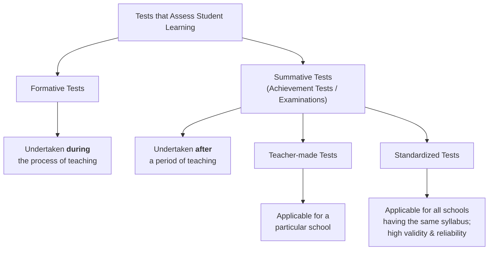
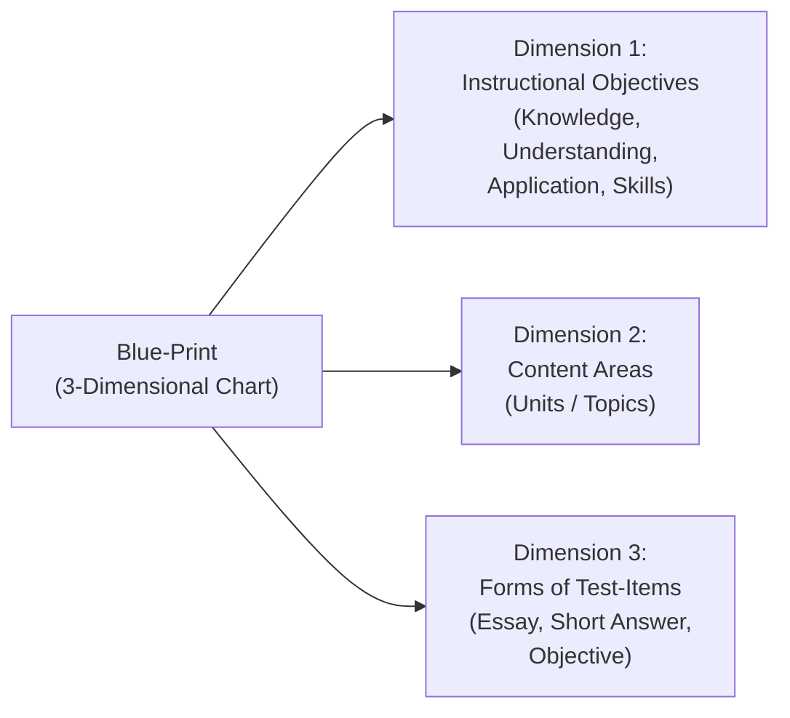
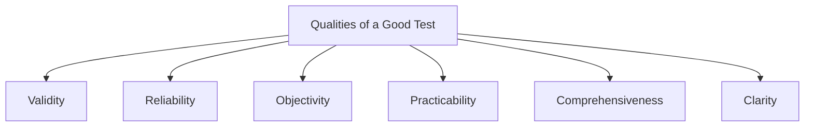
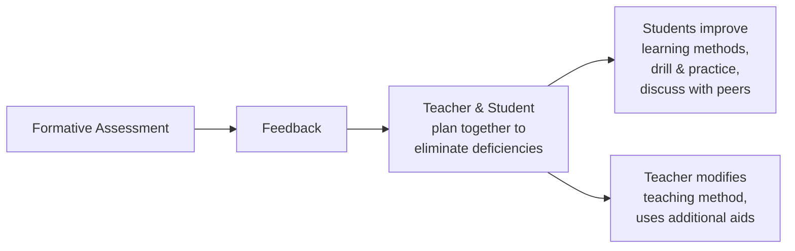
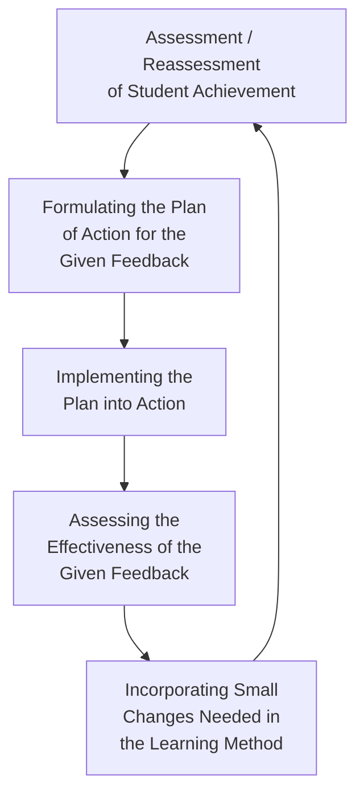
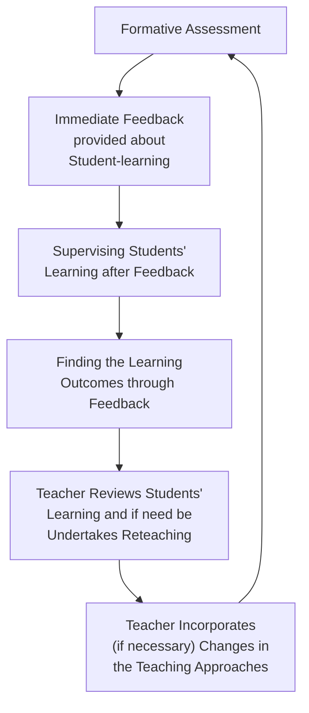
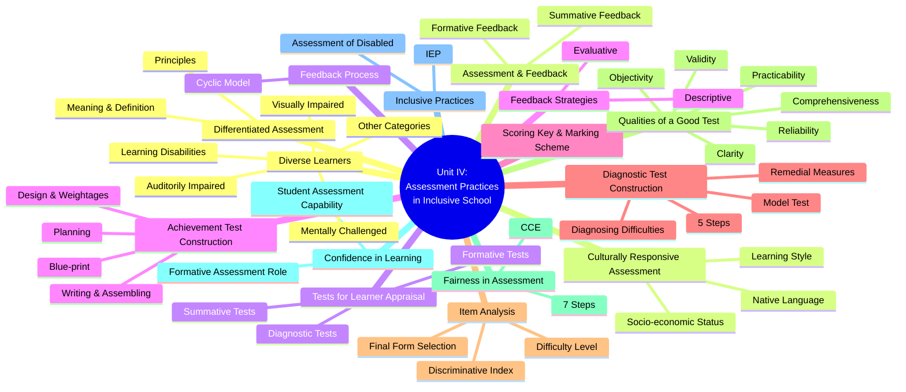

# Unit IV — Assessment Practices in Inclusive School

---

## 4:00 Introduction

**Inclusive Assessment** means an integrated assessment of pupils' learning in a mainstream classroom wherein the policies and practices followed facilitate **all kinds of pupils** — both normal and disabled — to learn together as far as possible and improve their respective learning.

**Inclusive Assessment Practices** involve adopting policies and practices that facilitate employing **differential assessment methods and techniques** to suit normal, gifted, slow learners, and disabled pupils who learn together in the inclusive classroom.

!!! note "This Unit Covers"
    - Meaning and principles of **Differentiated Assessment**
    - **Culturally Responsive Assessment** — concept and means
    - Use of **tests for learner appraisal**
    - **Achievement Test Construction** — planning, design, blue-print, weightages
    - **Scoring Key** and **Marking Scheme**
    - Construction of a **Diagnostic Test** and remedial measures
    - **Item Analysis** — difficulty level and discriminative index
    - **Qualities of a Good Test** — validity, reliability, objectivity, etc.
    - Ensuring **Fairness** in assessment
    - Assessment for enhancing **Confidence** in learning
    - **Inclusive Practices** — assessing disabled learners
    - Assessing **performance outcomes of diverse learners**
    - Assessment and **Feedback** — process and strategies

---

## 4:01 Differentiated Assessment

Individual students differ in their **rate of learning** and **style of learning**. Psychologists advocate that individual differences must be taken care of by arranging classroom instruction to suit the needs and abilities of each student. When individual differences are taken care of in the assessment of students' learning, such practice is known as **Differentiated Assessment**.

- Teachers use differentiated assessment to **match and respond** to the varying learning needs of diverse students in a classroom.
- It can lead to **enhanced student-learning** as students use their current understanding to discover, construct, and incorporate new knowledge and skills.
- It involves teachers considering a **range of assessment opportunities** to suit the needs, interests, and abilities of individual students.

---

### 4:01:1 Meaning and Definition of Differentiated Assessment

!!! important "Definition"
    **Differentiated Assessment** is defined as the way by which teachers make **adjustments to and modify assessment activities** for individual students or a group of students to cater for different learning needs and a range of learning styles and preferences.

Differentiated assessment may take into account the differences between individual students, such as their:

- **Prior learning experiences**
- **Current level of ability** to understand a topic
- **Performance outcomes** of diverse learners
- **Learning styles and preferences**
- **Interest and talents**
- **Motivation and engagement** with learning

---

### 4:01:2 Principles of Differentiated Assessment

Differentiated assessment involves the following steps:

| Step | Principle | Description |
|------|-----------|-------------|
| **i** | **Collect data** before teaching | Gather information about individual student's prior knowledge, learning ability, learning needs, and preferences before teaching a topic or content unit |
| **ii** | **Differentiate based on data** | Divide students into groups based on their learning needs, preferences, and ability; arrange suitable instructional methods for each group |
| **iii** | **Use varied resources** | Consulting different resources and materials to suit individual needs of students; evaluate learning of each student after the instructional period |
| **iv** | **Provide individualized feedback** | Provide individualized feedback to students to improve their learning while undertaking formative evaluation (oral questioning, daily assignments, pen-and-paper tests, etc.) |
| **v** | **Post-summative support** | Provide individualized aid to students based on summative evaluation findings, making students understand their respective strengths and weaknesses |

!!! tip "In Brief"
    Differentiated assessment involves:

    1. **Collecting data** regarding students before commencing teaching
    2. **Employing suitable instructional methods** that cater to the needs of various groups
    3. **Using different assessment tools and techniques** — teacher-made tests, standardized tests, performance-based tests, checklists, etc.

---

## 4:02 Culturally Responsive Assessment

Schools in India today are becoming increasingly diverse, consisting of students coming from **different cultural backgrounds** — differing with respect to their race, religion, language, socio-economic status, etc.

- Research studies point out that **cultural background of students** has significant influence on their learning.
- Students should be provided with **equal opportunities** regardless of cultural background.
- Assessment should also be **fair** and suit students' needs.
- An assessment designed in such a way that **none of the students** in the class feel affected in any way is called **'Culturally Responsive Assessment'**.

---

### 4:02:1 Ways and Means of Creating Culturally Responsive Assessment

Three key factors must be taken into account:

#### 1. Socio-Economic Status

- Students from families of **high socio-economic status** (where one or both parents have college education) tend to have more **advanced linguistic capabilities**.
- Accomplishing school tasks comes **more easily** for them than students from economically disadvantaged homes.
- It is necessary to provide **special training** to students from low socio-economic strata in facing examinations.

#### 2. Native Language

- If the **language spoken at home** and the medium of instruction are the same → no complexity arises.
- If the child is educated through a **language other than its mother tongue** → the child finds it difficult to learn, particularly in pronunciation, writing, and understanding traditional language style.
- **Arrangements should be made** for children to face examinations in their own mother tongue.
- While valuing answer scripts, marks should be awarded only for **quality of understanding** of the subject content — not for style of language or spelling.

#### 3. Learning Style

- Some students prefer to learn through **visuals**; some by **doing**; others through **abstract thinking**.
- If assessment tries to take into account the **learning style of each student**, it is termed **'Culturally Responsive' assessment**.
- A student who does well in **written tests** may not perform well in **oral tests or performance tests** requiring physical skills.
- A **common uniform test** for all is not proper — culturally responsive assessments employ **different methods and techniques** in which students feel more comfortable.

!!! warning "Key Insight"
    It may appear impossible at present to tailor assessment techniques to suit the needs of individual students, but as **technology improves**, tools may come into existence to make this at least partially a reality.

---

## 4:03 Use of Tests for Learner Appraisal

Tests serve as the **touchstones** for the appraisal of learners' achievement and its quality. Assessment and the teaching-learning process are **integrated** with each other.

| Test Type | When Used | Purpose |
|-----------|-----------|---------|
| **Formative Tests** | During teaching | Evaluate student learning as it develops |
| **Summative Tests (Achievement Tests)** | After teaching is over | Assess overall learning achievement |
| **Diagnostic Tests** | After achievement tests | Identify specific nature of learning difficulties and arrange remedial teaching |

---

### 4:03:1 Important Features of Using Tests for Learner Appraisal

| # | Feature |
|---|---------|
| **i** | Testing quality of students' learning is based on evaluating **responses** offered by students for test items reflecting their understanding |
| **ii** | Appraisal is done by **matching learning achievement** with expected learning outcomes |
| **iii** | Rate of students' learning reveals how far **classroom instruction** has successfully met learning needs |
| **iv** | Appraisal is undertaken for **improving** student learning |
| **v** | It is the **duty and responsibility** of the teacher to conduct periodical student appraisal and report to parents and stakeholders |
| **vi** | Teacher must employ a **variety of assessment tools and techniques** |
| **vii** | Assessment is **not an annual event** but integrated with the process of teaching |
| **viii** | Learner appraisal is a process to be undertaken **carefully and efficiently** |

---

## 4:04 Construction of an Achievement Test

Constructing a test to assess how far students have achieved proficiency in learning the course content occupies an **important place** in educational evaluation.

!!! abstract "Major Steps in Achievement Test Construction"
    1. **Planning** the test
    2. **Determining the design** of the test
    3. **Preparing the Blue-print** of the test
    4. **Writing the test items** and assembling the question paper

---

### 4:04:1 Planning the Test

The important tasks involved in planning:

| Task | Description |
|------|-------------|
| **a)** | Deciding the **content area** for the test |
| **b)** | Deciding the **time-limit** for answering the test |
| **c)** | Fixing the **total marks** allotted for the test |
| **d)** | Deciding the **types of test items** — Essay type, Paragraph, Short-answer, Objective type |
| **e)** | Deciding the **number of items** in each type of question |
| **f)** | Deciding about providing **choices** for students in answering questions |

---

### 4:04:2 Determining the Design of the Test

Tasks involved in this step:

| Step | Task |
|------|------|
| **i** | Identification of **instructional objectives** to be tested and assigning weightage to each |
| **ii** | Assigning weightages to the **content areas** to be tested |
| **iii** | Assigning weightages to **different forms of test-items** |
| **iv** | Assigning weightages to **difficulty levels** |

---

#### 4:04:2:01 Assigning Weightages to Instructional Objectives

In a good achievement test, the following distribution is recommended:

| Instructional Objective | % of Marks Assigned |
|------------------------|---------------------|
| **Knowledge** (recall + recognition) + **Understanding** | ≤ **60%** |
| **Application** | **30%** |
| **Skills** | **10%** |

!!! example "Model Blue-print Example"
    | Instructional Objective | Marks Allotted | % of Marks |
    |------------------------|---------------|------------|
    | Knowledge | 12 | 24 |
    | Understanding | 18 | 36 |
    | Application | 15 | 30 |
    | Skills | 5 | 10 |
    | **Total** | **50** | **100** |

---

#### 4:04:2:02 Assigning Weightages to Content Areas Tested

Allotting percentage of marks to the different topics or lessons in the content areas taken up for the test, depending upon their importance, is known as **'Giving Weightages to Contents'**.

!!! example "Model Weightage Distribution"
    | Content Unit | Marks Allotted | % of Marks |
    |-------------|---------------|------------|
    | Unit I | 10 | 20 |
    | Unit II | 8 | 16 |
    | Unit III | 8 | 16 |
    | Unit IV | 8 | 16 |
    | Unit V | 8 | 16 |
    | Unit VI | 8 | 16 |
    | **Total** | **50** | **100** |

---

#### 4:04:2:03 Assigning Weightages to Different Forms of Test-Items

The number of test-items depends upon:

- **Time limit** fixed for the test
- **Forms of test-items** to be included
- **Students' age level**
- **Difficulty level** of the contents
- **Range** of the subject content

!!! tip "Guidelines"
    - **1-hour test** → 3–4 types of questions
    - **2-hour test** → 5–6 forms of test items
    - **45-minute test** → 3 types: Essay type, Very Short Answer, Objective type

**Common mark allocation:**

| Form of Test-Item | Marks per Item | Time Required (approx.) |
|-------------------|---------------|------------------------|
| **Essay Type Question** | 8–10 marks | 10 minutes |
| **Paragraph Question** (Short Answer) | 4–5 marks | 10 minutes |
| **Very Short Answer** | 2 marks | — |
| **Objective Type** (MCQ, Matching, True/False, Fill-in-the-blank) | 1 mark each | — |

---

#### 4:04:2:04 Assigning Weightages to Difficulty Levels

| Difficulty Level | % of Total Marks | Description |
|-----------------|-----------------|-------------|
| **Average difficulty** | **60%** | Majority of items |
| **Difficult** | **20%** | Challenge for the gifted |
| **Easy** | **20%** | Answerable by all |

---

### 4:04:3 Preparing the Blue-Print of the Question Paper

!!! important "What is a Blue-Print?"
    A **Blue-print** is a **three-dimensional chart** showing:

    1. **Instructional objectives** tested
    2. **Content areas** (topics/units)
    3. **Types of test-items** — with number of test items and marks allotted for each dimension

    The blue-print reveals the **structure of the question paper** that is to be prepared.

---

#### 4:04:3:01 Use of Blue-Print of the Question Paper

| # | Advantage |
|---|-----------|
| **i** | Use of blue-print in preparation of question paper **increases its content validity** |
| **ii** | It clearly indicates the **scope of the test** and the extent of importance given for various aspects |
| **iii** | It ensures that **due importance** is given for the learning outcomes and subject contents |
| **iv** | It ensures that each test-item **tests a learning outcome** |
| **v** | It ensures that each test-item is **independent and free from overlapping** |

---

### 4:04:4 Writing the Test-Items and Assembling the Question Paper

- After writing the test-items from different topics as per the blue-print, each type of question is to be **grouped separately**.
- Appropriate **instructions** regarding how to answer the questions in a given group should be stated briefly.

!!! note "Difficulty Level Determination"
    - In **standardized tests** → difficulty level is found by **item analysis**
    - In **teacher-made tests** → difficulty is determined based on **professional experience**
    - If **majority** of testees answer an item correctly → it is an **easy item**
    - If only a **few** students answer correctly → it is a **difficult item**

---

## 4:05 Scoring Key and Marking Scheme

After the preparation of a question paper, the immediate task is developing the **Scoring Key** and the **Marking Scheme** that provide guidelines for awarding marks.

---

### 4:05:1 Scoring Key

!!! important "Definition"
    The **Scoring Key** is the list containing the **correct answers** for the objective type test-items of the question paper. Students' answers are compared with the correct answers in the scoring key for awarding marks.

**Example of a Scoring Key:**

| Question No. | Correct Answer | Marks Awarded |
|-------------|---------------|---------------|
| 1 | (a) | 1 |
| 2 | (c) | 1 |
| 3 | (b) | 1 |
| 4 | (d) | 1 |
| 5 | (a) | 1 |

---

### 4:05:2 Marking Scheme

!!! important "Definition"
    A **Marking Scheme** is prepared and provided to the scorers of answer scripts, indicating guidelines for awarding marks to questions like short answer type, paragraph type, essay type, etc.

**It indicates:**

- The **points or steps** expected in the answer for each question
- The **distribution of total marks** for the expected points/steps
- For **language tests** → how many marks to be deducted for spelling mistakes and grammatical errors
- For **science tests** → how many marks to be deducted for not expressing measurements in proper units (kg, metres, seconds, watts, volts, etc.)

**Example of a Marking Scheme:**

| Test No. | Type of Test-Item | Expected Answer | Marking Scheme |
|----------|------------------|-----------------|----------------|
| — | Short Answer (2 marks) | Two reasons provided correctly | 1 mark for each correct reason |
| — | Paragraph (3 marks) | Out of 5 points, if 3 are stated correctly | Only 3 marks awarded |
| — | Paragraph (1 mark) | If only 1 point is correctly stated | 1 mark awarded |
| — | Essay (10 marks) | All points correct | Full 10 marks |
| — | Essay (10 marks) | 4 to 6 out of 8 expected points correct | 5 to 7 marks |
| — | Essay (10 marks) | Less than 4 points correct | 3 marks |

!!! success "Key Benefit"
    Evaluation of answer scripts using **Scoring Key** and **Marking Scheme** ensures to a large extent **objectivity and transparency** in the scoring.

---

## 4:06 Construction of a Diagnostic Test

Before the construction and use of a diagnostic test, students who **struggle to learn** the subject content are to be identified. By analyzing the achievement test scores, the teacher can identify students who lag behind significantly.

- After arranging achievement test scores in **descending order**, the **bottom 10%** of students are identified as backward in learning.
- It can be easily inferred that they are having **learning difficulties**.

!!! abstract "Five Steps in Diagnostic Test Construction"
    1. **Planning** the diagnostic test
    2. **Writing** the test items
    3. **Assembling** the test items to form the question paper
    4. **Providing clear instructions** for answering the test
    5. **Providing** the scoring key and marking scheme

---

### 4:06:1 Explanations for the Different Steps

#### 4:06:1:01 Planning the Diagnostic Test

- By undertaking **question-wise analysis** of students' marks in an achievement test, the teacher can identify questions for which **more than 50%** of students gave wrong answers.
- The content areas in which these questions find place are taken to be the **areas of learning difficulties**.
- Each content should be divided into **small learning points** — no learning point should be ignored as insignificant.
- Learning points are arranged **sequentially in a logical order**.
- At least **one test-item** is to be developed for testing each learning point.

!!! example "Example: Physics — Thermometers"
    If students find it difficult to convert Centigrade to Fahrenheit, break the content into small learning points:

    1. Lower Fixed Point
    2. Upper Fixed Point
    3. Number of divisions between upper and lower fixed points in both scales
    4. Reading of origin in the two kinds of thermometric scales
    5. Formula: **F° = (9/5 × C°) + 32**

---

#### 4:06:1:02 Writing the Test Items of the Diagnostic Test

- Test-items are generally in the form of **'Very Short Answer'** or **'Objective type'** questions.
- Questions should be stated in **short sentences with simple words**, bringing out the learning points clearly.
- Questions should have **only one correct answer**.
- Questions should take the learner gradually from the **known to the unknown** learning points.

---

#### 4:06:1:03 Assembling the Test-Items to Form the Question Paper

- Questions are to be assembled in a **logical sequence**.
- The **number of each question** should be mentioned clearly.

---

#### 4:06:1:04 Providing Clear Instructions for Answering the Test

- Clear-cut directions for answering should be mentioned **briefly and clearly**.
- **Time limit** is fixed for answering the diagnostic test.
- It should be emphasized that testees should **answer all items** in the question paper.
- Instructions such as "you can mark the answers on the question paper itself" should be provided if students are required to answer on the question paper.

---

### 4:06:2 Model Diagnostic Test — Thermometer Conversion

| Q. No. | Question | Marks |
|--------|----------|-------|
| 1 | Draw the diagram of a Centigrade thermometer, marking important measurements | 4 |
| 2 | What is the lower fixed point in the Centigrade scale? | 2 |
| 3 | What is the upper fixed point in the Centigrade scale? | 2 |
| 4 | How many divisions between the lower and upper fixed points in the Centigrade scale? | 1 |
| 5 | Draw the Fahrenheit thermometer, marking the important measurements | 4 |
| 6 | What is the lower fixed point in the Fahrenheit scale? | 2 |
| 7 | What is the upper fixed point in the Fahrenheit scale? | 2 |
| 8 | How many divisions between the lower and upper fixed points in the Fahrenheit scale? | 1 |
| 9 | 100 divisions of Centigrade scale = how many divisions of Fahrenheit scale? | 1 |
| 10 | 1 division in Centigrade scale = how many divisions of Fahrenheit scale? | 1 |
| 11 | 5°C equals how many divisions of the Fahrenheit scale? | 1 |
| 12 | What is the starting point in the Fahrenheit scale? | 1 |
| 13 | 5°C = what measurement in the Fahrenheit scale? | 1 |
| 14 | What is the general formula for converting Centigrade to Fahrenheit? | 2 |
| 15 | 20°C = ______ °F | 2 |

---

### 4:06:3 Scoring Key and Marking Scheme for the Model Diagnostic Test

**Selected scoring guidelines:**

| Question | Cues for Awarding Marks |
|----------|------------------------|
| Q1 (Centigrade diagram) | Bulb part — 1; Body part — 1; Labelling lower fixed point — 1; Labelling upper fixed point — 1 |
| Q2 (Lower fixed point) | Numerical value — 1; Mentioning the unit (0°C) — 1 |
| Q3 (Upper fixed point) | Numerical value — 1; Mentioning the proper unit — 1 |
| Q5 (Fahrenheit diagram) | Bulb portion — 1; Body part — 1; Labelling lower fixed point — 1; Labelling upper fixed point — 1 |
| Q14 (Formula) | Writing C × 9/5 — 1; Writing (C × 9/5) + 32 — 1 |
| Q15 (Conversion) | Writing the value as 68 — 1; Mentioning the proper unit (°F) — 1 |

---

### 4:06:4 Diagnosing the Nature of Learning Difficulties

After administering the diagnostic test and scoring the answer scripts using the marking scheme, a **diagnostic table** should be prepared:

- If a student gets **half or more** of the total marks for a question → record with symbol **✓**
- If a student gets **less than half** → record with symbol **✗**

!!! example "Sample Diagnostic Table"
    | Student | Q1 | Q2 | Q3 | Q4 | Q5 | Q6 | Q7 | Q8 | Q9 | Q10 | Q11 | Q12 | Q13 | Q14 | Q15 | Q16 |
    |---------|----|----|----|----|----|----|----|----|----|----|-----|-----|-----|-----|-----|-----|
    | A | ✓ | ✓ | ✓ | ✓ | ✓ | ✓ | ✓ | ✓ | ✓ | ✓ | ✓ | ✓ | ✓ | ✓ | ✗ | ✗ |
    | B | ✓ | ✓ | ✓ | ✓ | ✓ | ✓ | ✓ | ✓ | ✓ | ✓ | ✓ | ✓ | ✓ | ✓ | ✗ | ✗ |
    | C | ✓ | ✓ | ✓ | ✓ | ✓ | ✓ | ✓ | ✓ | ✓ | ✓ | ✓ | ✓ | ✓ | ✓ | ✗ | ✗ |

    Questions **15 and 16** were answered incorrectly by all students → students do not follow the **BODMAS Law** (Bracket, Of, Division, Multiplication, Addition, Subtraction) correctly.

---

### 4:06:5 Taking-up Remedial Measures

Remedial measures differ as per the **nature and causes** of learning difficulties experienced by students.

- **'Reteaching'** does not mean teaching again — it means **enriching** what was taught by:
    - Providing further explanations with **additional illustrations**
    - Undertaking **group interaction sessions**
    - Providing **individual attention** to students
    - Increasing student **participation** in the teaching-learning process
    - Providing adequate **drill and practice**

- Students who are **highly backward** (slow learners) may need **individualized instruction**.
- Students with the **same kind of learning difficulties** are grouped together for remedial measures such as:
    - Additional drill and practice with **illustrations**
    - **Computer-assisted instruction**
    - **Peer-tutoring activities**

---

## 4:07 Question-wise Analysis / Item Analysis

The quality of a test depends upon the **test items** contained in it. Test-items are to be carefully selected, particularly while developing a **standardized test**, by finding:

- The **discriminative index** of each test-item
- The **difficulty level** of each test-item

!!! important "Purpose"
    **Item analysis** is concerned with identifying the best items to be included in the final form of the test so that the test will have specified characteristics like **validity** and **reliability**.

---

### 4:07:1 Indices of Difficulty Level and Discriminative Index of Test-Items

After scoring the answer scripts of the pilot study:

1. Based on total marks, individuals are placed in order from **high to low** (descending order)
2. **Top 27%** constitutes the **'High Achieving Group'**
3. **Bottom 27%** constitutes the **'Low Achieving Group'**

#### Difficulty Level (DL)

$$
DL = \frac{\text{Total number of students in both groups who answered correctly}}{\text{Total number of students in both groups put together}}
$$

- Items with DL value **< 0.50** → **Difficult items**
- Items with DL value **> 0.50** → **Easy items**
- DL value of **0.50** → **Average difficulty** (dividing line)

#### Discriminative Index (DI)

The **Discriminative Index** refers to the ability of the test-item to **discriminate a high achiever from a low achiever**.

$$
DI = \frac{\text{No. who answered correctly in High Group} - \text{No. who answered correctly in Low Group}}{\text{No. of students in the High or Low Achieving Group}}
$$

!!! example "Worked Example"
    Among 50 students in a pilot study:

    - No. of students in High-Achieving group = 27% of 50 = **13.5 ≈ 14**
    - No. of students in Low-Achieving group = **14**
    - 9 in the high group answered correctly; 5 in the low group answered correctly

    $$DI = \frac{9 - 5}{14} = \frac{4}{14} ≈ 0.285$$

!!! note "For Essay Type Questions"
    $$DL = \frac{\text{Total marks obtained for a particular test item}}{\text{Maximum Marks} \times \text{No. who attempted}}$$

    $$DI = \frac{X_1 + X_2 + X_3 + \ldots}{\text{Maximum Marks} \times \text{No. who attempted}}$$

    Where $X_1, X_2, X_3$ refer to marks obtained by different students for a particular test-item.

---

### 4:07:2 Preparing the Final Form of the Question Paper

Appropriate test-items are selected based on the discriminative index, then from among them, those with suitable difficulty level are selected.

**Recommended distribution for the final question paper:**

| Category | % of Test-Items |
|----------|----------------|
| **Average difficulty level** | 50% |
| **Easy** | 25% |
| **Difficult** | 20% |
| **Very difficult** | 5% |

Items should be arranged in **increasing order of difficulty level**.

**Selection Guide — Discriminating Power vs. Difficulty Level:**

| Discriminating Power | Quality | Difficulty Level | Difficulty Category |
|---------------------|---------|-----------------|---------------------|
| **0.4 & above** | Excellent Item | 0.4 – 0.6 | Average Difficulty |
| **0.2 – 0.4** | Good Item | 0.2 – 0.4 | Difficult |
| **0.2 – 0.1** | Requires Improvement | 0.6 – 0.8 | Easy |
| **< 0.1** | Item to be **dropped or condemned** | 0.8 – 1.0 | Very Easy |
| — | — | 0 – 0.2 | Very Difficult |

---

## 4:08 Qualities of a Good Test

The qualities (characteristics) of a good test are:

---

### 4:08:1 Validity

- **Test validity** = the degree to which the test actually measures **what it claims to measure**.
- It tells us what can be **inferred from test scores**.
- It is **specific** to the purpose and the group for which a test is to be used.

!!! example "Examples"
    - An achievement test in **science** should measure students' achievement in science only — there is no place for testing language skill.
    - A test of general intelligence validated with **rural students** cannot be used for urban population and vice versa.
    - Before administering, we should know **'for whom'** and **'for what purpose'** the test was developed.

---

### 4:08:2 Reliability

- **Reliability** = the **consistency** of scores obtained by the same person when re-examined with the same/identical test or an equivalent form of the test.
- Reliable tests yield **comparable scores** upon repeated administration.
- Reliability is related to the test's capacity to **accurately measure** whatever it claims to measure.

---

### 4:08:3 Objectivity

- Administration of the test, scoring of responses, and interpretation of scores should be **independent of the subjective judgement** of the individual examiner.
- The scores obtained by an individual should be **identical regardless of who** happens to be the examiner.

---

### 4:08:4 Practicability

- Refers to the matter concerning the **administration** of the test.
- A test is practicable if it can be:
    - **Easily administered**
    - Completed in a **short time**
    - Conducted at **less expense**
    - **Easy to interpret** the obtained test scores

---

### 4:08:5 Comprehensiveness

- A test should cover **all aspects** of what are to be tested.
- Questions should be **spread across all content areas** included for the test.
- The provision for testees to **choose among test-items** should be very less.
- Test-items should test **all instructional objectives** — knowledge, understanding, application, skills, etc.

---

### 4:08:6 Clarity

- Instructions should be **brief and clear** so students can answer without confusion.
- Questions should be stated with **simple, clear, and unambiguous** terms.

!!! example "Good vs. Poor Wording"
    - ✅ *"Draw the cross-sectional view of the human heart and **name** the parts"*
    - ❌ *"Draw the cross-sectional view of the human heart and **label** the parts"* (ambiguous)

!!! success "Minimum Essential Qualities"
    A good test need not necessarily possess **all** desirable qualities, but it is most important to have at least the three characteristics: **Validity**, **Reliability**, and **Objectivity**.

---

## 4:09 Ensuring Fairness in Assessment

### 4:09:1 Meaning of Fairness in Assessment

A **'Cricket Pitch'** is said to behave fairly if it does not favour more for the bowlers or batsmen but offers equal help for all — bowlers, batsmen, and fielders. Similarly, a **fair assessment** is one in which:

!!! quote "Lam, 1995"
    *"A fair assessment is one in which students are given **equitable opportunities** to demonstrate what they know."*

- **Fair assessment** means providing equitable opportunities to all students to demonstrate the extent of their learning.
- It does **not** mean assessing all students exactly in the same way.
- Fair assessment means students are assessed with the **methods and procedures most appropriate** to them.
- Assessment may vary from student to student depending on their **prior knowledge**, **cultural experience**, and **cognitive style**.
- The assessment system should consist of **different methods** — oral test, performance/practical test, observation, assignments, learning portfolio, etc.

---

### 4:09:2 Steps to Make Assessment Methods Fair

Creating custom-tailored assessments for each student is largely impractical, but there are **seven steps** to make assessment as fair as possible:

#### 1. Having Learning Outcomes Clearly Stated

- If expected learning outcomes are **clearly stated** and made known to students, they understand what is expected of them.
- The teacher should provide students the **list of concepts and skills** to be covered in the assessment and the **rubrics** to be used.

#### 2. What is Taught Alone Should Find Place in Assessment

- If the teacher expects students to demonstrate good writing skills, he should **explain what constitutes 'good writing'**, provide enough practice, and then only attempt to evaluate.
- Do not **assume** students have already developed the skills being assessed.

#### 3. Using Many Different Kinds of Measures and Methods

- Common written examinations alone are **not fair** for making significant decisions (passing, certification, etc.).
- During the entire course duration, information from a **broad variety of assessments** should be obtained:
    - Oral tests, written tests, practical examinations
    - Observation, interview, assignments, projects
- Repeating the same technique many times ≠ "using many different measures"
- It means using different kinds involving **reading, writing, doing, creating, investigating** in collaboration with peers.

!!! tip "Key Principle"
    Undertaking **Continuous and Comprehensive Evaluation (CCE)** during the entire learning period is the way to ensure fair assessment.

#### 4. Helping Students Learn How to Do the Work That is Assessed

- Students from **poor and disadvantaged families** may have been trained in learning by memorization or drill and practice.
- Such students should be helped to learn with **comprehension** and express accurately what they have learned.
- Help students learn through the use of **computers and media**, develop the ability to take part in **performance-based assessment**.

#### 5. Engaging and Encouraging Students

- The teacher should encourage students to **repeatedly practice** what they have learned and express them properly.
- Some students may struggle to express their best **without praise and encouragement** from the teacher.

#### 6. Interpreting Assessment Results Appropriately

Two approaches in interpreting assessment results:

| Approach | Description | Example |
|----------|-------------|---------|
| **Norm-based Evaluation** | Judging achievement by comparing against **peers** | Those with > 60% → I Class; next 40% → II Class; next 30% → III Class; rest → Fail |
| **Criterion-based Evaluation** | Judging achievement on the basis of **certain criteria/standards** | Those completing 75% of task elements correctly → First Division; 60% → Second Division |

!!! warning "Important"
    Norm-based approach is **highly inappropriate**. The **criterion-based approach** enables the teacher to make students understand their shortcomings and give appropriate feedback to improve performance.

#### 7. Teacher Evaluating His Own Assessment Method

- If students do not perform well, the teacher can interact with students (particularly low scorers) to find reasons such as:
    - Lack of **clarity in test-items**
    - **Inadequacy of instructions** provided
    - Concepts **not taught well** in the class
- By rectifying these, the teacher could increase **fairness** in future assessments.

!!! note "Clarification"
    Fairness in assessment is **not** the same as unbiased assessment, accuracy, consistency, reliability, or cultural sensitivity — those are **qualities of a good assessment tool**, not fairness in assessment.

---

## 4:10 Assessment for Enhancing Confidence in Learning

- Persisting with efforts to complete a challenging task or giving it up easily depends on one's **self-belief and confidence**.
- Individuals with **high self-confidence** believe they could achieve anything and always strive to succeed.
- Regardless of how good a teacher's instruction is, learning of those who function **without self-confidence** will never improve.
- The **foremost job** of a teacher is to develop and maintain confidence in learners.
- **Formative assessment** helps a lot in building confidence.

**How assessment enhances confidence:**

- Good assessment helps the teacher know about **outcomes of teaching** and helps students know the **status of their learning**.
- A student coming to know through assessment that his learning progress is **satisfactory** → becomes aware of what has been achieved and what gaps remain.
- This enables students to develop the ability to **control their learning**.
- Following formative assessment, students can discuss with **teachers, peers, and parents** about ways and means of improving their learning.

---

### Building Students' Assessment Capability

Teachers should help students understand the following:

| # | Capability |
|---|-----------|
| **i** | What **high quality work** looks like |
| **ii** | What **criteria define** quality work |
| **iii** | How to **compare and evaluate** their own work against the criteria of good work |

**Teacher's role:**

- While planning teaching, decide what kind of **learning experiences** are to be provided and how to assess them.
- Make known to students **in advance** what they are going to learn, why, and how things learned will be assessed.
- Know by employing a particular assessment method, **how well student learning will get improved**.

---

### Three Ways Assessment for Learning Helps

#### i) Identifying the Learning Needs

- Assessment information helps students know their **present position** — where they are now, where they want to go, and how to **reduce the gap**.
- Similarly, assessment information helps teachers know what **further steps** to take to enable students to move towards their goals.

#### ii) Feedback

- Assessment information provides **feedback to both teachers and students** and guides them to take further steps necessary to improve learning.

#### iii) Next Steps in Teaching and Learning

- Further steps in teaching and learning are determined on the basis of **assessment information**.
    - **a)** Guide students to know and execute further measures needed to improve their learning.
    - **b)** Guide teachers to introduce necessary **modifications in teaching** according to the learning needs identified by assessment information.

!!! success "Key Takeaway"
    Assessment for learning helps students know their **present status of learning** and plan ways of improving it. As formative assessment guides students to improve their learning, it **increases their confidence** in learning.

---

## 4:11 Inclusive Practices — Concept

Before starting to teach disabled children, it is necessary to gather information from different sources to assess the **nature and extent of their disabilities**:

- **Diagnostic tests** and **informal measures**
- **Pupil's self-report** and **report of the parents**
- Information from **continuously monitoring** the learning of children
- Reports submitted by a **doctor**, **special education teacher**, and **class teachers**

!!! abstract "Purpose of Pre-Assessment"
    Assessment of disabled children helps in:

    - Knowing their **learning needs and strengths**
    - Making available adequate help and **special services** (e.g., facilities for moving in wheelchairs, Braille reading and writing devices, magnifying lenses, hearing aids, support staff, etc.)

**Individual Education Plan (IEP):**

- An **IEP** is to be prepared by the class teacher based on the nature and extent of disability of each child.
- In the inclusive classroom, different instructional techniques are used:
    - **Group interaction sessions**
    - Use of services of the **special education teacher**
    - **Individualized instruction**

**Assessment methods for disabled children:**

| # | Assessment Area |
|---|----------------|
| **i** | Assessing **oral expressions** of learning outcomes |
| **ii** | Assessing **listening performance** |
| **iii** | Assessing performance through **written expressions** |
| **iv** | Assessing **basic reading skills** |
| **v** | Assessing **reading comprehension** |
| **vi** | Assessing **numerical ability** and computational skill |
| **vii** | Assessing skills to **solve problems** using mathematical computations |
| **viii** | Assessing understanding of **science concepts** |

!!! warning "Important"
    The achievement tests used for **normal children cannot be used** for disabled children. For each disabled child, **appropriate assessment methods** must be employed using suitable tools and techniques.

---

## 4:12 Assessing the Performance Outcomes of Diverse Learners

It is necessary to employ different tools and techniques for assessment of learning attainment of different types of students — **gifted learners**, **normal pupils**, students with **physical disabilities**, those with **learning disabilities**, students belonging to the **disadvantaged and poor**, etc. — all learning together in the same class.

---

### 4:12:1 Assessing the Learning Outcomes of the Visually Impaired

- **Totally blind** students learn by using their **auditory** and **kinesthetic (touching)** sensations.
- Students with **moderate visual impairment** can learn with the help of large print textbooks, magnifying glass, and portable lamp.

#### 4:12:1:01 Formative Assessment

- Teacher can assess learning by asking **oral questions** on topics taught in class.
- If home assignments are provided, questions can be **written on a sheet of paper** and given to visually impaired students, who prepare answers with the assistance of **parents or scribes**.
- For submission of assignments, visually impaired students can be given **additional time** (a few days more than normal students).
- Teacher can assess **participation in classroom group discussions**.

#### 4:12:1:02 Summative Assessment

- Question papers given to visually impaired students are the **same as those given to normal students**.
- Each visually impaired student is seated in a **separate place**.
- Answers given out **orally** are recorded verbatim by an appointed **scribe**.
- **Additional time** is given to complete dictating their answers.

---

### 4:12:2 Auditorily Impaired

- **Hard of hearing** → one who loses hearing capacity after acquiring speech.
- **Deaf** → those born with less capacity of hearing or who lost hearing before acquiring the ability to speak.
- A child that can hear sound of **50 decibels and more only** is auditorily handicapped, requiring special provisions.

**Teaching approaches:**

- **Visual and tactile stimuli** are increasingly used
- **Lip reading** and **Sign Language** are taught
- Children who are 'hard of hearing', if identified early, can be improved with **hearing aids**

#### 4:12:2:01 Assessing the Learning Outcomes of Auditorily Handicapped Children

Two criteria:

| # | Criterion |
|---|-----------|
| **i** | **Communicating** the criteria of assessment to auditorily handicapped students through gestures, facial expression, using objects, pictures, or printed sheets |
| **ii** | **Judging** the level of achievement of students on the assessment task and noting it |

**Summative Assessment:**

- **Printed question papers** can be used.
- To ensure students understand each question, use **facial expressions, gestures, lip reading, sign language**.
- Auditorily handicapped people **constantly use visual cues** to understand communication.

---

### 4:12:3 Learning Disabilities

- **Learning disability** is a **neuro-behavioural disorder** affecting the brain's ability to receive and process information.
- It is generally seen as a specific developmental disorder affecting basic skills.

**Assessment accommodations for students with learning disabilities:**

- Providing **more space** in answer sheets for solving numerical problems
- Evaluating through **relaxation** — not taking into consideration spelling and grammatical mistakes; assessing only the **content** which they try to convey
- Instead of questions requiring **long answers**, converting them into questions requiring **very small answers**

---

### 4:12:4 The Mentally Challenged

- Those with **I.Q. scores less than 70** in a standardized intelligence test are called **'Mentally Challenged'** (previously known as 'Mentally Retarded').
- These children lag significantly in **physical, emotional, and social development** compared to children of the same age.

**Assessment approaches:**

- Give them **more time** to answer
- Use of **demonstrations**, learning by doing along with the teacher
- Use of **audio-visual and tactile cues**
- Prepare an **Individual Educational Plan (IEP)** and implement accordingly
- Training in **choosing the correct answer** among options, matching with stimulus, speaking, writing words and numbers correctly, painting with different colour options
- Assess the **performance of each child separately**

---

### 4:12:5 Other Categories of Students

For **normal children**, **slow learners**, **orthopaedically handicapped**, and the **gifted**:

- Assessment should be made through **written tests** besides conducting **oral tests** and **practical tests**.
- For those with **orthopaedic handicap**, appropriate provisions should be made:
    - Easy access to their classroom
    - Therapeutic measures to move their limbs properly
    - Remedial measures to minimize motor disabilities for functional efficiency

!!! success "Inclusive Principle"
    Pupils with different kinds of disabilities — physically challenged, mentally challenged, orthopaedically handicapped, those with learning disabilities, slow learners, etc. — should be provided with **suitable opportunities and facilities** available to normal pupils, to express their learning achievement and get them assessed.

---

## 4:13 Assessment and Feedback

**Feedback** refers to providing students with the knowledge of results obtained in the assessment task, based upon which they are informed of the **deficiencies found in their learning**, along with recommendations for removing them.

- The **primary purpose** of assessment is to improve student learning.
- Feedback followed by assessment helps a lot.
- Generally, feedback is provided both after **formative assessments** (during teaching) and **summative assessments** (after teaching ended).

**Following formative assessment feedback:**

- Teacher and student **together plan** ways and means of eliminating learning deficiencies.
- Students try to improve by: modifying learning methods, undertaking additional drill and practice, discussing with teacher/peers/parents, utilizing more learning resources.
- Teacher incorporates necessary changes in teaching method and uses additional instructional aids.
- This kind of feedback results in **improving the learning of all kinds of students**; self-esteem and learning motivation of students will increase.

**Following summative assessment:**

- Students who lag behind are **informed of their learning achievement**.
- A **diagnostic test** is conducted for them.
- Based on findings, the teacher undertakes **remedial measures**.
- Remedial measures differ according to the nature and causes of learning difficulties:
    - **Review and reteaching** for some difficulties
    - **Additional drill and practice** with illustrations
    - Use of **additional instructional materials and resources**
    - **Individual attention** to each student
    - Increasing student **participation** in the teaching-learning process

!!! warning "For Some Learners"
    Some learning difficulties require measures like **increasing learning motivation**, solving emotional problems, and controlling **external environmental factors** that affect student learning.

!!! important "Key Relationship"
    Assessment of student learning and providing feedback are **related to each other**. Without assessment, providing feedback is not possible. Assessment without feedback is **ineffective**.

---

## 4:14 Process of Feedback

Feedback serves as the **connecting bridge** between the assessment of student learning and the measures taken to improve students' learning.

**The elements involved in the process of feedback form a cycle:**

1. **Formulating** the plan of action for the given feedback
2. **Implementing** the plan of action
3. **Assessing** the effectiveness of the given feedback
4. **Incorporating** small changes needed in the learning method
5. **Reassessment** of the learning achievement of students

---

### 4:14:1 Feedback Process in Formative Assessment

In formative assessment, providing feedback is **integrated in the teaching-learning process**:

---

## 4:15 Feedback Strategies

The strategies used in the feedback given after a formative evaluation test, so as to improve student learning, are of two types:

---

### 4:15:1 Evaluative Strategies

Generally, this kind of strategies express **approval or disapproval** for students' performance/response, which may be in **verbal, non-verbal, or written** forms.

| Type | Approval (Positive) | Disapproval (Negative) |
|------|---------------------|----------------------|
| **Verbal** | "Explained well", "Good performance", "Very good", "Excellent", "Simply brilliant" | "Wrong answer", "Irrelevant answer", "You are writing by sheer guess" |
| **Non-verbal** | Moving head up and down, smiling, patting on the back, clapping hands | Staring hard, pulling faces, moving head laterally on both sides |

- The expression of teacher's approval/disapproval is a form of **evaluative feedback strategy**.
- Teachers generally offer approval for **correct answers, good performance, independent and creative thinking, positive thoughts**, etc.
- Teacher's disapproval is usually expressed for students' behaviour related to **disorderly response**.

---

### 4:15:2 Descriptive Feedback Strategies

The following strategies are employed in providing **descriptive feedback** about student performance:

#### i) Telling the Student Whether the Response is Correct or Wrong

- This kind of feedback — merely telling whether the answer is right or wrong — **lacks proactiveness**.
- Described as **mechanical** feedback.

#### ii) Stating Why an Answer is Wrong

- While assessing answer scripts, the teacher can **complement students** for good answers using descriptive phrases like "well explained", "extensive answer", "good vocabulary", "good language style".
- For indicating mistakes, the teacher should **specifically state** what type of mistakes have been done and **how to avoid or rectify** them.
- Such descriptive feedback alone will prove to be **effective** in improving learning and performance.

#### iii) Stating What Students Have and Have Not Achieved

- The teacher makes the student know **how far** he/she has been successful in learning in relation to a specific goal.
- Also communicates what aspects of learning success have **not been achieved** and the reasons for the same.

#### iv) Specifying a Better Way of Expressing Response

- The focus is to explain to students the **modifications required** in their learning and how they could be accomplished.

#### v) Feedback Suggesting Ways to Improve One's Learning

- After assessing the learning performance of each student, the teacher points out the **methods of improving learning** and among those, the one that works best for a particular student.

---

## Summary

