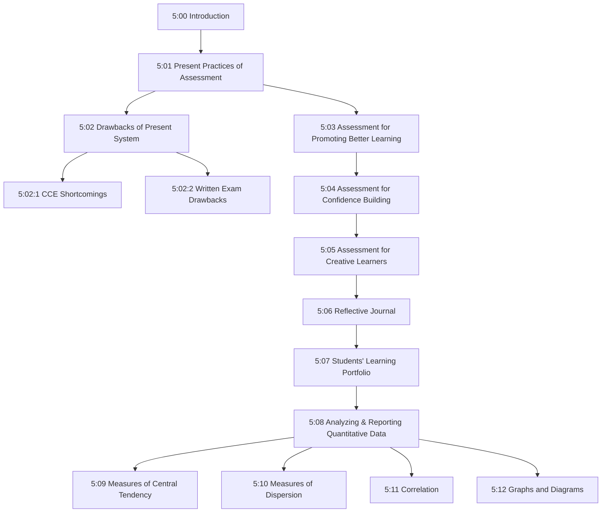
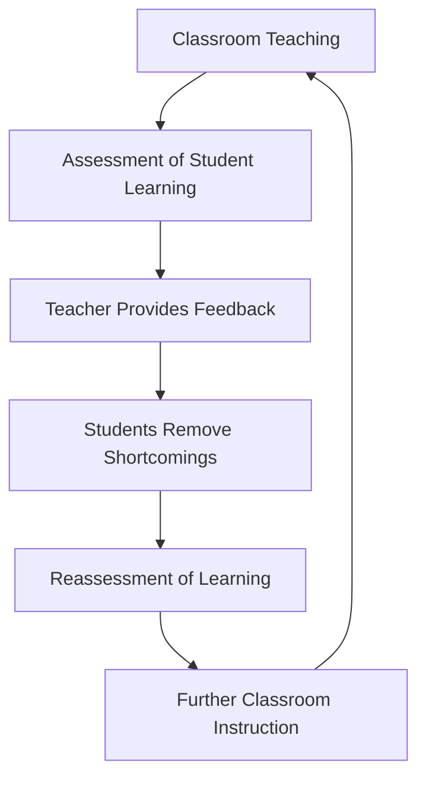
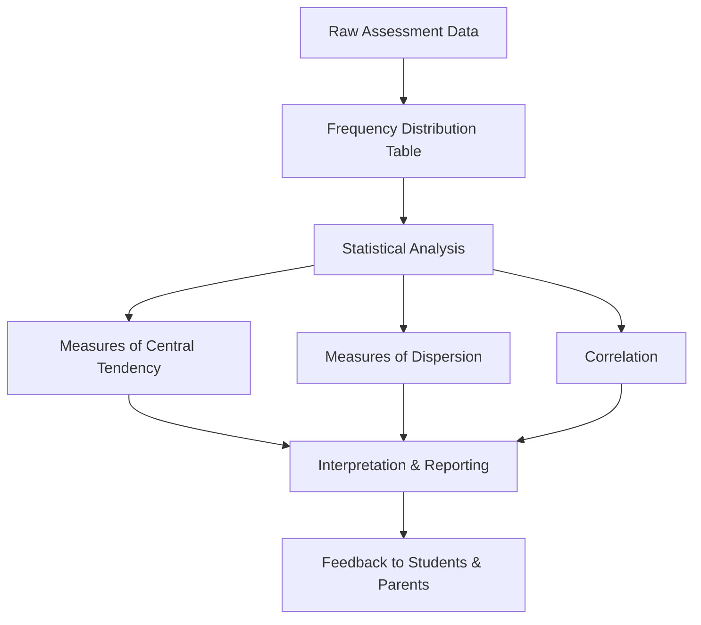
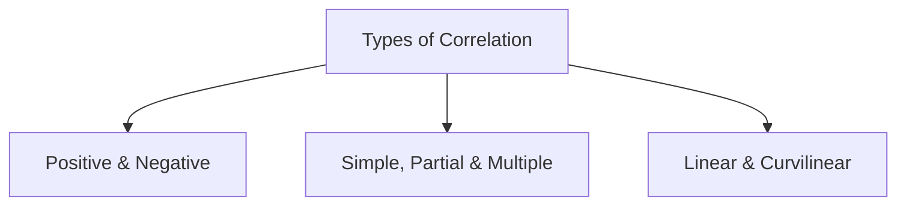
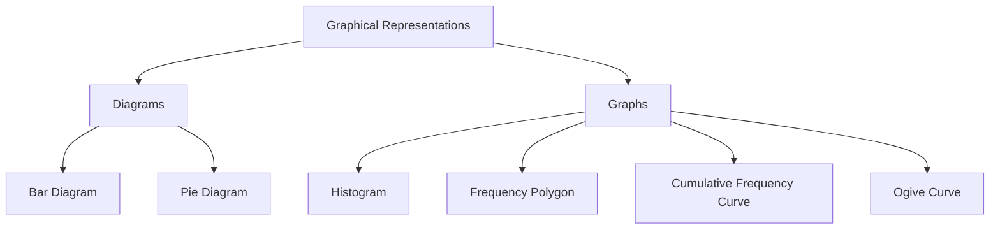

# Unit V — Prevalent Practices of Assessment & Reporting of Quantitative Data

---

## Unit Overview

---

## 5:00 Introduction

!!! note "Key Concept"
    **Assessment of learning** = Gathering information on learning progress and proficiency achieved by students.  
    **Evaluation of learning** = Judging the level of learning achievement based on assessment data.

- Teaching for good learning is **not possible** without an effective assessment practice.
- Assessment should be **integrated** with the teaching-learning process.
- An **effective assessment system** enhances the quality of both teaching and learning.
- The present education system is criticized for encouraging students to **memorize** content and recall it efficiently, rather than developing various abilities and skills.

**Topics covered in this unit:**

- Drawbacks of the present assessment system
- Assessment for better learning, confidence building, and creative learners
- Reflective journal — concept, structure, advantages, disadvantages
- Student learning portfolio
- Statistical techniques — measures of central tendency, dispersion, and correlation
- Graphical and diagrammatic representation of data

---

## 5:01 Present Practices of Assessment of Students' Learning

- Following the **Right to Education Act (2009)**, the **Continuous and Comprehensive Evaluation (CCE)** system was introduced from the academic year **2011** for secondary education (Std. VI to IX).
- CCE led to the development of an evaluation system assessing **different aspects** of student growth and development — both **scholastic** and **co-scholastic** proficiency.
- Assessment is done through both **formative** and **summative** assessments.
- This is a **school-based** assessment system of student learning.
- However, the **traditional written examination system** still continues for Std. X, XI, and XII.
- Till 2017, annual examinations were held at the school level for Std. XI; public examinations were conducted at the State level for Stds. X and XII.
- From the academic year **2017-18**, the Tamilnadu Government started conducting public examinations at the end of **Std. XI** also.

---

## 5:02 Drawbacks of the Present Assessment System of School Education

### 5:02:1 Shortcomings Found in the CCE System Implemented

!!! important "Key Statistic"
    As per a survey by *The Hindu*, **67%** of school teachers have not well understood the CCE system and **58%** oppose it.

**Probable causes for CCE failure:**

- Introduction of CCE **without adequate preparation**
- Lack of **awareness** among teachers about CCE
- Insufficient **training** and no evaluation of whether teachers understood CCE
- **Student-teacher ratio** in most Indian schools is **42:1** (against RTE stipulation of **30:1**)
- Shortage of about **15 lakh** trained and qualified teachers
- Teachers engaged in duties **other than teaching** and assessing student learning

**Specific shortcomings:**

| S.No. | Shortcoming |
|-------|-------------|
| 1 | Frequent assessment tests have **increased mental stress** of students |
| 2 | **No uniformity** in evaluative procedures — they differ from school to school |
| 3 | CCE is **not suitable** for overcrowded classes |
| 4 | Large number of students given **'A' grade** (75%-89%) though most do not deserve it |
| 5 | Students **lack subject knowledge** and lag behind in **language skills** |
| 6 | Teachers engaged more in **clerical work** (filling assessment forms) than teaching preparation |

!!! tip "Exam Point"
    CCE started with the aim of eliminating competitive attitude and examination stress but has **not achieved its purpose**. Research findings reveal that students studying in V Std. are not able to read fluently the III Std. text books.

---

### 5:02:2 Drawbacks of the Written Examination System of School Education

The old written examination system continues for students of Std. X, XI, and XII.

| S.No. | Drawback |
|-------|----------|
| 1 | Assesses learning achievement **only at the end of the year** without considering involvement throughout |
| 2 | **Highly objectionable** — nervous students may fail to express full potential; uninvolved students may score by luck |
| 3 | Questions encourage **memorization** and recall, not higher-order cognitive abilities (understanding, application, analysis, synthesis, evaluation) |
| 4 | Tests only **bookish knowledge**, not problem-solving ability or practical skills |
| 5 | Does **not encourage** critical thinking and creativity |
| 6 | **Lacks objectivity** and reliability |
| 7 | Subject knowledge assessed through written exams for **80% marks** and practicals for only **20%** |

!!! important "Key Point"
    Our assessment system tests only bookish knowledge and not the skills required to face future life. Students receive education that largely remains **unrelated to their future life**.

---

## 5:03 Assessment for Promoting Better Learning

!!! note "Definition"
    Assessment does not stop at evaluating students' learning achievement and grading their performance. Based on assessment findings, the teacher must provide **appropriate feedback** enabling students to know shortcomings and means of removing them.

**The Cyclic Process of Assessment for Better Learning:**

**Key Points:**

- Providing feedback to students is an **integral part** of assessment of student learning.
- Students significantly lagging behind should be subjected to a **diagnostic test** followed by **remedial teaching**.
- **Summative assessment** (annual exams) helps evaluate and grade students but does **not enhance** learning much.
- **Formative assessment** (during instruction) is **highly useful** in enhancing student learning.

**Two kinds of feedback from assessment:**

| Feedback Type | Action |
|--------------|--------|
| Most students fail to learn some concepts | Teacher undertakes **reteaching** with additional information, illustrations, and instructional aids |
| Most students fail to express high achievement | Implies **shortcomings in teaching** — teacher must incorporate necessary changes |
| Almost all students express very high achievement | Implies **test standard is low** — teacher should develop tests of reasonable standard with higher-order items |

!!! tip "Exam Point"
    Assessment with appropriate feedback can be considered as a way to **promote better learning** in students. Assessment, teaching, and assessment are **integrated together**.

---

## 5:04 Assessment for Confidence Building

!!! note "Key Concept"
    Students with **high self-confidence** believe they have the capacity to learn and do anything. However good the classroom teaching may be, if students **lack self-confidence**, their learning achievement may not be high.

**The teacher's most important professional duty** is to develop self-confidence in students. Assessment of learning helps to a great extent in this.

**Strategies for confidence building through assessment:**

1. **Formative assessment** during teaching of every unit aims at improving student learning — this instills self-confidence.
2. While introducing a topic, ask **simple questions** connected to practical life — almost all students can answer, building confidence.
3. In assignments, arrange questions from **simple to difficult** — enabling students to succeed in answering initial questions.
4. Provide **different kinds of questions** testing various skills (answering in paragraphs, colouring, constructing models, solving puzzles, using dictionary, etc.).
5. Following assessment, provide **suitable feedback** to each student.
6. While providing feedback, **appreciate efforts** taken for learning, indicate level of success, and offer guidance.

**Salient features of assessment for confidence building:**

| Feature | Description |
|---------|-------------|
| Task arrangement | Proceed from **simple to difficult** |
| Test items | All students can answer **at least some** questions |
| Assessment tools | Suit the **learning style** of each student |
| Feedback | Focus on both achievement and **efforts** |
| Appreciation | Point out **strengths and talents** revealed in learning |
| Rubrics | Students develop rubrics together and evaluate own and peers' work |
| Remedial support | Teacher arranges **remedial teaching** and **peer tutoring** for backward students |

!!! important "Exam Point"
    If assessment focuses on not only evaluating achievement but also on revealing efforts, level of success, and is followed by feedback offering guidance, then it helps develop **self-confidence** and ultimately enhances learning achievement.

---

## 5:05 Assessment for Creative Learners

**Characteristics of creative students:**

- **Sensitivity** to problems
- Ability to view problems from **different angles**
- Perceive **remote associations** among disconnected ideas
- **Persistence** in seeking new relationships
- Highly **flexible** thinking
- Ability to produce **new ideas** or innovative solutions
- Highly **imaginative**
- **Questioning attitude** about anything presented

**Methods of assessing creative learners:**

### i) Assessing Students' Activities in Creative Contexts

| Subject | Creative Assessment Activity |
|---------|------------------------------|
| **Language** | Compose a poem on a given topic, write a small essay |
| **Mathematics** | Solve puzzles, use alternative methods to solve problems |
| **Science** | Conduct experiments in laboratory, prepare learning aids from waste materials |

### ii) Assessing through Group Work

- Observe sharing of ideas, suggesting different solutions, approaching problems through alternate routes.

### iii) Asking Open-ended Questions (Divergent Thinking)

Instead of traditional convergent questions, ask **open-ended questions**:

| Traditional Question | Open-ended Alternative |
|---------------------|----------------------|
| "What are the advantages of friction?" | "What would happen if there is no friction at all in this world?" |
| "What are the benefits of the Himalayas to India?" | "What would have happened to India if there is no Himalayan range of mountains?" |

### iv) Extempore Speaking and Quiz Programmes

- Give a subject topic and ask students to **talk at short notice** (5 minutes).
- Conduct **quiz programmes** related to content areas.

### v) Group Discussion, Projects, and Debates

- Observe and analyse participation in group discussions, group projects, and debates.

### vi) Application-type Test Items

- Prepare achievement tests giving **more importance** for 'application' type items rather than recall-based items.

---

## 5:06 Reflective Journal

### 5:06:1 Concept of 'Reflective Journal'

!!! note "Definition"
    A **reflective journal** is a means of recording ideas, personal thoughts and experiences, as well as reflections and insights a student has in the process of a course.

**How it works:**

1. Students **reflect every day** (evening/night, at home) on concepts learned, learning activities organized, illustrations offered, discussions with peers, reference materials suggested.
2. Record reflections in a **separate notebook** for each subject.
3. Submit the notebook to the teacher at the **end of each week**.
4. Teacher reviews during weekly holidays, records **comments** on strengths and weaknesses.
5. Returns notebooks with **feedback** (oral or written) on the first day of the following week.

**Students should record:**

- All concepts learned and learning activities organized
- Concepts easily understood
- Concepts felt difficult to understand
- Concepts that could be related to practical life
- Ways and means to learn difficult concepts
- Co-curricular activities related to learning
- Connections with previously learned concepts
- Doubts to be cleared and questions to be asked

---

### 5:06:2 Model Format of Reflective Journal

| Field | Details |
|-------|---------|
| Name of the student | |
| Class and Section | |
| Subject | |
| Topic | |
| Date | |
| Class Period/Time | |

**Journal Entries should include:**

1. All concepts learned and learning experiences provided
2. Those easily understood among the contents taught
3. Those felt difficult among the contents taught
4. Contents that could be related to practical life
5. Ways and means to learn difficult concepts
6. Co-curricular activities related to learning
7. Connections with previously learned concepts
8. Doubts, questions, and specific problems to be pointed out
9. Overall opinion about today's classroom learning

**Teacher's response/comments** and **Teacher's Signature** at the end.

---

### 5:06:3 Illustration of a Reflective Journal

**Example:** Student Sureshbabu V, Class IX-A, Subject: Physics, Topic: Newton's Laws of Motion, Date: 14.7.2017

| Topic | Journal Entry |
|-------|--------------|
| Newton's First Law | Could understand the concept of 'inertia'; difficult to understand static and dynamic inertia; wants to know what factors inertia depends on |
| Newton's Second Law | Could understand F = ma formula; difficulty in understanding derivation (why F = Kma); could work out numerical problems; plans to get reference books from library |

---

### 5:06:4 Designing a Good Reflective Journal

1. **Decide the format** that fits the course contents
2. Ensure students understand the **regularity of submission**
3. Prepare **rubrics** for each topic at the beginning of the academic year
4. Ensure **confidentiality** and privacy of information provided by students
5. Feedback is provided to students based on the comments written in the reflective journal

---

### 5:06:5 Rubrics for Assessing the Reflective Journal

| Criteria | Very Good | Good | Satisfactory | Needs Improvement |
|----------|-----------|------|-------------|-------------------|
| **Reflection** | Proficiently demonstrates deep thinking; integrates knowledge with real-life issues | Integrates learning into real-world experience; analyses with critical attitude | Satisfactory ability to relate knowledge to previous experiences | Only descriptions of theoretical knowledge; no reflection beyond descriptions |
| **Critical Thinking** | Demonstrates critical thinking skills and new perspectives for creative solutions | Analyses issues from multiple perspectives | Shows some consideration behind events | No evidence of using multiple perspectives |

---

### 5:06:6 Advantages of Reflective Journal

| S.No. | Advantage |
|-------|-----------|
| 1 | **Active Learning** — encourages students to take initiative and analyse problems from different perspectives |
| 2 | **Understanding Progress** — provides opportunities for teachers to understand how students think and feel |
| 3 | **Improving Writing Skills** — involves students in a new form of writing |
| 4 | **Freely Expressing Personal Views** — offers opportunities for personal views and gentle criticisms |
| 5 | **Enhancing Critical Thinking and Creativity** — develops critical thinking when relating knowledge to real-world issues |

---

### 5:06:7 Disadvantages of Reflective Journal

| S.No. | Disadvantage |
|-------|-------------|
| 1 | **Difficult for objective marking** — subjective nature makes it hard for assessors to be consistent |
| 2 | **Time consuming for grading** — wide context involves many concepts and perspectives |
| 3 | **Confidentiality concerns** — students may not honestly disclose ideas fearing impact on grades |
| 4 | **Clear guidelines needed** — many students may not be familiar with reflective writing procedure |

---

## 5:07 Students' Learning Portfolio

!!! note "Cross Reference"
    Detailed description about Student Learning Portfolio is given in **Unit II (2:02:4:02)**. Refer to Unit II for complete details.

### 5:07:1 Assessment of Learning Using Student Portfolio

Refer to **2:02:4:03** in Unit II.

### 5:07:2 Designing the Assessment of Learning Using Student Portfolio

Refer to **2:02:4:04** in Unit II.

### 5:07:3 Advantages of Using Student Portfolio in the Assessment of Learning

Refer to **2:02:4:05** in Unit II.

### 5:07:4 Disadvantages of Using Student Portfolio in the Assessment of Learning

Refer to **2:02:4:06** in Unit II.

---

## 5:08 Analyzing, Interpreting and Reporting Quantitative Data

!!! important "Why Statistical Analysis is Needed"
    A student's score of 65 in Science cannot be interpreted without knowing the **average** and **dispersion** of the class. If class average is 75, the score is below average. If class average is 45, the score is above average.

**Important measures in basic statistical analysis:**

1. **Measures of Central Tendency** — Mean, Median, Mode
2. **Measures of Dispersion** — Range, Mean Deviation, Standard Deviation, Quartile Deviation
3. **Correlation**

**Data can be presented in three ways:**

1. Textual Form
2. Tabular Form (most common)
3. Graphical Form

---

## 5:09 Measures of Central Tendency

!!! note "Definition"
    **Measure of Central Tendency** is that single measure which reflects the nature of the entire sample of scores or the whole frequency distribution. It is the score around which scores are crowded — the representative of the given group of data.

**Three measures of central tendency:**

| Measure | Symbol | Definition |
|---------|--------|------------|
| **Arithmetic Mean** | M or X̄ | Sum of all values divided by total number of items |
| **Median** | Mdn | The midpoint that divides the distribution into two equal halves |
| **Mode** | Me | The most frequently occurring score in a distribution |

---

### 5:09:1 Arithmetic Mean

!!! note "Definition"
    The **Arithmetic Mean** is the centre of gravity of the group. It is obtained by adding the values of all items and dividing the sum by the total number of items.

**Formula (Raw Data):**

$$\bar{X} = \frac{\sum X}{N}$$

Where ΣX = sum of all values; N = total number of items.

---

#### 5:09:1:01 Mean for the Discrete Series

**A) Direct Method:**

$$\bar{X} = \frac{\sum fX}{N}$$

Where f = frequency; X = values of the variable; N = Σf

**B) Short-cut Method:**

$$\bar{X} = A + \frac{\sum fd}{N}$$

Where A = Assumed Mean; d = X − A

---

#### 5:09:1:02 Mean for Grouped Data (Frequency Distribution)

**A) Direct Method (Long Method):**

$$\bar{X} = \frac{\sum fX}{N}$$

Where X = mid-point of each class interval.

**Procedure:**

1. Find **mid-point** of each class interval = (lower limit + upper limit) / 2
2. Find the product of **f and X** for each class (fX)
3. Add the values fX to get **ΣfX**
4. Divide ΣfX by N to get the **Mean**

**B) Short-cut Method:**

$$\bar{X} = A + \frac{\sum fd}{N} \times i$$

Where A = Assumed mean (mid-point against highest frequency); d = step deviation = (X − A)/i; i = class size.

---

#### 5:09:1:03 Merits of Arithmetic Mean

1. Has a **well-defined mathematical formula**
2. Depends on **all items** in the distribution
3. Sum of deviations from the mean is always **zero** — mean serves as the **centre of gravity**
4. Highly useful for computing other statistics like **Standard Deviation** and **Correlation Coefficient**

---

#### 5:09:1:04 Demerits of Arithmetic Mean

1. **Extreme items** (very small or very high values) affect the mean very much
2. Usually **not represented** by the actual value of any item
3. Cannot be computed for **incomplete frequency distributions** (if any item is missing or unknown)

---

### 5:09:2 Median

!!! note "Definition"
    **Median** is the midpoint of a given distribution. It divides the distribution exactly into two halves — 50% of total items lie below it and 50% above it.

**For Raw Data (Odd N):**

$$\text{Median} = \text{Value of the } \frac{N+1}{2}\text{th item}$$

**For Raw Data (Even N):**

$$\text{Median} = \text{Average of the } \frac{N}{2}\text{th and } \frac{N}{2}+1\text{th items}$$

---

#### 5:09:2:01 Computation of Median for Raw Scores

**Procedure:**

1. Write items in **ascending or descending** order of values
2. Apply the formula based on whether N is odd or even

---

#### 5:09:2:02 Computation of Median for Grouped Data (Discrete Series)

$$\text{Median} = \text{Value of the } \frac{N+1}{2}\text{th item}$$

Use the **cumulative frequency** column to locate the item.

---

#### 5:09:2:03 Computation of Median for Grouped Data (Continuous Series)

**Procedure:**

1. Find **cumulative frequency (Cf)** starting from the lowest class interval
2. Find where the value of **(N/2)th item** lies — this is the **median class**
3. Apply the formula:

$$\text{Mdn} = l + \frac{\frac{N}{2} - C}{f} \times i$$

Where:

| Symbol | Meaning |
|--------|---------|
| l | Exact lower limit of the median class |
| C | Cumulative frequency up to the median class |
| f | Frequency of the median class |
| i | Class size |
| N | Total frequency |

---

#### 5:09:2:04 Merits of 'Median'

1. **Easy** to calculate
2. Has a **definite algebraic formula**
3. **Not affected** by extreme items
4. Can be calculated for **open-ended** distributions
5. Can be computed even if **extreme items are missing**
6. Can be calculated by **graphical method**
7. In **skewed distributions**, median is more representative than mean and mode

---

#### 5:09:2:05 Demerits of 'Median'

1. Does **not depend** upon values of all items
2. Does **not lend** itself for further algebraic treatment
3. Gets **affected** by sampling variations
4. **Not much useful** for further statistical analysis

---

### 5:09:3 Mode

!!! note "Definition"
    **Mode** is the measure which occurs **most frequently** in a distribution. It is the most often repeated score.

- If **two** values have equal maximum frequency → **Bimodal** distribution
- If **more than two** → **Multimodal** distribution

---

#### 5:09:3:01 Computation of Mode for Grouped Data (Discrete Series)

The score with the **maximum frequency** is taken as the mode.

---

#### 5:09:3:02 Computation of Mode for Grouped Data (Continuous Series)

**Formula:**

$$Me = l + \frac{f_1}{f_1 + f_2} \times i$$

Where:

| Symbol | Meaning |
|--------|---------|
| l | True lower limit of the modal class |
| i | Class size |
| f₁ | Frequency of the class **previous** to the modal class |
| f₂ | Frequency of the class **succeeding** the modal class |

**For multimodal distributions:**

$$Me = 3 \times \text{Median} - 2 \times \text{Mean}$$

!!! tip "Important Relationships"
    - If **M = Mdn = Me** → **Normal Probability Distribution** (most students have average scores)
    - If **M < Mdn < Me** → **Negatively skewed** (most students are high achievers)
    - If **M > Mdn > Me** → **Positively skewed** (most students are low achievers)

---

#### 5:09:3:03 Merits of Mode

1. **Easy** to understand and calculate
2. Value **does not change** due to very small or very large values
3. Can be found using the **graphical method**

---

#### 5:09:3:04 Demerits of Mode

- Does **not find much use** in educational research
- More useful in the **business world** (e.g., finding the most demanded size of commodities)

---

## 5:10 Measures of Dispersion or Deviation

### 5:10:1 Concept of 'Measure of Dispersion' and its Types

!!! note "Definition"
    **Measures of dispersion** (also known as measures of variability) describe the **spread** or **scatter** of individual scores around an average or measure of central tendency.

- **Lesser dispersion** → Greater **Homogeneity**
- **Higher dispersion** → Greater **Heterogeneity**

**Four measures of dispersion:**

| Measure | Symbol |
|---------|--------|
| Range | R |
| Mean Deviation | M.D. |
| Standard Deviation | σ (sigma) |
| Quartile Deviation | Q.D. |

---

### 5:10:2 Need for the Measures of Dispersion

!!! important "Why Averages Alone Are Not Sufficient"
    **Example:** Group A (15,25,35,45,55,55,65,75,85,95) and Group B (51,52,53,54,55,55,56,57,58,59) both have the **same mean (55)**, **same median (55)**, and **same mode (55)**. But Group A has a range of **80** while Group B has a range of only **8**. If pass mark is 40, 3 students fail in Group A but **none** fail in Group B.

Therefore, along with measures of average, **measures of dispersion** must also be considered while comparing performance.

---

### 5:10:3 Range

!!! note "Definition"
    **Range** is the difference between the highest item (L) and the smallest item (S) in the group.

$$R = L - S$$

**Merits:** Easy to compute and understand.

**Demerits:**

- Easily affected by **fluctuations of sampling**
- Not based on **each and every item**
- Cannot be computed for **open-ended** class distributions

---

### 5:10:4 Mean Deviation (M.D.)

!!! note "Definition"
    **Mean Deviation** (also called Average Deviation) is the average of the **absolute values** of the deviations of individual items from their Arithmetic Mean.

**Formula (Raw Data):**

$$M.D. = \frac{\sum |x|}{N}$$

Where x = X − M (deviation from mean)

**Formula (Grouped Data):**

$$M.D. = \frac{\sum f|x|}{N}$$

---

#### 5:10:4:01 Computation of Mean Deviation of Ungrouped Data

**Steps:**

1. Compute the **Mean (M)**
2. Find deviation of each item from mean (x = X − M)
3. Check that **Σx = 0**
4. Find **absolute values** |x|
5. Compute **Σ|x|**
6. M.D. = Σ|x| / N

---

#### 5:10:4:02 Computation of M.D for Grouped Data (Discrete Series)

**Steps:**

1. Find the **Mean** using M = ΣfX / N
2. Compute deviation of each item from mean (x = X − M)
3. Find **absolute values** |x|
4. Multiply each frequency by |x| to get **f|x|**
5. Find **Σf|x|**
6. M.D. = Σf|x| / N

---

#### 5:10:4:03 Computation of M.D for Grouped Data (Continuous Series)

**Steps:**

1. Find the **Mean** using mid-points
2. Compute deviation of mid-point of each C.I. from mean (x = X − M)
3. Find **absolute values** |x|
4. Multiply each frequency by |x| to get **f|x|**
5. Find **Σf|x|**
6. M.D. = Σf|x| / N

---

#### 5:10:4:04 Merits and Demerits of Mean Deviation

| Merits | Demerits |
|--------|----------|
| Based on mean, hence **all items** are taken into account | **Less stable** than S.D. |
| | Signs of deviations are **neglected** — unsuitable for further algebraic treatment |
| | **Not based** on sound mathematical formula |

---

### 5:10:5 Standard Deviation (S.D.)

!!! note "Definition"
    **Standard Deviation (S.D.)** is the square root of the mean of the squares of the deviations of all items from the Arithmetic Mean (Root of Mean of Squared Deviations — R.M.S. Deviations). Represented by the Greek letter **σ** (sigma).

**Formula (Raw Data):**

$$\sigma = \sqrt{\frac{\sum x^2}{N}}$$

Where x = X − X̄

**Using Assumed Mean:**

$$\sigma = \sqrt{\frac{\sum d^2}{N} - \left(\frac{\sum d}{N}\right)^2}$$

Where d = X − A (A = assumed mean)

**Formula (Frequency Distribution):**

$$\sigma = i \times \sqrt{\frac{\sum fd^2}{N} - \left(\frac{\sum fd}{N}\right)^2}$$

Where d = (X − A)/i; i = class size

!!! tip "Key Term"
    **Variance** = Square of Standard Deviation = σ²

---

#### 5:10:5:01 Computation of Standard Deviation for Ungrouped Data

**Steps:**

1. Compute the **Mean (M)**
2. Find deviation of each item from mean (x = X − M); verify Σx = 0
3. **Square** each deviation (x²)
4. Find **Σx²**
5. Find **variance** = Σx²/N
6. **S.D. = √variance**

!!! tip "Practical Tip"
    If the mean involves a fraction, use the **short-cut method** with Assumed Mean for easier computation.

---

#### 5:10:5:02 Computation of S.D. for Grouped Data (Discrete Series)

**Steps:**

1. Choose any item as **Assumed Mean (A)**
2. Compute deviation d = X − A for each item
3. Multiply each frequency by deviation to get **fd**
4. Multiply fd by d to get **fd²**
5. Compute Σfd and Σfd²
6. Apply the formula

---

#### 5:10:5:03 Computation of S.D. for Grouped Data (Continuous Series)

**Steps:**

1. Compute **step deviation** d = (X − A)/i
2. Find **fd** and **Σfd**
3. Find **fd²** and **Σfd²**
4. Apply the formula:

$$\sigma = i \times \sqrt{\frac{\sum fd^2}{N} - \left(\frac{\sum fd}{N}\right)^2}$$

---

#### 5:10:5:04 Situations Where S.D. is Used

1. When a **highly reliable** measure of dispersion is needed
2. When **mean** is used as the measure of average
3. To interpret distributions based on **Normal Probability Curve**
4. To compute and compare **skewness** of distributions
5. To compare **dispersion** of distributions using variance
6. Used extensively in **Statistical Quality Control** methods

---

### 5:10:6 Quartile Deviation (Q.D.)

!!! note "Definition"
    **Quartile Deviation** is the semi-inter-quartile range, i.e., half the difference between the upper quartile (Q₃) and lower quartile (Q₁).

$$Q.D. = \frac{Q_3 - Q_1}{2}$$

**Quartile Points:**

| Quartile | Symbol | Meaning |
|----------|--------|---------|
| First Quartile (Lower) | Q₁ | Below which **25%** of items lie |
| Second Quartile | Q₂ | Below which **50%** of items lie (= **Median**) |
| Third Quartile (Upper) | Q₃ | Below which **75%** of items lie |

---

#### 5:10:6:01 Computation of Quartile Deviation for Ungrouped Data

**Steps:**

1. Arrange data in **ascending order**
2. Q₁ = Value of the **(N+1)/4** th item
3. Q₃ = Value of the **3(N+1)/4** th item
4. Q.D. = (Q₃ − Q₁) / 2

---

#### 5:10:6:02 Computation of Q.D. for Grouped Data (Discrete Series)

**Steps:**

1. Form table with items in ascending order
2. Compute **cumulative frequencies**
3. Find Q₁ using: Q₁ = l₁ + [(N/4 − C₁)/f₁] × i
4. Find Q₃ using: Q₃ = l₃ + [(3N/4 − C₃)/f₃] × i
5. Q.D. = (Q₃ − Q₁) / 2

---

#### 5:10:6:03 Computation of Q.D. for Grouped Data (Continuous Series)

**Same procedure** as discrete series but using exact lower limits of quartile classes.

**Formulae:**

$$Q_1 = l_1 + \frac{\frac{N}{4} - C_1}{f_1} \times i$$

$$Q_3 = l_3 + \frac{\frac{3N}{4} - C_3}{f_3} \times i$$

$$Q.D. = \frac{Q_3 - Q_1}{2}$$

---

## 5:11 Correlation

### 5:11:1 Concept of Correlation

!!! note "Definition"
    **Correlation** states the relationship between two or more variables. Two variables are said to be related if changes in one variable are accompanied by changes in the other.

- The degree of relationship is measured by the **Correlation Coefficient** whose value ranges between **−1 and +1**.

---

### 5:11:2 Types of Correlation

---

#### 5:11:2:01 Positive and Negative Correlation

| Type | Definition | Examples |
|------|-----------|----------|
| **Positive Correlation** | Both variables change in the **same direction** | Marks in Maths & Physics; Intelligence & Achievement; Height & Weight |
| **Negative Correlation** | Variables change in **opposite directions** | Speed & Time; Pressure & Volume of gas; Prices & Demand |
| **Zero Correlation** | Changes in one variable **do not affect** the other | Intelligence & Weight; Height & Academic achievement |

| Correlation Type | Value |
|-----------------|-------|
| Perfect Positive | **r = +1** |
| Imperfect Positive | **0 < r < +1** |
| Zero | **r = 0** |
| Imperfect Negative | **−1 < r < 0** |
| Perfect Negative | **r = −1** |

---

### 5:11:3 Measuring the Correlation between Two Variables

**Two methods:**

1. **Karl Pearson's Product Moment Correlation Coefficient**
2. **Spearman's Rank Order Correlation Coefficient**

---

#### 5:11:3:01 Computing Karl Pearson's Correlation Coefficient for Ungrouped Data

**Formula:**

$$r = \frac{N\sum x'y' - (\sum x')(\sum y')}{\sqrt{[N\sum (x')^2 - (\sum x')^2][N\sum (y')^2 - (\sum y')^2]}}$$

Where x' = X − A; y' = Y − B (A, B are assumed means); N = total pairs of scores.

**Steps:**

1. Write X and Y values
2. Choose assumed means A and B; compute deviations x' and y'
3. Compute Σx', Σy'
4. Compute products x'y' and find Σx'y'
5. Compute (x')² and find Σ(x')²
6. Compute (y')² and find Σ(y')²
7. Substitute in the formula

---

#### 5:11:3:02 Computing Rank Order Correlation Coefficient

**Spearman's Formula:**

$$\rho = 1 - \frac{6\sum D^2}{N(N^2 - 1)}$$

Where D = R₁ − R₂ (difference in ranks); N = total number of pairs.

**Steps:**

1. Assign **ranks** to each variable (highest value = rank 1)
2. For **tied ranks**, assign the average of the ranks involved
3. Compute **D** (difference in ranks) for each pair
4. Compute **D²** and find **ΣD²**
5. Substitute in the formula

---

### 5:11:4 Interpretation of Correlation Coefficient

| Value of r | Interpretation |
|-----------|---------------|
| **+0.81 to +1.0** | Very high level of relationship |
| **+0.61 to +0.80** | High level of relationship |
| **+0.41 to +0.60** | Moderate or significant level of relationship |
| **+0.21 to +0.40** | Low level of relationship |
| **0 to 0.20** | Very low or insignificant level of relationship |

!!! tip "Exam Point"
    A negative value (e.g., r = −0.6) indicates **negative/inverse** relationship and the amount of relationship is 0.6 (Moderate).

---

### 5:11:5 Uses of Product Moment Correlation Coefficient

1. Helps find the **kind and degree** of relationship between two sets of scores
2. Used to establish **reliability and validity** of tests
3. Used in **regression equations** and **factor analysis**

---

## 5:12 Graphs and Diagrams

!!! note "Purpose"
    The most important function of statistics is to present complex data in an **easy to understand** manner. Diagrams and graphs enable us to understand at a glance how frequencies are distributed.

---

### 5:12:1 Diagrams

#### 5:12:1:01 Bar Diagram

**Uses:**

- Compare different persons or groups on a **single variable**
- Compare a person or group on **many variables**

**Rules for drawing Bar Diagrams:**

| Rule | Description |
|------|-------------|
| 1 | Bars drawn from a **common base line** |
| 2 | All bars of **equal width** |
| 3 | **Equal gap** between any two bars |
| 4 | For vertical bars, height on **Y-axis**; for horizontal bars, length on **X-axis** |
| 5 | **Foot notes** written legibly below (vertical) or left (horizontal) |
| 6 | Similar items represented with **same colour**, dots, or lines |

---

#### 5:12:1:02 Pie Diagram

!!! note "Definition"
    A **Pie Diagram** is a circle divided into sectors for comparison of statistical data in visual form. Total angle at the centre is **360°**.

**Steps:**

1. Draw a circle with suitable radius
2. Divide each category by total and multiply by **360°** to find sector angle
3. Form sectors as per categories
4. Use **different colours** or designs for each sector
5. Provide a **legend** indicating what each colour represents

**Formula for sector angle:**

$$\text{Sector Angle} = \frac{f}{N} \times 360°$$

---

### 5:12:2 Graphs

#### 5:12:2:01 Histogram

!!! note "Definition"
    **Histogram** is the most popular and widely used graph for representing frequency distribution data as adjacent rectangles.

**How to draw:**

- **X-axis:** Exact limits of class intervals
- **Y-axis:** Frequencies
- Base of each rectangle = **width of class interval**
- Height of each rectangle = **frequency** of that class

!!! tip "Key Point"
    Histogram helps understand the nature of a frequency distribution at a glance but is **not useful** to compare two or more distributions.

---

#### 5:12:2:02 Frequency Polygon

**Steps:**

1. Mark exact score limits on **X-axis**
2. Take frequencies on **Y-axis**
3. Mark frequency of each class at the **mid-point** of the class interval
4. **Join the points** with straight lines
5. Complete the polygon by joining ends to **X-axis** at the mid-points of the classes before and after the distribution

!!! tip "Key Point"
    To compare **two or more** frequency distributions, frequency polygon is the **best suited** method. Use percentage of frequencies on Y-axis for comparison.

---

#### 5:12:2:03 Cumulative Frequency Curve

**Types:**

| Type | Method |
|------|--------|
| **Less than** cumulative frequency | Start from lowest C.I., add frequencies of successive C.Is going upward |
| **More than** cumulative frequency | Start from highest C.I., add frequencies of successive C.Is going downward |

**How to draw:**

1. Mark exact limits of C.Is on **X-axis** and cumulative frequencies on **Y-axis**
2. For **"Less than"** curve: mark points above exact **upper limits**
3. For **"More than"** curve: mark points above exact **lower limits**
4. Join points by **free hand**
5. The **intersection point** of the two curves gives the **Median** value (X-coordinate)

---

#### 5:12:2:04 Ogive Curve (or Cumulative Frequency Percentage Curve)

!!! note "Definition"
    If **percentage cumulative frequencies** are taken on the Y-axis instead of cumulative frequencies, the curve drawn is called an **Ogive**.

**Formula:**

$$\text{Percentage Cumulative Frequency} = \frac{100}{N} \times \text{Cumulative Frequency}$$

**Uses of Ogive Curves:**

- Finding **percentiles**
- Finding **percentile ranks**

---

## Summary: Comparison of Measures of Central Tendency

| Feature | Mean | Median | Mode |
|---------|------|--------|------|
| **Definition** | Sum of values / N | Midpoint of distribution | Most frequent value |
| **Affected by extremes** | Yes | No | No |
| **Uses all items** | Yes | No | No |
| **Algebraic treatment** | Yes | Limited | Limited |
| **Open-ended data** | Cannot compute | Can compute | Can compute |
| **Best for** | Normal distributions | Skewed distributions | Quick estimation |

## Summary: Comparison of Measures of Dispersion

| Feature | Range | M.D. | S.D. | Q.D. |
|---------|-------|------|------|------|
| **Ease of computation** | Very easy | Moderate | Complex | Moderate |
| **Uses all items** | No | Yes | Yes | No |
| **Reliability** | Low | Moderate | **Highest** | Moderate |
| **Further algebraic use** | No | No | **Yes** | No |
| **Best used with** | Quick comparison | — | Mean | Median |
